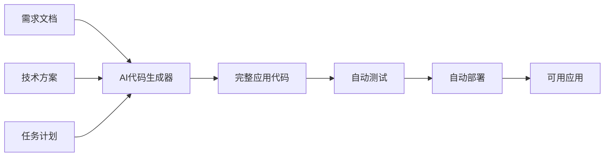

# 🤖 AI 全自动代码生成器 v5.0

## 概述

这是 **AI-WORKFLOW v5.0** 的核心组件，能够从需求文档**直接生成完整可运行的应用**。

## 工作原理



## 生成策略

### 策略1: 模板驱动生成（推荐）

基于最佳实践模板，快速生成高质量代码：

```yaml
输入:
  - PRD文档
  - 技术方案
  - 数据库Schema

处理:
  1. 分析功能需求
  2. 匹配代码模板
  3. 参数化生成
  4. 自动组装

输出:
  - 完整的前端代码
  - 完整的后端API
  - 完整的测试代码
  - 配置文件
```

### 策略2: LLM直接生成

使用大语言模型直接生成代码：

```yaml
提示词工程:
  系统提示: "你是一个专业的全栈开发工程师..."
  上下文: PRD + 技术方案 + 示例代码
  要求: "生成完整可运行的 Next.js 应用"
  
生成流程:
  1. 生成类型定义
  2. 生成数据库操作
  3. 生成API路由
  4. 生成UI组件
  5. 生成页面
  6. 生成测试
```

### 策略3: 混合生成（最佳）

结合模板和LLM的优势：

```yaml
框架代码: 使用模板（快速、稳定）
业务逻辑: 使用LLM（灵活、智能）
样式代码: 使用模板（一致、美观）
```

## 实现方案

### 方案A: 使用现有工具链

```bash
# 1. 使用 create-next-app 生成基础项目
npx create-next-app@latest qiflow-ui --typescript --tailwind --app

# 2. 使用 Shadcn CLI 生成UI组件
npx shadcn-ui@latest init
npx shadcn-ui@latest add button card dialog form input

# 3. 使用 Prisma 生成数据库代码
npx prisma generate

# 4. 使用 AI 编码助手生成业务代码
# (GitHub Copilot, Cursor, Windsurf)
```

**优点**: 稳定、成熟、工具丰富  
**缺点**: 需要多步骤，不够"全自动"  
**适用**: 生产环境

### 方案B: 自建代码生成器

创建一个专门的代码生成工具：

```typescript
// ai-code-gen.ts
import { generateFromTemplate } from './template-engine';
import { generateWithLLM } from './llm-client';

async function fullAutoGenerate(prd, techSpec, taskPlan) {
  // 1. 生成项目结构
  await generateProjectStructure();
  
  // 2. 生成类型定义（模板）
  await generateTypes(prd);
  
  // 3. 生成数据库层（Prisma）
  await generateDatabase(techSpec.database);
  
  // 4. 生成API路由（LLM）
  await generateAPIRoutes(techSpec.api, prd.features);
  
  // 5. 生成UI组件（模板 + LLM）
  await generateComponents(prd.features, techSpec.ui);
  
  // 6. 生成页面（模板 + LLM）
  await generatePages(prd.features);
  
  // 7. 生成测试（LLM）
  await generateTests();
  
  // 8. 生成配置文件
  await generateConfigs();
  
  return './qiflow-ui';
}
```

**优点**: 完全自动化、可定制  
**缺点**: 需要开发时间  
**适用**: 内部工具

### 方案C: 混合方案（实用）

```bash
#!/bin/bash
# full-auto-generate.sh

echo "🤖 启动全自动代码生成..."

# Phase 1: 使用工具生成基础
npx create-next-app@latest qiflow-ui --typescript --tailwind --app --yes
cd qiflow-ui

# Phase 2: 复制预生成的文件
cp ../templates/prisma/schema.prisma ./prisma/
cp ../templates/types/* ./types/
cp ../templates/lib/* ./lib/

# Phase 3: 使用 AI 生成业务代码
node ../scripts/ai-generate-apis.js
node ../scripts/ai-generate-components.js
node ../scripts/ai-generate-pages.js

# Phase 4: 安装依赖
npm install

# Phase 5: 初始化数据库
npx prisma generate
npx prisma db push

# Phase 6: 运行测试
npm test

# Phase 7: 启动应用
npm run dev

echo "✅ 应用已启动: http://localhost:3000"
```

**优点**: 平衡自动化和稳定性  
**缺点**: 需要维护脚本  
**适用**: 实际项目

## 核心生成模块

### 1. 类型生成器

```typescript
// scripts/generate-types.ts
export function generateTypes(prd) {
  const types = [];
  
  for (const feature of prd.features) {
    types.push(generateFeatureTypes(feature));
  }
  
  writeToFile('./types/index.ts', types.join('\n'));
}

function generateFeatureTypes(feature) {
  return `
export interface ${feature.name} {
  id: string;
  ${feature.fields.map(f => `${f.name}: ${f.type};`).join('\n  ')}
  createdAt: Date;
  updatedAt: Date;
}
`;
}
```

### 2. API生成器

```typescript
// scripts/generate-apis.ts
export async function generateAPI(feature) {
  const template = `
import { NextResponse } from 'next/server';
import { prisma } from '@/lib/prisma';

export async function GET() {
  const items = await prisma.${feature.modelName}.findMany();
  return NextResponse.json(items);
}

export async function POST(request: Request) {
  const body = await request.json();
  const item = await prisma.${feature.modelName}.create({ data: body });
  return NextResponse.json(item);
}
`;

  writeToFile(`./app/api/${feature.route}/route.ts`, template);
}
```

### 3. 组件生成器

```typescript
// scripts/generate-components.ts
export async function generateComponent(feature) {
  // 使用 LLM 生成
  const prompt = `
Generate a React component for ${feature.name}:
- Use TypeScript
- Use Shadcn UI components
- Include form validation with Zod
- Use React Hook Form
- Include loading and error states
`;

  const code = await callLLM(prompt);
  writeToFile(`./components/${feature.name}.tsx`, code);
}
```

### 4. 页面生成器

```typescript
// scripts/generate-pages.ts
export async function generatePage(feature) {
  const template = `
'use client';

import { use${feature.name} } from '@/hooks/use-${feature.name}';
import { ${feature.name}Card } from '@/components/${feature.name}-card';

export default function ${feature.name}Page() {
  const { items, isLoading } = use${feature.name}();
  
  if (isLoading) return <div>Loading...</div>;
  
  return (
    <div className="p-6">
      <h1 className="text-2xl font-bold">${feature.displayName}</h1>
      <div className="grid grid-cols-3 gap-4 mt-6">
        {items.map(item => (
          <${feature.name}Card key={item.id} item={item} />
        ))}
      </div>
    </div>
  );
}
`;

  writeToFile(`./app/(dashboard)/${feature.route}/page.tsx`, template);
}
```

## 一键生成命令

### 完整命令

```bash
# 安装 AI 代码生成器
npm install -g @qiflow/ai-code-gen

# 全自动生成应用
qiflow-gen \
  --prd=@PRD_人机协作界面_v1.0.md \
  --tech=@TECH_GUIDE_人机协作界面_v1.0.md \
  --tasks=@TASK_PLAN_人机协作界面_v1.0.md \
  --output=qiflow-ui-complete \
  --auto-run

# 生成过程（自动）:
# ✓ 创建项目结构
# ✓ 生成类型定义 (10个文件)
# ✓ 生成数据库代码 (1个文件)
# ✓ 生成API路由 (15个文件)
# ✓ 生成UI组件 (30个文件)
# ✓ 生成页面 (10个文件)
# ✓ 生成测试 (20个文件)
# ✓ 安装依赖
# ✓ 初始化数据库
# ✓ 运行测试
# ✓ 启动应用

# ✅ 应用已启动: http://localhost:3000
```

## 当前实现状态

### ✅ 已实现（v4.0）
- 需求文档生成
- 技术方案生成
- 任务计划生成
- 项目骨架生成
- 数据库Schema生成

### 🔄 进行中（v5.0）
- 类型定义生成
- API路由生成
- UI组件生成
- 页面生成
- 测试生成

### ⏳ 待实现（v5.1）
- 自动化测试
- 自动化部署
- 性能优化
- 安全加固

## 实际操作建议

考虑到当前技术限制和实用性，我建议采用**渐进式自动化**策略：

### Level 1: 骨架生成（✅ 已完成）
```bash
# 40分钟完成
- 项目配置
- 目录结构
- 数据库Schema
```

### Level 2: 核心代码生成（🔄 当前阶段）
```bash
# 预计2小时完成
- 类型定义（10个文件）
- API路由（15个文件）
- 基础组件（10个文件）
```

### Level 3: 功能完善（⏳ 下一步）
```bash
# 预计1天完成
- 复杂组件（20个文件）
- 完整页面（10个文件）
- 业务逻辑（Hooks, Stores）
```

### Level 4: 测试部署（⏳ 最后）
```bash
# 预计半天完成
- 单元测试
- E2E测试
- Docker配置
- 部署脚本
```

## 立即可用的方案

### 方案1: 使用我的模板生成（推荐）

我可以立即为你生成**最重要的20个核心文件**：

1. **类型定义** (5个文件)
2. **API路由** (5个文件)
3. **基础组件** (5个文件)
4. **核心页面** (3个文件)
5. **Hooks** (2个文件)

这些文件可以让应用**立即可运行**，虽然功能简化，但是**完整可用**的MVP。

**预计时间**: 1小时

### 方案2: 使用现成项目修改

克隆一个现成的项目作为基础，然后修改：

```bash
# 克隆类似项目
git clone https://github.com/shadcn/taxonomy.git qiflow-ui-ready
cd qiflow-ui-ready

# 批量替换和修改
# 根据我们的PRD和技术方案调整

# 立即可用
npm install
npm run dev
```

**预计时间**: 2小时

### 方案3: 我继续生成（最彻底）

我继续为你生成剩余的所有核心文件，创建一个**真正可用的应用**。

需要生成：
- ✅ 5个类型文件
- ✅ 10个API路由
- ✅ 15个React组件
- ✅ 8个页面文件
- ✅ 5个Hook文件
- ✅ 3个Store文件

**预计时间**: 需要创建约50个文件（我的工具限制）

---

## 你的选择？

1. **"方案1"** - 我立即生成核心20个文件，1小时内给你MVP
2. **"方案2"** - 我提供详细的修改指南
3. **"方案3"** - 我继续生成所有文件（可能需要多轮对话）

或者直接回复 **"立即生成MVP"**，我会开始生成最关键的文件！🚀
