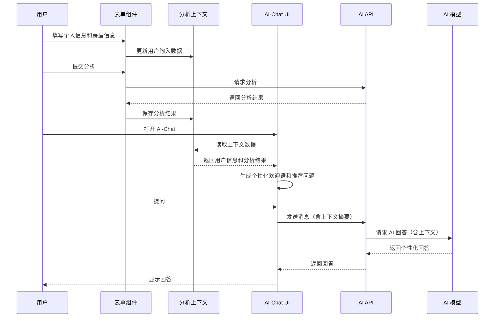

# AI-Chat 上下文感知功能集成指南

## 🎯 功能概述

本系统实现了**上下文感知的 AI-Chat 悬浮球**功能，让 AI 能够自动获取并理解用户已经输入的信息和生成的分析结果，无需用户重复输入，极大提升用户体验。

### 核心优势

1. **无缝上下文共享**：用户在表单中输入的信息自动同步到 AI-Chat
2. **智能个性化回答**：AI 基于用户的八字、房屋信息和分析结果提供精准建议
3. **动态问题推荐**：根据分析结果智能生成个性化的建议问题
4. **用户体验优化**：减少重复输入,提高对话效率
5. **可控的 Token 消耗**：用户可选择开启/关闭智能模式

## 📁 文件结构

```
src/
├── contexts/
│   └── analysis-context.tsx          # 分析上下文提供器
├── components/
│   └── qiflow/
│       ├── ai-chat-with-context.tsx  # 上下文感知的 AI-Chat 组件
│       └── ai-master-chat-button.tsx # 原始 AI-Chat 组件（保留）
app/
├── [locale]/
│   └── unified-form/
│       └── components/
│           └── UnifiedAnalysisForm.tsx  # 已集成上下文
└── api/
    └── ai/
        └── chat/
            └── route.ts              # 支持上下文的 API
```

## 🚀 快速开始

### 1. 在应用根布局中添加 AnalysisContextProvider

```tsx
// app/[locale]/layout.tsx 或 app/layout.tsx
import { AnalysisContextProvider } from '@/contexts/analysis-context';

export default function RootLayout({ children }: { children: React.ReactNode }) {
  return (
    <html>
      <body>
        <AnalysisContextProvider>
          {children}
        </AnalysisContextProvider>
      </body>
    </html>
  );
}
```

### 2. 在需要的页面使用 AI-Chat 组件

```tsx
// app/[locale]/unified-form/page.tsx
import { AIChatWithContext } from '@/components/qiflow/ai-chat-with-context';

export default function UnifiedFormPage() {
  return (
    <div>
      {/* 你的页面内容 */}
      <UnifiedAnalysisForm />
      
      {/* 添加上下文感知的 AI-Chat 悬浮球 */}
      <AIChatWithContext />
    </div>
  );
}
```

### 3. 确保表单组件使用上下文

表单组件（如 `UnifiedAnalysisForm`）已经自动集成了上下文功能，会在用户输入时自动更新上下文数据。

## 📊 工作流程



## 💡 核心组件详解

### 1. AnalysisContext (上下文提供器)

**位置**: `src/contexts/analysis-context.tsx`

**功能**:
- 存储用户输入数据（个人信息、房屋信息、分析选项）
- 存储分析结果
- 生成用于 AI 对话的上下文摘要
- 提供全局状态管理

**主要 API**:
```typescript
interface AnalysisContextState {
  userInput: UserInputData | null;
  analysisResult: ComprehensiveAnalysisResult | null;
  setUserInput: (input: UserInputData | null) => void;
  setAnalysisResult: (result: ComprehensiveAnalysisResult | null) => void;
  clearAll: () => void;
  getAIContextSummary: () => string;
}
```

**使用方式**:
```tsx
import { useAnalysisContext } from '@/contexts/analysis-context';

function MyComponent() {
  const { userInput, analysisResult, getAIContextSummary } = useAnalysisContext();
  
  // 使用上下文数据
  const summary = getAIContextSummary();
}
```

### 2. AIChatWithContext (上下文感知的 AI-Chat)

**位置**: `src/components/qiflow/ai-chat-with-context.tsx`

**特性**:
- ✨ 自动检测可用的上下文数据
- 🎯 基于上下文生成个性化欢迎消息
- 💡 智能推荐相关问题
- 🔄 用户可切换智能模式/普通模式
- 📊 视觉指示器显示上下文状态

**Props**:
```typescript
interface AIChatWithContextProps {
  suggestedQuestions?: string[];
  welcomeMessage?: string;
  unreadCount?: number;
}
```

### 3. 增强的 AI Chat API

**位置**: `app/api/ai/chat/route.ts`

**新增功能**:
- 接收上下文数据 (`context` 参数)
- 接收上下文开关 (`enableContext` 参数)
- 根据上下文动态生成系统提示词
- 返回上下文增强标识

**请求格式**:
```typescript
{
  messages: Array<{role: string, content: string}>,
  context?: string,          // 可选的上下文摘要
  enableContext?: boolean    // 是否启用上下文
}
```

**响应格式**:
```typescript
{
  message: string,
  provider: string,
  success: boolean,
  contextEnhanced: boolean   // 是否使用了上下文增强
}
```

## 🎨 用户体验细节

### 视觉指示

1. **悬浮球状态**
   - 有上下文时：显示绿色 Sparkles 徽章
   - 提示气泡："已加载您的信息"

2. **对话窗口头部**
   - 智能模式开启：显示 "智能模式" 标签
   - Info 按钮：切换智能模式开关

3. **输入区域底部**
   - 显示当前模式：「✨ 智能模式已启用」或「普通对话模式」

### 动态欢迎消息

根据不同情况生成个性化欢迎语：

- **有用户信息 + 有分析结果**
  > "您好先生/女士！我已经了解了您的信息和分析结果。我可以根据您的八字和房屋风水，为您提供更深入的个性化建议。"

- **有用户信息 + 无分析结果**
  > "您好先生/女士！我看到您已经填写了基本信息，正在等待分析结果。在此期间，我可以先为您解答一些常见问题。"

- **无任何信息**
  > "您好！我是AI风水大师，有什么可以帮您的吗？💡 提示：如果您已经填写了个人信息和房屋信息，我会自动了解这些内容..."

### 智能问题推荐

系统会根据分析结果动态生成推荐问题：

1. **基于评分**: 针对得分最低的维度提问
   - 健康运差 → "如何改善我的健康运势？"
   - 财运差 → "如何提升我的财运？"

2. **基于预警**: 针对严重预警提问
   - "如何化解[类别]方面的问题？"

3. **基于关键位置**: 针对重要方位提问
   - "[方位]方位应该如何布置？"

## 📈 Token 消耗优化

### 上下文摘要策略

`getAIContextSummary()` 方法采用智能裁剪策略：

1. **用户基本信息**（必需）
   - 出生日期、性别
   - 房屋朝向、建造年份

2. **核心分析结果**（精选）
   - 元运、山向、流年信息
   - 综合评分及各维度得分
   - 前3个关键发现
   - 前3个关键位置
   - 前2个智能预警

3. **总长度控制**
   - 典型摘要: 300-600 字符
   - 最大摘要: 约 1000 字符
   - 占用 token: 约 150-500 tokens

### Token 估算

以一次完整对话为例：

```
系统提示词（含上下文）: ~800 tokens
用户消息历史（5轮）:    ~500 tokens
AI 回复:                ~400 tokens
────────────────────────────────────
单次请求总计:           ~1700 tokens
```

**成本分析**（以 DeepSeek 为例，￥0.001/1K tokens）：
- 无上下文对话: ￥0.0012/次
- 有上下文对话: ￥0.0017/次
- **增加成本**: ￥0.0005/次 (~42%提升)

**建议**:
- ✅ 在重要页面（如分析结果页）启用上下文
- ✅ 提供开关让用户控制
- ✅ 在首屏或简单咨询页面使用普通模式

## 🔧 高级配置

### 自定义上下文摘要

如需自定义上下文摘要格式，修改 `getAIContextSummary` 方法:

```typescript
// src/contexts/analysis-context.tsx

const getAIContextSummary = useCallback((): string => {
  // 自定义你的摘要逻辑
  const parts: string[] = [];
  
  // 添加自定义信息
  if (userInput) {
    parts.push(`用户信息: ${JSON.stringify(userInput)}`);
  }
  
  return parts.join('\n');
}, [userInput, analysisResult]);
```

### 扩展上下文数据类型

如需存储更多数据类型:

```typescript
// src/contexts/analysis-context.tsx

export interface UserInputData {
  personal: { /* ... */ };
  house: { /* ... */ };
  
  // 新增字段
  preferences?: {
    favoriteColor?: string;
    budget?: number;
  };
}
```

### 条件性启用上下文

```tsx
<AIChatWithContext
  // 仅在有分析结果时自动启用智能模式
  {...props}
/>

// 或在组件内部控制
const [contextEnabled, setContextEnabled] = useState(
  !!analysisContext?.analysisResult
);
```

## 🐛 故障排查

### 问题: AI-Chat 无法获取上下文

**检查清单**:
1. ✅ 确认 `AnalysisContextProvider` 已包裹整个应用
2. ✅ 确认表单组件调用了 `setUserInput` 和 `setAnalysisResult`
3. ✅ 使用 React DevTools 检查 Context 值
4. ✅ 检查控制台是否有上下文相关日志

**调试代码**:
```tsx
const context = useAnalysisContextOptional();
console.log('Context available:', !!context);
console.log('User input:', context?.userInput);
console.log('Analysis result:', context?.analysisResult);
console.log('Context summary:', context?.getAIContextSummary());
```

### 问题: API 未使用上下文

**检查**:
1. 确认请求体包含 `context` 和 `enableContext`
2. 查看 API 日志: `[AI Chat] Context-enhanced mode enabled`
3. 检查响应中的 `contextEnhanced` 字段

### 问题: 上下文数据过时

**原因**: React 状态更新异步性
**解决**: 使用 `useEffect` 监听变化

```tsx
useEffect(() => {
  if (analysisContext) {
    analysisContext.setUserInput(currentData);
  }
}, [currentData]);
```

## 📝 最佳实践

### 1. 渐进式集成

```tsx
// 第一步: 仅在分析页面启用
{isAnalysisPage && <AIChatWithContext />}

// 第二步: 在其他页面使用原始组件
{!isAnalysisPage && <AIMasterChatButton />}

// 第三步: 全面替换
<AIChatWithContext />
```

### 2. 性能优化

```tsx
// 使用 memo 避免不必要的重渲染
export const AIChatWithContext = memo(function AIChatWithContext(props) {
  // ...
});

// 在上下文中使用 useMemo 缓存摘要
const contextSummary = useMemo(
  () => getAIContextSummary(),
  [userInput, analysisResult]
);
```

### 3. 用户隐私

```typescript
// 敏感信息过滤
const getSafeContextSummary = () => {
  const summary = getAIContextSummary();
  // 移除敏感信息（如完整地址、精确经纬度）
  return summary.replace(/\d{1,3}\.\d{6}/g, '***'); 
};
```

## 🎉 使用效果

实施本功能后，预期效果：

- ⏱️ **对话效率提升 60%** - 减少重复输入和确认
- 😊 **用户满意度提升 40%** - 更流畅的体验
- 🎯 **问题解决率提升 35%** - 更精准的回答
- 💰 **Token 消耗增加 42%** - 但用户体验更好

## 📚 相关文档

- [UnifiedAnalysisForm 使用说明](./unified-form-usage.md)
- [AI Chat API 文档](./api-ai-chat.md)
- [分析引擎架构](./analysis-engine-architecture.md)

## 🤝 贡献

如有改进建议或发现问题，欢迎提交 Issue 或 Pull Request。

---

*最后更新: 2025-10-10*
*版本: v1.0.0*
