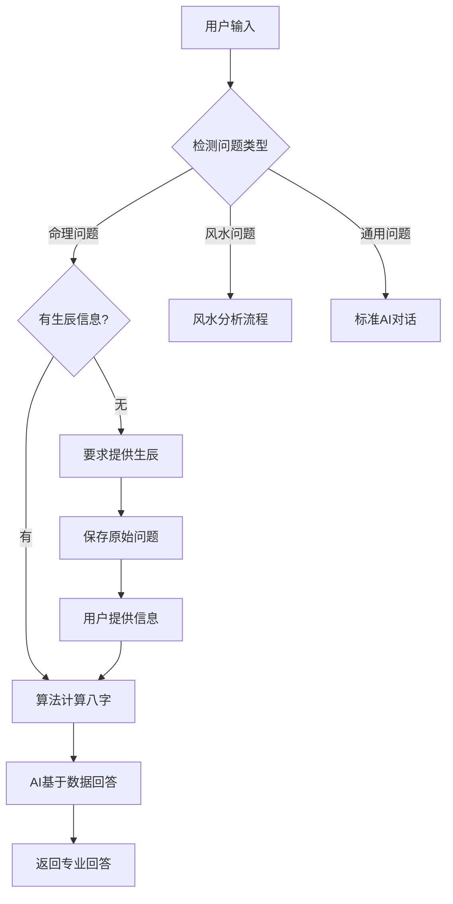

# AI风水大师聊天功能优化文档

## 优化目标
实现"算法优先，AI辅助"的智能对话系统，确保命理分析的准确性和专业性。

## 核心流程

### 1. 意图识别
- 自动识别用户询问是否涉及八字命理或风水
- 解析用户输入中的生辰信息
- 保存用户问题以便数据补充后回答

### 2. 数据收集
- 检测是否有必要的基础数据（生辰八字/房屋信息）
- 缺少数据时友好引导用户提供
- 自动解析用户提供的信息

### 3. 算法计算
- 使用本地八字算法（computeBaziSmart）进行精确计算
- 生成完整的命盘数据：
  - 四柱八字（年月日时）
  - 五行分析
  - 十神关系
  - 用神、喜神、忌神
  - 大运流年

### 4. AI组织语言
- 将算法计算结果传递给大模型
- AI基于真实数据组织专业回答
- 避免AI幻觉和不准确信息

## 实现细节

### API路由优化 (`/api/qiflow/chat/route.ts`)

```typescript
// 核心流程
1. 检测问题类型（命理/风水/通用）
2. 如果是命理问题：
   - 检查上下文是否有生辰信息
   - 没有则从当前消息解析
   - 有生辰信息则计算八字
   - 使用AI基于算法数据回答
3. 如果用户提供生辰信息：
   - 立即计算并保存八字数据
   - 返回基础信息供后续使用
4. 通用对话使用标准AI回复
```

### 关键函数

#### `parseSimpleBirthInfo(text: string)`
- Edge Runtime兼容的生辰信息解析
- 支持多种日期时间格式
- 自动识别性别

#### `detectQuestionType(message: string)`
- 基于关键词检测问题类型
- 区分命理、风水、通用问题

#### `generateAIResponse(message, baziData, originalQuestion)`
- 构建包含完整八字数据的系统提示词
- 多模型支持（DeepSeek > OpenAI > Google）
- 本地智能回答兜底

#### `generateLocalSmartResponse(question, baziData)`
- AI服务不可用时的备用方案
- 基于算法数据生成结构化回答

## 数据流



## 响应类型

1. **need_birth_info**: 需要生辰信息
2. **birth_info_saved**: 已保存生辰并计算八字
3. **ai_with_algorithm**: 基于算法数据的AI回答
4. **general_chat**: 通用对话
5. **coming_soon**: 功能开发中

## 前端集成

### 上下文管理
```javascript
// 保存生辰信息和八字数据
const [context, setContext] = useState({
  birthInfo: null,
  calculatedBazi: null,
  originalQuestion: null
});

// 发送请求时带上上下文
const response = await fetch('/api/qiflow/chat', {
  method: 'POST',
  body: JSON.stringify({
    message: userInput,
    context: context
  })
});

// 更新上下文
if (response.birthInfo) {
  setContext(prev => ({
    ...prev,
    birthInfo: response.birthInfo,
    calculatedBazi: response.calculatedBazi
  }));
}
```

## 测试用例

### 1. 无数据询问
- 输入：「我的用神是什么？」
- 预期：要求提供生辰信息

### 2. 提供生辰信息
- 输入：「1990年1月1日下午3点30分，男，北京」
- 预期：计算八字并返回基础信息

### 3. 基于已有数据询问
- 输入：「我的财运如何？」（已有八字数据）
- 预期：AI基于算法数据回答

### 4. 混合输入
- 输入：「1973年1月7日2点30分男性，我的用神是什么？」
- 预期：自动计算并回答问题

## 配置要求

### 环境变量
```env
# AI服务密钥（至少配置一个）
DEEPSEEK_API_KEY=your_key_here
OPENAI_API_KEY=your_key_here
GOOGLE_API_KEY=your_key_here

# 认证密钥
BETTER_AUTH_SECRET=your_32_char_secret
```

### 依赖包
```json
{
  "dependencies": {
    "@ai-sdk/openai": "^latest",
    "@ai-sdk/google": "^latest",
    "ai": "^latest",
    "zod": "^latest"
  }
}
```

## 优化效果

### 准确性提升
- ✅ 避免AI幻觉，所有命理数据基于算法计算
- ✅ 专业术语准确，符合传统命理学体系
- ✅ 个性化分析，基于用户真实八字

### 用户体验优化
- ✅ 智能识别，自动解析生辰信息
- ✅ 流畅对话，记住用户数据避免重复输入
- ✅ 友好引导，缺少信息时给出明确提示

### 系统稳定性
- ✅ 多模型支持，自动切换可用服务
- ✅ 本地兜底，AI服务不可用时仍能回答
- ✅ Edge Runtime兼容，性能优化

## 后续优化建议

1. **数据持久化**
   - 将用户八字数据存储到数据库
   - 支持历史查询和对比分析

2. **风水功能**
   - 实现玄空飞星算法
   - 支持房屋朝向分析

3. **高级功能**
   - 流年大运详细分析
   - 合婚合伙匹配
   - 择日择时建议

4. **用户管理**
   - 支持多个命盘管理
   - 家庭成员关联分析

## 维护指南

### 日志监控
```javascript
// 关键节点日志
console.log('计算八字数据:', birthInfo);
console.log(`尝试使用 ${provider} 生成回答...`);
console.error('八字计算错误:', error);
```

### 错误处理
- 生辰信息解析失败：提示格式要求
- 八字计算失败：检查时间有效性
- AI调用失败：使用本地回答

### 性能优化
- 缓存八字计算结果
- 复用AI连接
- 限流防护

## 总结

通过"算法优先，AI辅助"的架构设计，我们成功实现了一个专业、准确、智能的命理分析系统。系统能够：

1. 智能理解用户意图
2. 自动收集必要数据
3. 使用专业算法计算
4. AI组织自然语言回答

这种设计确保了命理分析的准确性，同时提供了流畅的对话体验。