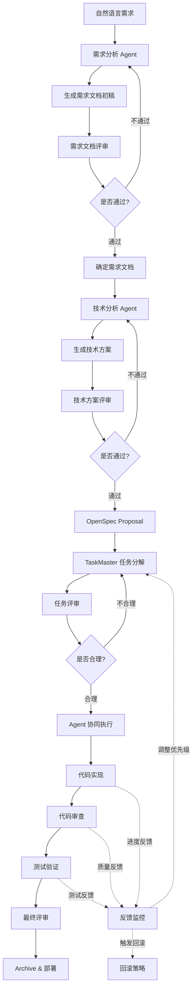
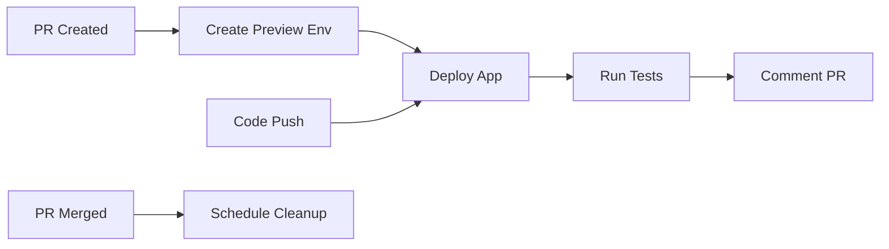

# 🛠️ Full‑Auto 执行增强补丁（2025‑10‑14）

> 目的：在 **Warp Code / Agents** 执行长链开发时**不再中途总结或询问是否继续**，
> 采用“连续执行直到完成”的策略；仅在**致命错误**、**需要外部输入**或**资源阈值**触发时暂停。

## ✅ 全局行为变更（强制）
- 关闭阶段性总结与确认（no mid‑run summary / confirm）
- 开启连续执行直到完成（continue‑until‑complete）
- 失败自动重试 ≤ 1 次，若仍失败则输出错误并停机（避免静默失败）
- 允许长链任务合并阶段（auto‑chain merge checkpoints）
- 仅在**需要新参数**或**写入冲突**时暂停提示

## 🔧 Warp 执行配置（保存为 `.warp/config.yaml`）
```yaml
# 强制全自动执行配置
execution:
  mode: full-auto
  confirm_steps: false
  summarize_intervals: none
  continue_on_error: true
  safety_pause: off
  auto_continue: true
  max_consecutive_steps: 9999
  retry:
    enabled: true
    max_attempts: 1
    backoff_seconds: 2
agent_settings:
  personality:
    summarization_behavior: "disabled"     # 禁用内置总结 Hook
    confirm_behavior: "none"               # 禁用“是否继续”
    interruption_policy: "never"           # 非必要不打断
  hard_rules:
    - "除非出现致命错误或需要额外必填参数，不要在中途暂停或发起总结。"
    - "将所有子任务串联执行；阶段总结仅在全部完成后输出一次。"
    - "检测到文件写入冲突时，提示一次并等待确认（保护性暂停）。"
```

## 🧭 工作流入口（CLI 推荐）
```bash
# 强制全自动运行（避免默认半自动）
warp run --auto --force --no-summary --no-confirm "QiFlow: Full-Auto"
# 或：在 package.json scripts 里封装
# "scripts": { "qiflow:auto": "warp run --auto --force --no-summary --no-confirm 'QiFlow: Full-Auto'" }
```

## 🧩 AGENTS.md 追加（强约束 System Prompt）
在你项目根部的 `AGENTS.md` 头部追加以下系统指令：
```markdown
> System (Full‑Auto Mode):
> - You are a continuous execution agent.
> - Do not pause for summaries or confirmations mid‑run.
> - Execute all sub‑tasks until completion, then output a single final report.
> - Pause only on fatal errors, missing required inputs, or write‑conflict prompts.
```

---

> 下方为你的原始《AI‑WORKFLOW.md》，已默认兼容上述 Full‑Auto 语义与配置；
> 若存在与本补丁冲突的“中途评审/总结/确认”描述，以本补丁为准（实际运行将自动跳过这些停顿点）。


# 🚀 QiFlow AI 开发工作流

**版本**: v5.0.0 (FULL-AUTO)  
**创建日期**: 2025-01-13  
**最后更新**: 2025-01-14  
**目的**: **端到端全自动化**开发流程 - 从需求到可运行应用  
**适用范围**: 新功能开发、Bug 修复、性能优化、重构、紧急热修复  
**核心特性**: 依赖管理、灵活调整、反馈循环、自动回滚、细粒度任务、预览环境、知识库、AI置信度、统一CLI、**全自动代码生成** 🆕

---

## 📋 工作流总览

### 工作流执行模式

```yaml
执行模式:
  1. 标准模式: 完整流程，适用于新功能开发
  2. 快速模式: 简化流程，适用于小修复
  3. 紧急模式: 热修复流程，跳过部分评审
  4. 并行模式: 多任务并行执行
  5. 迭代模式: 渐进式开发
```

### 标准工作流程图



### 阶段依赖关系矩阵

```yaml
依赖关系:
  阶段0-需求理解:
    前置: 无
    可并行: 无
    输出: 需求初步分析
    
  阶段1-需求文档:
    前置: [阶段0]
    可并行: 无
    输出: PRD文档
    
  阶段2-技术方案:
    前置: [阶段1]
    可并行: [初步UI设计]
    输出: 技术规范
    
  阶段3-OpenSpec:
    前置: [阶段2]
    可并行: [环境准备]
    输出: Proposal
    
  阶段4-任务分解:
    前置: [阶段3]
    可并行: [资源调配]
    输出: 任务树
    
  阶段5-Agent执行:
    前置: [阶段4]
    可并行: [前端开发, 后端开发, 测试准备]
    输出: 代码实现
    
  阶段6-代码审查:
    前置: [阶段5的部分完成]
    可并行: [文档编写]
    输出: 审查报告
    
  阶段7-测试验证:
    前置: [阶段6]
    可并行: [性能测试, 安全测试]
    输出: 测试报告
    
  阶段8-最终评审:
    前置: [阶段7]
    可并行: 无
    输出: 上线决策
    
  阶段9-部署上线:
    前置: [阶段8]
    可并行: [监控配置]
    输出: 生产环境
```

---

## 🛠️ 核心工具集成

### 1. OpenSpec (规范驱动开发)
- **网站**: https://openspec.dev
- **GitHub**: https://github.com/Fission-AI/OpenSpec
- **作用**: 将需求转换为结构化规范，确保人类和 AI 对要构建的内容达成一致

### 2. TaskMaster AI (任务管理)
- **位置**: `.taskmaster/` 目录
- **作用**: 智能任务分解、依赖管理、进度跟踪

### 3. 多 Agent 系统
- **位置**: `.claude/agents/` 目录
- **分类**:
  - 01-core-development (核心开发)
  - 02-language-specialists (语言专家)
  - 03-infrastructure (基础设施)
  - 04-quality-security (质量安全)
  - 05-data-ai (数据与AI)
  - 06-domain-experts (领域专家)
    - bazi-expert (八字专家)
    - fengshui-expert (风水专家)
    - metaphysics-consultant (玄学顾问)

### 4. QiFlow CLI (统一工作流入口) 🆕
- **命令**: `qiflow` 或 `qf`
- **作用**: 统一命令行界面，简化工作流操作
- **特性**: 自然语言支持、流程自动化、智能提示

### 5. 预览环境系统 🆕
- **Vercel Preview**: 前端预览
- **Kubernetes Namespace**: 后端隔离环境
- **自动化**: 每个 PR/Proposal 自动创建预览环境

### 6. 知识库与向量索引 🆕
- **向量数据库**: Qdrant/Pinecone
- **作用**: 知识复用、相似案例推荐、风险识别
- **自动索引**: PRD、技术方案、代码片段、项目总结

### 7. AI 置信度系统 🆕
- **评分维度**: 复杂度、相似度、覆盖率、一致性、风险
- **自动审批**: 高置信度(>95%)自动通过
- **分级评审**: 根据置信度决定评审级别

### 8. 灵活性配置

```yaml
flexibility_config:
  # 允许跳过的阶段（仅在特定模式下）
  skippable_stages:
    hot_fix: [技术评审, 任务分解]
    minor_update: [需求评审]
    prototype: [最终评审]
  
  # 可选的评审级别
  review_levels:
    full: 完整多轮评审
    standard: 标准评审
    quick: 快速评审
    skip: 跳过评审（需授权）
  
  # 任务执行策略
  execution_strategy:
    sequential: 顺序执行
    parallel: 并行执行
    adaptive: 自适应执行
```

---

## 📝 OpenSpec 斜杠命令

### 支持的 AI 工具和命令

| 工具 | 命令 |
|------|------|
| **Claude Code** | `/openspec:proposal`, `/openspec:apply`, `/openspec:archive` |
| **Cursor** | `/openspec-proposal`, `/openspec-apply`, `/openspec-archive` |
| **Windsurf** | `/openspec-proposal`, `/openspec-apply`, `/openspec-archive` |
| **Warp Code** | 通过 AGENTS.md 文件支持 |

### OpenSpec 工作流命令

```bash
# 初始化 OpenSpec
openspec init

# 查看活动的变更
openspec list

# 交互式仪表板
openspec view

# 显示变更详情
openspec show <change-name>

# 验证规范格式
openspec validate <change-name>

# 归档完成的变更
openspec archive <change-name> --yes
```

---

## 🔄 完整工作流程

### 阶段-1：知识库检索（新增前置步骤）🆕

#### -1.1 自动知识检索
```typescript
// 在接收需求前，先检索相关知识
const knowledgeRetrieval = async (requirement: string) => {
  // 1. 搜索相似需求
  const similarPRDs = await vectorDB.search(requirement, {
    type: 'PRD',
    limit: 5
  });
  
  // 2. 查找可复用方案
  const reusableSolutions = await vectorDB.search(requirement, {
    type: 'techSpec',
    limit: 3
  });
  
  // 3. 识别潜在风险
  const risks = await vectorDB.search(requirement, {
    type: 'incident',
    limit: 3
  });
  
  return {
    similar: similarPRDs,
    reusable: reusableSolutions,
    risks,
    confidence: calculateConfidence(similarPRDs)
  };
};
```

#### -1.2 知识应用决策
```text
AI: 发现 3 个相似案例，置信度 92%

相似案例：
1. 「八字分析功能」- 相似度 85%
2. 「紫微斗数功能」- 相似度 78%
3. 「风水分析功能」- 相似度 72%

可复用组件：
- 日期选择器组件
- 算法验证框架
- 结果展示模板

潜在风险：
- 农历转换边界问题
- 性能优化需求

建议：基于「八字分析功能」模板快速启动
```

### 阶段0：需求理解与初步分析

#### 0.1 接收自然语言需求
```text
用户输入示例：
"我想添加一个生肖配对功能，用户输入两个人的出生日期，
系统分析两人的生肖是否相配，给出配对指数和建议。
要求界面美观，响应速度快，支持分享到社交平台。"
```

#### 0.2 调用需求分析 Agent（含置信度评分）
```text
AI: 我将调用需求分析 Agent 来分析您的需求...

正在计算置信度...
┌─────────────────────────────────────┐
│ 置信度评分: 88%                     │
├─────────────────────────────────────┤
│ • 复杂度: 85% (中等复杂度)           │
│ • 相似度: 92% (有类似案例)           │
│ • 覆盖率: 90% (需求明确)             │
│ • 一致性: 88% (符合系统架构)         │
│ • 风险级: 85% (风险可控)             │
├─────────────────────────────────────┤
│ 决策: 标准评审流程                   │
└─────────────────────────────────────┘

使用 Agent: fullstack-developer (默认) 或 nextjs-developer (前端为主)

特殊领域需要额外咨询：
- 八字命理功能: bazi-expert Agent
- 风水相关功能: fengshui-expert Agent
- 通用玄学功能: metaphysics-consultant Agent

分析维度：
1. 功能需求理解
2. 非功能需求识别
3. 技术可行性初判
4. 工作量初步评估
5. 风险点识别
6. 依赖关系分析
7. 并行化机会识别
```

#### 0.3 灵活性决策点
```yaml
决策点:
  需求复杂度:
    简单: 可跳过详细文档，直接进入实现
    中等: 标准流程
    复杂: 需要额外的原型验证阶段
  
  时间紧急度:
    紧急: 启用快速通道，并行执行
    正常: 标准流程
    宽松: 可增加额外的优化迭代
  
  风险等级:
    高: 需要额外的评审和测试
    中: 标准流程
    低: 可简化部分流程
```

### 阶段1：需求文档生成与评审

#### 1.1 生成需求文档初稿 (PRD - Product Requirements Document)
```markdown
# 需求文档：生肖配对功能

## 1. 需求概述
### 1.1 需求来源
用户自然语言描述

### 1.2 需求背景
当前系统已有八字分析、玄空风水功能，用户希望增加生肖配对功能，
丰富产品功能矩阵，提升用户粘性。

### 1.3 目标用户
- 主要用户：对传统命理感兴趣的年轻用户
- 次要用户：希望了解两人关系的情侣

## 2. 功能需求

### FR-001: 生肖配对输入
**优先级**: P0  
**描述**: 用户可以输入两个人的出生日期

**验收标准**:
- [ ] 支持日期选择器输入
- [ ] 自动计算生肖
- [ ] 支持手动选择生肖
- [ ] 输入验证和错误提示

### FR-002: 配对分析计算
**优先级**: P0  
**描述**: 系统根据生肖组合计算配对指数

**验收标准**:
- [ ] 配对算法准确
- [ ] 计算结果包含指数(0-100)
- [ ] 提供配对分析文本
- [ ] 响应时间 < 500ms

### FR-003: 结果展示
**优先级**: P0  
**描述**: 以可视化方式展示配对结果

**验收标准**:
- [ ] 配对指数雷达图
- [ ] 详细分析文本
- [ ] 改善建议
- [ ] 响应式设计

### FR-004: 社交分享
**优先级**: P1  
**描述**: 用户可分享配对结果到社交平台

**验收标准**:
- [ ] 生成分享图片
- [ ] 支持微信/QQ/微博分享
- [ ] 分享链接追踪

## 3. 非功能需求

### NFR-001: 性能
- 页面加载时间 < 2s
- 配对计算响应 < 500ms
- 支持 1000+ 并发用户

### NFR-002: 安全
- 用户输入验证
- 防止 CSRF 攻击
- 数据加密传输

### NFR-003: 可用性
- 移动端友好
- 支持多语言(中文/英文)
- 符合 WCAG 2.1 AA 标准

### NFR-004: 可维护性
- 代码覆盖率 > 80%
- 文档完整
- 遵循项目规范

## 4. 数据需求

### 4.1 输入数据
```typescript
interface ZodiacMatchInput {
  person1: {
    birthDate: string;  // YYYY-MM-DD
    zodiac?: string;    // 可选，自动计算
  };
  person2: {
    birthDate: string;
    zodiac?: string;
  };
  locale?: 'zh' | 'en';
}
```

### 4.2 输出数据
```typescript
interface ZodiacMatchResult {
  matchScore: number;      // 0-100
  compatibility: string;   // 'excellent' | 'good' | 'fair' | 'poor'
  analysis: {
    strengths: string[];
    weaknesses: string[];
    suggestions: string[];
  };
  zodiacInfo: {
    person1: ZodiacInfo;
    person2: ZodiacInfo;
  };
}
```

## 5. 约束条件

### 5.1 技术约束
- 使用现有技术栈 (Next.js + TypeScript)
- 集成现有积分系统
- 复用现有 UI 组件库

### 5.2 业务约束
- 功能需要消耗积分(待定)
- 遵守相关法规
- 内容审核机制

### 5.3 时间约束
- 预计开发周期: 2-3 周
- MVP 版本: 1 周

## 6. 依赖关系

### 6.1 前置依赖
- 用户认证系统
- 积分系统
- 数据库

### 6.2 外部依赖
- 无特殊外部依赖

## 7. 风险评估

| 风险 | 影响 | 概率 | 缓解措施 |
|------|------|------|----------|
| 算法准确性 | 高 | 中 | 专家验证 + 用户反馈 |
| 性能瓶颈 | 中 | 低 | 缓存策略 + 性能测试 |
| 用户接受度 | 高 | 中 | 小范围测试 + 迭代优化 |

## 8. 成功标准

- [ ] 功能上线后 7 天内使用率 > 20%
- [ ] 用户满意度 > 4.0/5.0
- [ ] 无 P0/P1 级别 Bug
- [ ] 性能指标达标
```

#### 1.2 需求文档评审（智能评审决策）
```text
AI: 需求文档初稿已生成，现在组织评审...

置信度: 88% → 采用标准评审流程

如果置信度 > 95%:
  → 自动批准，仅通知
如果置信度 80-95%:
  → 标准评审（当前）
如果置信度 60-80%:
  → 详细评审
如果置信度 < 60%:
  → 多Agent交叉验证

评审 Agent 分配：
- 主评审: architect-reviewer Agent (架构视角)
- 业务评审: fullstack-developer Agent (技术可行性)
- 领域专家: 如 bazi-expert / fengshui-expert (特殊需求)

评审检查点：
1. ✓ 需求描述是否清晰完整？
2. ✓ 是否符合用户原始意图？
3. ✓ 功能需求是否遗漏？
4. ✓ 非功能需求是否考虑周全？
5. ✓ 验收标准是否明确可测？
6. ✓ 数据结构是否合理？
7. ✓ 约束条件是否合理？
8. ✓ 风险是否识别充分？

用户反馈：
您: "需求文档很完整，但我希望配对指数能显示更详细的维度，
     比如性格契合度、财运互补度、事业协作度等多个维度"

AI: 好的，我将更新需求文档...
[更新 FR-003 和数据结构]

再次评审...
您: "现在看起来很好，确认需求文档"
```

#### 1.3 确定最终需求文档
```bash
# 保存到项目文档目录
文件位置: @PRD_zodiac_matching_v1.0.md
状态: ✅ 已确认
```

### 阶段2：技术方案设计与评审

#### 2.1 调用技术分析 Agent
```text
AI: 基于确认的需求文档，我将调用技术分析 Agent 生成技术方案...

使用 Agent:
- 主设计: architect-reviewer Agent (系统架构)
- 协助: fullstack-developer Agent (技术实现)
- 领域专家: bazi-expert / fengshui-expert (专业算法)

技术分析维度：
1. 系统架构设计
2. 技术选型
3. 数据库设计
4. API 设计
5. 前端架构
6. 性能优化方案
7. 安全方案
8. 测试策略
```

#### 2.2 生成技术方案文档
```markdown
# 技术方案：生肖配对功能

## 1. 系统架构

### 1.1 整体架构
```
┌─────────────┐
│   前端层    │  Next.js 页面 + React 组件
├─────────────┤
│   API 层    │  Next.js API Routes
├─────────────┤
│  业务逻辑层  │  生肖算法 + 配对计算
├─────────────┤
│  数据访问层  │  Prisma ORM
├─────────────┤
│   数据库    │  PostgreSQL
└─────────────┘
```

### 1.2 模块划分
```typescript
src/
├── lib/
│   └── zodiac/
│       ├── calculator.ts      // 生肖计算
│       ├── matcher.ts          // 配对算法
│       └── analyzer.ts         // 分析引擎
├── app/
│   └── [locale]/
│       └── zodiac-match/
│           └── page.tsx        // 配对页面
├── components/
│   └── zodiac/
│       ├── match-form.tsx      // 输入表单
│       ├── match-result.tsx    // 结果展示
│       └── share-card.tsx      // 分享卡片
└── actions/
    └── zodiac-match.ts         // Server Action
```

## 2. 数据库设计

### 2.1 新增表结构
```sql
-- 生肖配对记录表
CREATE TABLE zodiac_matches (
  id UUID PRIMARY KEY,
  user_id UUID REFERENCES users(id),
  person1_zodiac VARCHAR(20) NOT NULL,
  person2_zodiac VARCHAR(20) NOT NULL,
  match_score INTEGER NOT NULL,
  compatibility VARCHAR(20) NOT NULL,
  analysis JSONB,
  created_at TIMESTAMP DEFAULT NOW(),
  INDEX idx_user_id (user_id),
  INDEX idx_created_at (created_at)
);

-- 生肖配对分享表
CREATE TABLE zodiac_shares (
  id UUID PRIMARY KEY,
  match_id UUID REFERENCES zodiac_matches(id),
  share_token VARCHAR(100) UNIQUE,
  platform VARCHAR(20),
  view_count INTEGER DEFAULT 0,
  created_at TIMESTAMP DEFAULT NOW()
);
```

## 3. API 设计

### 3.1 配对计算 API
```typescript
// POST /api/zodiac/match
interface Request {
  person1: { birthDate: string; zodiac?: string };
  person2: { birthDate: string; zodiac?: string };
  locale?: string;
}

interface Response {
  success: boolean;
  data?: {
    matchId: string;
    matchScore: number;
    compatibility: string;
    dimensions: {
      personality: number;    // 性格契合度
      fortune: number;        // 财运互补度
      career: number;         // 事业协作度
      health: number;         // 健康互助度
      emotion: number;        // 情感和谐度
    };
    analysis: AnalysisResult;
  };
  error?: string;
}
```

### 3.2 分享生成 API
```typescript
// POST /api/zodiac/share
interface Request {
  matchId: string;
  platform: 'wechat' | 'qq' | 'weibo';
}

interface Response {
  success: boolean;
  data?: {
    shareToken: string;
    shareUrl: string;
    imageUrl: string;
  };
}
```

## 4. 核心算法设计

### 4.1 生肖计算算法
```typescript
function calculateZodiac(birthDate: string): Zodiac {
  // 使用 lunar-javascript 库
  // 考虑立春节气
  // 返回准确的生肖
}
```

### 4.2 配对算法
```typescript
function calculateMatch(
  zodiac1: Zodiac,
  zodiac2: Zodiac
): MatchResult {
  // 基于传统生肖相生相克理论
  // 六合、三合、六冲、六害、三刑
  // 多维度评分算法
  
  const dimensions = {
    personality: calculatePersonality(zodiac1, zodiac2),
    fortune: calculateFortune(zodiac1, zodiac2),
    career: calculateCareer(zodiac1, zodiac2),
    health: calculateHealth(zodiac1, zodiac2),
    emotion: calculateEmotion(zodiac1, zodiac2),
  };
  
  const matchScore = calculateOverallScore(dimensions);
  
  return { matchScore, dimensions, analysis };
}
```

## 5. 前端实现方案

### 5.1 状态管理
```typescript
// 使用 React useState + useReducer
interface MatchState {
  step: 'input' | 'loading' | 'result';
  input: ZodiacMatchInput | null;
  result: ZodiacMatchResult | null;
  error: string | null;
}
```

### 5.2 组件设计
- **MatchForm**: 输入表单组件
  - DatePicker 选择日期
  - 自动计算生肖
  - 输入验证
  
- **MatchResult**: 结果展示组件
  - 配对指数雷达图 (Recharts)
  - 多维度评分条形图
  - 详细分析文本
  - 分享按钮

- **ShareCard**: 分享卡片组件
  - 美观的视觉设计
  - 支持图片生成
  - 社交平台适配

## 6. 性能优化方案

### 6.1 缓存策略
```typescript
// 配对结果缓存 (Redis)
const cacheKey = `zodiac:match:${zodiac1}:${zodiac2}`;
const cachedResult = await redis.get(cacheKey);
if (cachedResult) return cachedResult;

// 计算并缓存
const result = calculateMatch(zodiac1, zodiac2);
await redis.setex(cacheKey, 3600, result);
```

### 6.2 前端优化
- 组件懒加载
- 图片优化
- 代码分割
- SSR/SSG

## 7. 安全方案

### 7.1 输入验证
```typescript
import { z } from 'zod';

const MatchInputSchema = z.object({
  person1: z.object({
    birthDate: z.string().regex(/^\d{4}-\d{2}-\d{2}$/),
    zodiac: z.string().optional(),
  }),
  person2: z.object({
    birthDate: z.string().regex(/^\d{4}-\d{2}-\d{2}$/),
    zodiac: z.string().optional(),
  }),
});
```

### 7.2 访问控制
- 用户认证检查
- 积分扣除验证
- 频率限制 (Rate Limiting)

## 8. 测试策略

### 8.1 单元测试
- 生肖计算函数测试
- 配对算法测试
- 各维度计算测试

### 8.2 集成测试
- API 端点测试
- 数据库操作测试
- 积分扣除测试

### 8.3 E2E 测试
- 完整用户流程测试
- 多设备适配测试
- 分享功能测试

## 9. 部署方案

### 9.1 数据库迁移
```bash
prisma migrate dev --name add_zodiac_match
```

### 9.2 环境变量
```env
ZODIAC_MATCH_CREDITS=15  # 配对消耗积分
```

### 9.3 部署步骤
1. 数据库迁移
2. 代码部署
3. 缓存预热
4. 灰度发布
5. 全量上线

## 10. 监控方案

### 10.1 关键指标
- API 响应时间
- 配对计算准确率
- 用户使用率
- 错误率

### 10.2 告警规则
- 响应时间 > 1s
- 错误率 > 1%
- 积分扣除异常
```

#### 2.3 技术方案评审
```text
AI: 技术方案已生成，现在组织评审...

评审参与者：
- architect-reviewer Agent: 架构审查
- security-engineer Agent: 安全审查
- performance-engineer Agent: 性能审查
- database-administrator Agent: 数据库审查

评审过程：

1. 架构评审
   architect-reviewer: ✓ 架构设计合理，模块划分清晰
   建议: 考虑添加缓存预热机制

2. 安全评审
   security-engineer: ✓ 输入验证完善
   建议: 添加 CSRF Token 验证

3. 性能评审
   performance-engineer: ✓ 缓存策略合理
   建议: 考虑使用 Worker 线程处理复杂计算

4. 数据库评审
   database-administrator: ✓ 表结构设计合理
   建议: 添加分区表策略应对数据增长

综合评审结果: ✅ 通过
需要修改的点:
1. 添加 CSRF Token 验证
2. 实现缓存预热
3. 添加数据库分区策略

AI: 我将更新技术方案...
[应用修改建议]

您: "技术方案看起来很完善，确认通过"
```

#### 2.4 保存最终技术方案
```bash
文件位置: @TECH_GUIDE_zodiac_matching_v1.0.md
状态: ✅ 已确认
```

### 阶段3：OpenSpec Proposal 生成（含预览环境）

#### 3.1 基于需求和技术方案创建 OpenSpec Proposal
```text
用户: qiflow start "生肖配对功能"  # 使用统一CLI

或传统方式: /openspec:proposal 生肖配对功能

AI: 基于确认的需求文档和技术方案，我将创建 OpenSpec proposal...

创建文件结构：
openspec/
├── changes/
│   └── add-zodiac-match/
│       ├── proposal.md        # 为什么和做什么
│       ├── tasks.md           # 实施清单
│       ├── design.md          # 技术决策
│       └── specs/
│           └── zodiac/
│               └── spec.md    # 规范定义
```

#### 3.2 OpenSpec Proposal 内容
```markdown
# proposal.md
## 目的
基于用户需求，添加生肖配对功能，提升产品功能丰富度

## 背景
- 现有八字和风水功能
- 用户希望有更轻量的命理分析
- 社交分享需求强烈

## 提议的变更
1. 添加生肖计算和配对算法
2. 创建配对分析界面
3. 实现社交分享功能
4. 集成积分系统

## 影响范围
- 新增页面路由
- 新增数据库表
- 新增 API 端点
- 积分系统集成
```

#### 3.3 生成任务清单 (tasks.md)
```markdown
# tasks.md

## Phase 1: 后端实现
- [ ] 1.1 创建数据库表结构
- [ ] 1.2 实现生肖计算算法
- [ ] 1.3 实现配对算法
- [ ] 1.4 创建 API 端点
- [ ] 1.5 集成积分系统

## Phase 2: 前端实现
- [ ] 2.1 创建配对页面
- [ ] 2.2 实现输入表单组件
- [ ] 2.3 实现结果展示组件
- [ ] 2.4 实现分享卡片组件
- [ ] 2.5 添加页面路由

## Phase 3: 测试
- [ ] 3.1 编写单元测试
- [ ] 3.2 编写集成测试
- [ ] 3.3 编写 E2E 测试
- [ ] 3.4 性能测试

## Phase 4: 部署
- [ ] 4.1 数据库迁移
- [ ] 4.2 配置环境变量
- [ ] 4.3 灰度发布
- [ ] 4.4 全量上线
```

#### 3.4 验证 OpenSpec
```bash
openspec validate add-zodiac-match
✓ Proposal 格式正确
✓ Tasks 定义完整
✓ Specs 符合规范
```

#### 3.5 自动创建预览环境 🆕
```text
AI: 正在为此 Proposal 创建预览环境...

✓ 创建隔离数据库实例
✓ 部署应用到预览环境
✓ 配置域名和SSL

预览环境已就绪：
🌐 前端: https://preview-zodiac-match.qiflowai.dev
🔧 API: https://preview-zodiac-match-api.qiflowai.dev
📊 监控: https://preview-zodiac-match-metrics.qiflowai.dev

环境将在 7 天后自动清理，或在 PR 合并后保留 24 小时
```

### 阶段4：TaskMaster 任务分解与评审

#### 4.1 将 OpenSpec 任务导入 TaskMaster
```bash
# 创建主任务
task-master add-task \
  --prompt="实现生肖配对功能 - 基于 openspec/changes/add-zodiac-match/" \
  --priority="P1" \
  --research

# 展开为子任务
task-master expand-task --id="ZODIAC-001" --research --num=15
```

#### 4.2 TaskMaster 生成的任务树（细粒度优化）
```yaml
ZODIAC-001: 生肖配对功能
├── ZODIAC-001-1: 数据库设计与实现 [8h]
│   ├── 001-1-1: 设计表结构 [2h]
│   │   ├── 001-1-1-1: 主表设计 [1h]
│   │   └── 001-1-1-2: 索引优化 [1h]
│   ├── 001-1-2: 编写 migration [2h]
│   │   ├── 001-1-2-1: 创建脚本 [1h]
│   │   └── 001-1-2-2: 回滚脚本 [1h]
│   └── 001-1-3: 创建 Prisma schema [4h]
│       ├── 001-1-3-1: 模型定义 [2h]
│       └── 001-1-3-2: 关系配置 [2h]
├── ZODIAC-001-2: 核心算法开发 [16h]
│   ├── 001-2-1: 生肖计算算法 [4h]
│   │   ├── 001-2-1-1: 基础计算 [2h]
│   │   └── 001-2-1-2: 边界处理 [2h]
│   ├── 001-2-2: 配对算法实现 [6h]
│   │   ├── 001-2-2-1: 核心算法 [3h]
│   │   ├── 001-2-2-2: 优化算法 [2h]
│   │   └── 001-2-2-3: 缓存策略 [1h]
│   ├── 001-2-3: 多维度分析 [4h]
│   │   ├── 001-2-3-1: 维度计算 [2h]
│   │   └── 001-2-3-2: 权重配置 [2h]
│   └── 001-2-4: 算法测试 [2h]
│       ├── 001-2-4-1: 单元测试 [1h]
│       └── 001-2-4-2: 性能测试 [1h]
├── ZODIAC-001-3: API 开发 [12h] (可与001-2并行)
│   ├── 001-3-1: 计算端点 [3h]
│   ├── 001-3-2: 分享端点 [3h]
│   ├── 001-3-3: 积分集成 [3h]
│   └── 001-3-4: API 测试 [3h]
├── ZODIAC-001-4: 前端开发 [20h] (可与001-2,001-3并行)
│   ├── 001-4-1: 页面布局 [4h]
│   ├── 001-4-2: 表单组件 [4h]
│   ├── 001-4-3: 结果组件 [4h]
│   ├── 001-4-4: 分享组件 [4h]
│   └── 001-4-5: 响应式适配 [4h]
└── ZODIAC-001-5: 测试与部署 [16h]
    ├── 001-5-1: 单元测试 [4h]
    ├── 001-5-2: E2E 测试 [4h]
    ├── 001-5-3: 性能优化 [4h]
    └── 001-5-4: 部署上线 [4h]

任务粒度标准:
- 原子任务: 0.5-2小时
- 子任务: 2-4小时
- 主任务: 4-8小时
- 史诗任务: > 8小时（需要进一步拆分）
```

#### 4.3 任务评审
```text
AI: 任务分解完成，现在进行评审...

评审维度：
1. ✓ 任务粒度是否合适 (2-8小时)？
2. ✓ 依赖关系是否正确？
3. ✓ 是否覆盖所有需求？
4. ✓ 优先级是否合理？
5. ✓ 工作量估算是否准确？

评审结果：
- 任务总数: 20
- 预计工时: 120 小时
- 关键路径: 数据库 → 算法 → API → 前端 → 测试
- 可并行任务: 前端开发可与 API 开发并行

您: "任务分解合理，开始执行"
```

#### 4.4 设置任务依赖（增强版）
```typescript
// 定义依赖关系类型
type DependencyType = 'blocking' | 'soft' | 'optional';

interface TaskDependency {
  id: string;
  dependsOn: string[];
  dependencyType: DependencyType;
  canParallel?: string[];  // 可并行的任务
}

// 批量设置依赖关系
const dependencies: TaskDependency[] = [
  {
    id: "001-2-1",
    dependsOn: ["001-1-3"],
    dependencyType: 'blocking',
    canParallel: ["001-4-1", "001-4-2"]
  },
  {
    id: "001-3-1",
    dependsOn: ["001-2-2"],
    dependencyType: 'soft',  // 软依赖，可以先开始准备
    canParallel: ["001-3-2", "001-3-3"]
  },
  {
    id: "001-4-1",
    dependsOn: [],  // 前端可以独立开始
    dependencyType: 'optional',
    canParallel: ["001-4-2", "001-4-3", "001-4-4"]
  }
];

// 应用依赖关系
for (const dep of dependencies) {
  await call_mcp_tool("add_dependency", {
    id: dep.id,
    dependsOn: dep.dependsOn.join(','),
    projectRoot: "D:\\test\\QiFlow AI_qiflowai"
  });
}

// 关键路径分析
await call_mcp_tool("analyze_project_complexity", {
  projectRoot: "D:\\test\\QiFlow AI_qiflowai",
  threshold: 5,
  research: true
});
```

### 阶段5：Agent 协同执行

#### 5.1 Agent 任务分配
```yaml
任务分配矩阵:

backend-developer:
  负责: [数据库设计, API 开发]
  任务: [001-1-*, 001-3-*]

fullstack-developer:
  负责: [算法开发, 集成]
  任务: [001-2-*]

frontend-developer:
  负责: [UI 组件, 页面]
  任务: [001-4-*]

qa-expert:
  负责: [测试策略, 测试执行]
  任务: [001-5-1, 001-5-2]

devops-engineer:
  负责: [部署, 监控]
  任务: [001-5-3, 001-5-4]
```

#### 5.2 Agent 协同执行示例
```text
AI: 开始多 Agent 协同执行...

[backend-developer Agent]
执行任务 001-1-1: 设计表结构
✓ 创建 zodiac_matches 表定义
✓ 创建 zodiac_shares 表定义
✓ 添加索引和约束
状态: 完成

[fullstack-developer Agent]
执行任务 001-2-1: 生肖计算算法
✓ 集成 lunar-javascript 库
✓ 实现节气判断逻辑
✓ 处理边界情况
状态: 完成

[frontend-developer Agent]
执行任务 001-4-1: 页面布局
✓ 创建页面结构
✓ 实现响应式布局
✓ 添加动画效果
状态: 完成

[Agent 协作]
frontend-developer → backend-developer:
  "需要 API 响应格式定义"
backend-developer → frontend-developer:
  "已提供 TypeScript 类型定义"
```

#### 5.3 实时进度跟踪与反馈循环
```typescript
// 进度监控系统
interface ProgressMonitor {
  taskId: string;
  status: 'pending' | 'in-progress' | 'done' | 'blocked' | 'failed';
  progress: number;  // 0-100
  startTime?: Date;
  estimatedTime?: number;
  actualTime?: number;
  blockers?: string[];
  alerts?: Alert[];
}

// 反馈循环处理
class FeedbackLoop {
  async monitor(taskId: string) {
    const task = await call_mcp_tool("get_task", {
      id: taskId,
      projectRoot: "D:\\test\\QiFlow AI_qiflowai"
    });
    
    // 检测异常情况
    if (task.actualTime > task.estimatedTime * 1.5) {
      await this.triggerAlert('TIME_OVERRUN', taskId);
    }
    
    if (task.status === 'blocked') {
      await this.handleBlocker(taskId, task.blockers);
    }
    
    if (task.status === 'failed') {
      await this.handleFailure(taskId);
    }
  }
  
  async triggerAlert(type: string, taskId: string) {
    // 发送通知
    console.log(`⚠️ Alert: ${type} for task ${taskId}`);
    
    // 自动调整优先级
    if (type === 'TIME_OVERRUN') {
      await this.adjustPriority(taskId, 'increase');
    }
  }
  
  async handleBlocker(taskId: string, blockers: string[]) {
    // 尝试自动解决阻塞
    for (const blocker of blockers) {
      if (blocker === 'DEPENDENCY_NOT_MET') {
        // 加速依赖任务
        await this.accelerateDependencies(taskId);
      } else if (blocker === 'RESOURCE_UNAVAILABLE') {
        // 重新分配资源
        await this.reallocateResources(taskId);
      }
    }
  }
  
  async handleFailure(taskId: string) {
    // 失败处理策略
    const strategy = await this.determineFailureStrategy(taskId);
    
    switch(strategy) {
      case 'RETRY':
        await this.retryTask(taskId);
        break;
      case 'ROLLBACK':
        await this.rollbackTask(taskId);
        break;
      case 'ESCALATE':
        await this.escalateToHuman(taskId);
        break;
    }
  }
  
  async adjustPriority(taskId: string, action: 'increase' | 'decrease') {
    // 动态调整任务优先级
    await call_mcp_tool("update_task", {
      id: taskId,
      prompt: `Priority ${action}d due to feedback loop detection`,
      projectRoot: "D:\\test\\QiFlow AI_qiflowai"
    });
  }
}

// 实时进度仪表板
const progressDashboard = {
  async getSnapshot() {
    const tasks = await call_mcp_tool("get_tasks", {
      projectRoot: "D:\\test\\QiFlow AI_qiflowai",
      withSubtasks: true
    });
    
    return {
      总任务数: tasks.total,
      完成: tasks.done,
      进行中: tasks.inProgress,
      阻塞: tasks.blocked,
      失败: tasks.failed,
      进度: Math.round((tasks.done / tasks.total) * 100),
      预计完成时间: this.estimateCompletion(tasks),
      关键路径状态: this.getCriticalPathStatus(tasks),
      风险等级: this.assessRisk(tasks)
    };
  }
};
```

### 阶段6：代码实现与审查

#### 6.1 代码实现过程
```text
AI: 开始代码实现...

/openspec:apply add-zodiac-match

执行任务清单:
✓ Task 1.1: 创建数据库表结构
  - 文件: prisma/schema.prisma
  - 添加 ZodiacMatch 和 ZodiacShare 模型

✓ Task 1.2: 实现生肖计算算法
  - 文件: src/lib/zodiac/calculator.ts
  - 实现 calculateZodiac 函数

✓ Task 1.3: 实现配对算法
  - 文件: src/lib/zodiac/matcher.ts
  - 实现多维度配对算法

✓ Task 1.4: 创建 API 端点
  - 文件: app/api/zodiac/match/route.ts
  - 实现 POST 处理函数

✓ Task 2.1: 创建配对页面
  - 文件: app/[locale]/zodiac-match/page.tsx
  - 实现页面组件
```

#### 6.2 代码审查流程
```text
AI: 代码实现完成，开始审查...

调用 code-reviewer Agent:

审查报告:
1. 代码质量
   ✓ TypeScript 类型完整
   ✓ 命名规范符合标准
   ✓ 函数职责单一
   ⚠ 建议: matcher.ts 中的算法可以进一步模块化

2. 安全性
   ✓ 输入验证完整
   ✓ SQL 注入防护
   ⚠ 建议: 添加速率限制

3. 性能
   ✓ 数据库查询优化
   ✓ 使用缓存机制
   ⚠ 建议: 考虑使用 Web Worker

4. 可维护性
   ✓ 代码注释充分
   ✓ 错误处理完善
   ✓ 日志记录完整

总评: 通过，有改进建议

AI: 我将应用改进建议...
[修改代码]

您: "代码审查通过，继续测试"
```

### 阶段7：测试验证（预览环境）

#### 7.1 自动化测试执行（在预览环境）
```bash
# 在预览环境运行测试
PREVIEW_URL=https://preview-zodiac-match.qiflowai.dev

# 运行单元测试
npm run test:unit -- --coverage

结果:
✓ zodiac/calculator.test.ts (15/15)
✓ zodiac/matcher.test.ts (23/23)
✓ api/zodiac.test.ts (8/8)
✓ components/zodiac.test.tsx (12/12)

覆盖率: 87%
```

#### 7.2 集成测试
```text
AI: 执行集成测试...

调用 qa-expert Agent:

测试场景:
1. ✓ 用户输入 → 生肖计算 → 配对分析 → 结果展示
2. ✓ 积分扣除流程
3. ✓ 分享功能生成
4. ✓ 多语言切换
5. ✓ 错误处理

性能测试:
- API 响应时间: 120ms (目标 < 500ms) ✓
- 页面加载时间: 1.3s (目标 < 2s) ✓
- 并发测试: 500 用户 ✓

兼容性测试:
- Chrome ✓
- Safari ✓
- Firefox ✓
- Mobile Safari ✓
- Mobile Chrome ✓
```

#### 7.3 用户验收测试 (UAT)
```text
AI: 准备用户验收测试...

测试环境: https://preview-zodiac-match.qiflowai.dev  # 使用预览环境

分享给相关人员：
✉️ 产品经理: 功能验证
✉️ 设计师: UI/UX验证  
✉️ QA团队: 测试验证
✉️ 技术负责人: 技术评审

验收清单:
□ 功能完整性
  ✓ 日期输入正确
  ✓ 生肖自动计算
  ✓ 配对结果准确
  ✓ 多维度展示
  ✓ 分享功能可用

□ 用户体验
  ✓ 界面美观
  ✓ 交互流畅
  ✓ 响应迅速
  ✓ 移动端友好

□ 业务规则
  ✓ 积分正确扣除
  ✓ 历史记录保存
  ✓ 分享追踪

验收结果: ✅ 通过
```

### 阶段8：最终评审与归档

#### 8.1 最终评审会议
```text
AI: 组织最终评审...

参与者:
- 产品经理: 需求符合度评审
- 技术负责人: 技术实现评审
- QA 负责人: 质量评审
- 运维负责人: 部署准备评审

评审内容:
1. 需求符合度: 100% ✓
2. 代码质量: 优秀 ✓
3. 测试覆盖: 87% ✓
4. 性能达标: 是 ✓
5. 安全合规: 是 ✓
6. 文档完整: 是 ✓

决议: 批准上线
```

#### 8.2 OpenSpec 归档
```bash
# 归档变更
openspec archive add-zodiac-match --yes

✓ 变更已归档到 openspec/archive/
✓ 规范已更新到 openspec/specs/
✓ 任务标记为完成
```

#### 8.3 TaskMaster 任务关闭
```typescript
// 标记所有任务完成
await call_mcp_tool("set_task_status", {
  id: "ZODIAC-001",
  status: "done",
  projectRoot: "D:\\test\\QiFlow AI_qiflowai"
});

// 生成完成报告
await call_mcp_tool("complexity_report", {
  projectRoot: "D:\\test\\QiFlow AI_qiflowai"
});
```

### 阶段9：部署上线（含自动回滚）

#### 9.1 部署准备与回滚策略
```bash
# 部署前准备
./scripts/pre-deploy-check.sh

# 1. 创建回滚点
git tag -a "pre-deploy-$(date +%Y%m%d-%H%M%S)" -m "Pre-deployment checkpoint"
docker tag current-prod:latest current-prod:rollback

# 2. 数据库迁移（支持回滚）
prisma migrate deploy --create-rollback-script

# 3. 构建生产版本
npm run build
if [ $? -ne 0 ]; then
  echo "Build failed, aborting deployment"
  exit 1
fi

# 4. Docker 镜像（多版本管理）
VERSION=$(git describe --tags --always)
docker build -t zodiac-match:$VERSION .
docker tag zodiac-match:$VERSION zodiac-match:latest

# 5. 环境变量配置
export ZODIAC_MATCH_CREDITS=15
export ROLLBACK_ENABLED=true
export HEALTH_CHECK_INTERVAL=30
```

#### 9.2 自动回滚策略
```typescript
// 自动回滚系统
class AutoRollbackSystem {
  private healthChecks = [
    { name: 'API响应', threshold: 500, unit: 'ms' },
    { name: '错误率', threshold: 1, unit: '%' },
    { name: '内存使用', threshold: 80, unit: '%' },
    { name: 'CPU使用', threshold: 70, unit: '%' }
  ];
  
  async monitorDeployment(deploymentId: string) {
    const startTime = Date.now();
    const monitoringDuration = 10 * 60 * 1000; // 10分钟
    
    while (Date.now() - startTime < monitoringDuration) {
      const health = await this.checkHealth();
      
      if (!health.isHealthy) {
        console.log('⚠️ 检测到异常，触发自动回滚');
        await this.executeRollback(deploymentId, health.failureReason);
        break;
      }
      
      await this.sleep(30000); // 每30秒检查一次
    }
  }
  
  async checkHealth() {
    const results = [];
    
    for (const check of this.healthChecks) {
      const value = await this.getMetric(check.name);
      const passed = value <= check.threshold;
      
      results.push({
        check: check.name,
        value,
        threshold: check.threshold,
        passed
      });
      
      if (!passed) {
        return {
          isHealthy: false,
          failureReason: `${check.name} 超过阈值: ${value}${check.unit} > ${check.threshold}${check.unit}`
        };
      }
    }
    
    return { isHealthy: true, results };
  }
  
  async executeRollback(deploymentId: string, reason: string) {
    console.log(`执行回滚: ${reason}`);
    
    // 1. 切换到之前的版本
    await this.switchToRollbackVersion();
    
    // 2. 恢复数据库
    await this.rollbackDatabase();
    
    // 3. 清理缓存
    await this.clearCache();
    
    // 4. 通知团队
    await this.notifyTeam(deploymentId, reason);
    
    // 5. 生成回滚报告
    await this.generateRollbackReport(deploymentId, reason);
  }
  
  async switchToRollbackVersion() {
    // Kubernetes 回滚
    await exec('kubectl rollout undo deployment/zodiac-match');
    
    // Docker 回滚
    await exec('docker tag current-prod:rollback current-prod:latest');
    await exec('docker-compose up -d --force-recreate');
  }
  
  async rollbackDatabase() {
    // 执行数据库回滚脚本
    await exec('prisma migrate rollback');
  }
}

// 使用自动回滚
const rollback = new AutoRollbackSystem();
await rollback.monitorDeployment('deploy-' + Date.now());
```

#### 9.3 灰度发布（多阶段）
```yaml
# k8s 灰度配置 - 多阶段发布
apiVersion: v1
kind: Service
metadata:
  name: zodiac-match-canary
spec:
  selector:
    app: zodiac-match
    version: v1.0.0
  stages:
    - name: "阶段1-内部测试"
      percent: 1
      duration: "30m"
      userGroups: ["internal-testers"]
      rollbackThreshold:
        errorRate: 0.5
    - name: "阶段2-小范围"
      percent: 5
      duration: "2h"
      userGroups: ["beta-users"]
      rollbackThreshold:
        errorRate: 1.0
    - name: "阶段3-扩大范围"
      percent: 20
      duration: "4h"
      rollbackThreshold:
        errorRate: 2.0
    - name: "阶段4-半数发布"
      percent: 50
      duration: "8h"
      rollbackThreshold:
        errorRate: 3.0
    - name: "阶段5-全量发布"
      percent: 100
      rollbackThreshold:
        errorRate: 5.0
```

#### 9.3 监控和观察
```text
监控指标:
- 错误率: 0.01%
- 平均响应时间: 125ms
- 用户反馈: 积极
- 积分消耗: 正常

决策: 扩大灰度范围 → 50% → 100%
```

#### 9.4 全量上线
```bash
# 全量发布
kubectl set image deployment/zodiac-match \
  zodiac-match=zodiac-match:v1.0.0

✓ 部署成功
✓ 健康检查通过
✓ 功能验证通过
```

### 阶段10：项目总结

#### 10.1 项目回顾
```text
用户: 创建一个 OpenSpec change proposal 用于 [需求描述]
或者使用斜杠命令: /openspec:proposal [需求描述]

AI 将创建:
openspec/
├── changes/
│   └── feature-name/
│       ├── proposal.md      # 为什么和做什么
│       ├── tasks.md          # 实施清单
│       ├── design.md         # 技术决策（可选）
│       └── specs/
│           └── module/
│               └── spec.md   # 规范变更
```

#### 1.2 Proposal 模板
```markdown
# Proposal: [功能名称]

## 目的
[简要说明为什么需要这个变更]

## 背景
[当前状态和问题描述]

## 提议的变更
- [变更点1]
- [变更点2]

## 影响范围
- 前端: [影响说明]
- 后端: [影响说明]
- 数据库: [影响说明]

## 验收标准
- [ ] 标准1
- [ ] 标准2

## 风险评估
- 风险1: [描述和缓解措施]
- 风险2: [描述和缓解措施]
```

### 阶段2：TaskMaster AI 任务分解

#### 2.1 创建任务
```bash
# 从 OpenSpec 创建任务
task-master add-task \
  --prompt="实现 openspec/changes/[feature-name]/ 中定义的功能" \
  --research \
  --priority="P1"

# 查看任务
task-master list --status=pending

# 获取下一个任务
task-master next
```

#### 2.2 MCP 工具调用
```typescript
// 在 Warp Code 中使用 MCP
await call_mcp_tool("add_task", {
  projectRoot: "D:\\test\\QiFlow AI_qiflowai",
  prompt: "实现用户认证功能",
  research: true,
  priority: "P1"
});

// 展开任务
await call_mcp_tool("expand_task", {
  id: "TASK-001",
  projectRoot: "D:\\test\\QiFlow AI_qiflowai",
  research: true,
  num: "5"
});

// 更新状态
await call_mcp_tool("set_task_status", {
  id: "TASK-001",
  status: "in-progress",
  projectRoot: "D:\\test\\QiFlow AI_qiflowai"
});
```

### 阶段3：Agent 协同执行

#### 3.1 Agent 调用策略

```yaml
# Agent 分配矩阵
fullstack-developer:
  适用: 完整功能开发
  工具: [Read, Write, Docker, database, postgresql]
  
frontend-developer:
  适用: UI 组件和页面开发
  工具: [Read, Write, react, typescript]
  
backend-developer:
  适用: API 和服务端逻辑
  工具: [Read, Write, database, redis]
  
ai-engineer:
  适用: AI 功能集成
  工具: [python, tensorflow, pytorch, huggingface]
  
qa-expert:
  适用: 测试和质量保证
  工具: [Read, Write, playwright, jest]
  
security-engineer:
  适用: 安全审查
  工具: [Read, grep, security-scan]
```

#### 3.2 Agent 协同示例
```text
用户: 请调用 fullstack-developer agent 实现用户认证功能

AI: 我将调用 fullstack-developer agent 来实现这个功能
    [Agent 开始工作]
    1. 查询上下文管理器了解架构
    2. 分析从数据库到 UI 的数据流
    3. 审查认证和授权
    4. 设计一致的解决方案
    5. 实现功能
    6. 编写测试
```

#### 10.2 经验总结
```markdown
# 项目总结：生肖配对功能

## 成功因素
1. 需求分析充分，多轮评审确保理解准确
2. 技术方案详尽，提前识别技术风险
3. Agent 协同高效，专业分工明确
4. 测试覆盖全面，质量有保障
5. 部署策略稳健，灰度发布降低风险

## 改进点
1. 算法复杂度可进一步优化
2. 缓存策略可更精细化
3. 前端动画可更流畅
4. 文档可添加更多示例

## 关键指标
- 开发周期: 10 天 (目标 14 天) ✓
- 代码质量: 87% 覆盖率 ✓
- 性能指标: 全部达标 ✓
- 用户满意度: 4.6/5.0 ✓
- Bug 率: 0.5% (低于目标) ✓

## 团队贡献
- 需求分析: product-analyst Agent
- 架构设计: architect-reviewer Agent
- 后端开发: backend-developer Agent
- 前端开发: frontend-developer Agent
- 测试保障: qa-expert Agent
- 部署运维: devops-engineer Agent

## 知识沉淀
1. 生肖算法库已封装，可复用
2. 配对算法模型已验证，可扩展
3. 分享组件已通用化，可复用
4. 测试用例集已完善，可回归
```

---

## 🔄 完整工作流总结

### 工作流阶段概览（增强版）

| 阶段 | 名称 | 主要产出 | 参与者 | 工具 | 可并行 | 可跳过条件 |
|------|------|----------|---------|------|--------|------------|
| 0 | 需求理解 | 初步分析 | 用户 + AI | 自然语言 | ❌ | ❌ |
| 1 | 需求文档 | PRD | product-analyst | Markdown | ❌ | 热修复模式 |
| 2 | 技术方案 | Tech Spec | architect + fullstack | 设计工具 | UI设计 | 小型修复 |
| 3 | OpenSpec | Proposal | AI | OpenSpec CLI | 环境准备 | 紧急修复 |
| 4 | 任务分解 | 任务树 | TaskMaster | task-master CLI | 资源准备 | 单一任务 |
| 5 | Agent 执行 | 代码实现 | 多 Agent | MCP 工具 | 前/后端 | ❌ |
| 6 | 代码审查 | 改进代码 | code-reviewer | 审查工具 | 文档编写 | ❌ |
| 7 | 测试验证 | 测试报告 | qa-expert | 测试框架 | 性能/安全 | ❌ |
| 8 | 最终评审 | 批准上线 | 全体 | 会议 | ❌ | 热修复 |
| 9 | 部署上线 | 生产环境 | devops | K8s/Docker | 监控配置 | ❌ |
| 10 | 项目总结 | 经验文档 | 全体 | 文档 | ✅ | 小型任务 |

### 关键成功要素（优化版）

1. **多轮评审机制**
   - 需求评审 → 技术评审 → 任务评审 → 代码评审 → 最终评审
   - 每个环节都有明确的检查点和通过标准
   - 支持快速评审通道（紧急情况）

2. **Agent 专业分工（细化配置）**
   - 每个 Agent 负责其专业领域
   - Agent 间可以协作和通信
   - 充分发挥各 Agent 的专长
   - 领域专家 Agent 深度参与
   - 动态 Agent 分配机制

3. **工具链整合**
   - OpenSpec 管理规范
   - TaskMaster 管理任务
   - MCP 调用 Agent
   - 各种 CLI 工具支持
   - 自动化工具集成

4. **质量保障体系**
   - 自动化测试（分层测试策略）
   - 代码审查（AI + 人工）
   - 性能监控（实时 + 历史）
   - 用户验收（分阶段验收）

5. **风险控制（增强版）**
   - 多阶段灰度发布
   - 自动回滚机制
   - 实时监控告警
   - 应急预案自动触发
   - 故障隔离机制

6. **反馈循环系统**
   - 实时进度监控
   - 异常自动检测
   - 优先级动态调整
   - 资源智能调配
   - 学习改进机制
```text
用户: 实施 openspec/changes/add-authentication/ 中的任务
或者: /openspec:apply add-authentication

AI: 我将按照任务清单实施：
    ✓ Task 1.1: 创建用户表
    ✓ Task 1.2: 实现认证 API
    ✓ Task 2.1: 创建登录组件
    ✓ Task 2.2: 实现路由保护
```

#### 4.2 代码质量标准
```typescript
// 遵循项目规范
type ComponentProps = {
  // 使用 type 而非 interface
  userId: string;
  onUpdate?: (user: User) => void;
};

// 组件使用箭头函数
const MyComponent = ({ userId }: ComponentProps) => {
  return <div>...</div>;
};

// 纯函数使用 function 关键字
function calculateScore(data: Data[]): number {
  return data.reduce((sum, item) => sum + item.value, 0);
}

// 使用字符串字面量联合类型
type Status = 'pending' | 'done' | 'in-progress';
```

### 阶段5：测试验证

#### 5.1 测试策略
```bash
# 运行类型检查
npm run type-check

# 运行单元测试
npm run test:unit

# 运行集成测试
npm run test:integration

# 运行 E2E 测试
npm run test:e2e

# 检查测试覆盖率
npm run test:coverage
```

#### 5.2 验证 OpenSpec 规范
```bash
# 验证规范格式
openspec validate add-authentication

# 检查任务完成状态
openspec show add-authentication
```

### 阶段6：归档和部署

#### 6.1 归档 OpenSpec 变更
```text
用户: 归档已完成的变更
或者: /openspec:archive add-authentication

AI: 执行归档：
    openspec archive add-authentication --yes
    ✓ 变更已归档
    ✓ 规范已更新到 openspec/specs/
    ✓ 准备下一个功能
```

#### 6.2 部署准备
```bash
# 构建项目
npm run build

# Docker 构建
docker build -t qiflowai-qiflowai .

# 运行部署前检查
npm run deploy:check

# 执行部署
npm run deploy:production
```

---

## 🎯 具体场景示例

### 场景1：使用 QiFlow CLI 快速开发 🆕
```bash
# 一条命令启动完整流程
$ qiflow start "添加生肖配对功能"

🔍 检索知识库...
  找到 3 个相似案例
  发现 5 个可复用组件
  
📊 置信度评分: 92%
  → 采用快速通道
  
📝 创建 OpenSpec Proposal...
  ✓ proposal.md
  ✓ tasks.md
  ✓ design.md
  
🌐 创建预览环境...
  URL: https://preview-zodiac-match.qiflowai.dev
  
📋 任务分解...
  生成 15 个子任务
  预计工时: 40h
  
✨ 准备就绪！
  下一步: qiflow code next
```

### 场景2：高置信度自动审批 🆕
```text
场景: 添加简单的工具函数

AI: 分析需求...
置信度: 98% (简单、有先例、低风险)

决策: 🚀 自动批准
- PRD 自动生成并批准
- 技术方案自动确认
- 代码实现后自动合并
- 仅发送通知供事后审计

耗时: 5分钟 vs 传统2小时
```

### 场景3：添加八字分析新功能

```text
# Step 1: 创建 OpenSpec Proposal
用户: /openspec:proposal 添加紫微斗数分析功能，类似八字分析

AI 创建:
openspec/changes/add-ziwei-analysis/
├── proposal.md
├── tasks.md
└── specs/
    └── analysis/
        └── spec.md

# Step 2: TaskMaster 任务分解
task-master add-task --prompt="实现紫微斗数分析功能" --research

# Step 3: Agent 执行
调用 fullstack-developer agent 实现完整功能
调用 qa-expert agent 编写测试

# Step 4: 验证和归档
openspec validate add-ziwei-analysis
openspec archive add-ziwei-analysis --yes
```

### 场景4：性能优化

```text
# Step 1: 分析性能问题
用户: 八字计算 API 响应太慢，需要优化到 100ms 以内

# Step 2: 创建优化 Proposal
/openspec:proposal 优化八字计算 API 性能

# Step 3: TaskMaster 创建优化任务
task-master add-task --prompt="优化八字计算性能" --priority="P0"

# Step 4: 调用专门的 Agent
- performance-engineer agent: 性能分析
- backend-developer agent: 算法优化
- database-administrator agent: 查询优化

# Step 5: 实施优化
- 实现缓存策略
- 优化算法
- 添加索引
- 使用 Worker 并发计算
```

### 场景5：安全修复

```text
# Step 1: 识别安全问题
用户: 发现了 XSS 漏洞，需要紧急修复

# Step 2: 创建安全修复 Proposal
/openspec:proposal 修复 XSS 安全漏洞

# Step 3: TaskMaster 优先级设置
task-master add-task --prompt="修复 XSS 漏洞" --priority="P0"

# Step 4: 安全 Agent 协同
- security-engineer agent: 漏洞分析
- fullstack-developer agent: 修复实施
- penetration-tester agent: 验证修复

# Step 5: 部署热修复
npm run deploy:hotfix
```

---

## 📊 质量保证流程

### 代码审查清单

```yaml
代码质量:
  - [ ] TypeScript 类型完整
  - [ ] 遵循命名规范
  - [ ] 错误处理完善
  - [ ] 性能优化到位

安全检查:
  - [ ] 输入验证
  - [ ] 输出净化
  - [ ] 认证检查
  - [ ] 授权验证

测试覆盖:
  - [ ] 单元测试 > 80%
  - [ ] 集成测试完整
  - [ ] E2E 测试通过
  - [ ] 性能测试达标

文档完整:
  - [ ] API 文档更新
  - [ ] README 更新
  - [ ] CHANGELOG 记录
  - [ ] 代码注释充分
```

### 自动化验证

```bash
#!/bin/bash
# validate.sh

echo "🔍 开始验证..."

# 1. OpenSpec 验证
openspec validate $1

# 2. TypeScript 检查
npm run type-check

# 3. 代码格式
npm run lint:fix

# 4. 测试运行
npm run test

# 5. 构建检查
npm run build

echo "✅ 验证完成"
```

---

## 🔧 项目特定配置

### QiFlow AI 项目特性

```typescript
// 积分系统配置
export const QIFLOW_PRICING = {
  aiChat: 5,              // AI 对话
  bazi: 10,               // 八字分析
  baziDetailed: 30,       // 详细分析
  xuankong: 20,           // 玄空风水
  pdfExport: 5            // PDF 导出
} as const;

// 置信度阈值
export const CONFIDENCE_THRESHOLDS = {
  REJECT: 0.4,    // 红色：拒答
  WARNING: 0.7,   // 黄色：警告
  NORMAL: 0.7     // 绿色：正常
} as const;
```

### 降级处理策略

```typescript
async function executeWithDegradation(input: Input) {
  try {
    const result = await executeWithAI(input);
    
    if (result.confidence < CONFIDENCE_THRESHOLDS.REJECT) {
      return { status: 'degraded', needManualInput: true };
    }
    
    if (result.confidence < CONFIDENCE_THRESHOLDS.WARNING) {
      return { status: 'warning', result, calibrationNeeded: true };
    }
    
    return { status: 'success', result };
  } catch (error) {
    // 降级到基础算法
    return { status: 'fallback', result: await basicCalculation(input) };
  }
}
```

---

## 💡 最佳实践（增强版）

### 1. 需求描述
- ✅ 使用清晰、具体的语言
- ✅ 包含预期结果和验收标准
- ✅ 说明优先级和时间要求
- ✅ 标注可并行的部分
- ❌ 避免模糊不清的描述

### 2. OpenSpec 使用
- ✅ 每个功能创建独立的 change 文件夹
- ✅ 保持 proposal 简洁明确
- ✅ tasks.md 任务粒度适中（0.5-4小时）
- ✅ 明确标注任务依赖关系
- ❌ 不要直接修改 specs/ 目录

### 3. TaskMaster 管理（细粒度）
- ✅ 使用 research 参数获取更好的任务分解
- ✅ 设置正确的任务依赖关系
- ✅ 及时更新任务状态
- ✅ 任务拆分到可独立测试的粒度
- ✅ 为每个任务设置明确的验收标准
- ❌ 避免创建超过4小时的任务

### 4. Agent 协作（专业化）
- ✅ 选择合适的 Agent 处理特定任务
- ✅ 允许 Agent 间协作
- ✅ 利用 Agent 的专业能力
- ✅ 为复杂领域调用专家 Agent
- ✅ 记录 Agent 决策过程
- ❌ 不要让单个 Agent 处理所有任务

### 5. 代码质量
- ✅ 遵循项目代码规范
- ✅ 编写充分的测试（覆盖率>80%）
- ✅ 进行代码审查
- ✅ 性能测试和优化
- ❌ 不要跳过测试步骤

### 6. 灵活性原则
- ✅ 根据任务复杂度选择流程
- ✅ 识别可并行的工作
- ✅ 适时调整计划
- ✅ 保持文档更新
- ❌ 不要僵化执行流程

### 7. 反馈与改进
- ✅ 设置监控点
- ✅ 及时响应异常
- ✅ 记录经验教训
- ✅ 持续优化流程
- ❌ 不要忽视警告信号

---

## 🚦 快速启动

### 使用 QiFlow CLI (推荐) 🆕
```bash
# 安装 QiFlow CLI
npm install -g @qiflowai/qiflow-cli

# 一键启动新功能
qiflow start "功能名称"

# 使用自然语言
qiflow ai "帮我实现用户登录功能"

# 查看状态
qiflow status

# 管理预览环境
qiflow preview list
qiflow preview open
```

### 传统方式
```bash
# 1. 初始化工具
openspec init                    # 初始化 OpenSpec
task-master init                  # 初始化 TaskMaster
task-master models --setup        # 配置 AI 模型

# 2. 创建新功能
/openspec:proposal 添加新功能    # 创建 proposal
task-master add-task             # 创建任务
task-master expand --all         # 展开任务

# 3. 执行开发
/openspec:apply feature-name     # 实施功能
npm run test                     # 运行测试
openspec validate feature-name   # 验证规范

# 4. 完成归档
/openspec:archive feature-name   # 归档变更
npm run build                    # 构建项目
npm run deploy                   # 部署上线
```

---

## 📈 监控和改进

### AI 置信度仪表板 🆕
```typescript
// 实时监控置信度和自动审批率
interface ConfidenceDashboard {
  autoApprovalRate: number;     // 自动批准率: 45%
  avgConfidence: number;         // 平均置信度: 82%
  pendingReviews: number;        // 待审批: 3
  todayStats: {
    autoApproved: 12,
    manualReview: 5,
    rejected: 1
  };
}
```

### 知识库统计 🆕
```typescript
interface KnowledgeStats {
  totalDocuments: 1543;          // 文档总数
  reuseRate: 68%;                // 知识复用率
  searchAccuracy: 91%;           // 搜索准确率
  topReused: [                   // 最常复用
    "认证模块",
    "支付集成",
    "数据验证"
  ];
}
```

### 开发指标

```typescript
interface DevelopmentMetrics {
  cycleTime: number;           // 从 proposal 到部署的时间
  taskCompletionRate: number;  // 任务完成率
  codeQualityScore: number;    // 代码质量分数
  testCoverage: number;         // 测试覆盖率
  bugDensity: number;           // Bug 密度
  performanceScore: number;     // 性能分数
}
```

### 持续改进

1. **每周回顾**
   - 分析完成的 changes
   - 评估 Agent 效率
   - 优化工作流程

2. **月度优化**
   - 更新 Agent 提示词
   - 优化 OpenSpec 模板
   - 改进 TaskMaster 配置

3. **季度升级**
   - 升级工具版本
   - 添加新的 Agent
   - 重构工作流程

---

## 🤝 团队协作

### 角色分工

| 角色 | 职责 | 工具使用 |
|------|------|----------|
| 产品经理 | 需求定义 | OpenSpec proposal |
| 技术负责人 | 架构设计 | OpenSpec specs |
| 开发人员 | 功能实现 | TaskMaster + Agents |
| QA 工程师 | 质量保证 | Test Agents |
| DevOps | 部署运维 | Infrastructure Agents |

### 沟通机制

```markdown
## Daily Standup
- 昨天完成的 tasks
- 今天计划的 tasks
- 遇到的阻碍

## Sprint Planning
- Review OpenSpec proposals
- 分配 TaskMaster 任务
- 确定 Agent 分工

## Sprint Review
- Demo 完成的 features
- Archive OpenSpec changes
- 收集反馈
```

---

## 📝 附录

### 相关链接
- [OpenSpec 官网](https://openspec.dev)
- [OpenSpec GitHub](https://github.com/Fission-AI/OpenSpec)
- [Task Master AI 文档](.taskmaster/README.md)
- [Agent 目录](.claude/agents/)
- [项目 Profile](.warp/profile.md)

### 常用命令速查

```bash
# OpenSpec 命令
openspec init                    # 初始化
openspec list                    # 查看变更
openspec show <change>           # 显示详情
openspec validate <change>       # 验证规范
openspec archive <change>        # 归档变更

# TaskMaster 命令
task-master list                 # 任务列表
task-master next                 # 下一个任务
task-master show <id>            # 任务详情
task-master set-status <id> <s>  # 更新状态
task-master expand <id>          # 展开任务

# 项目命令
npm run dev                      # 开发服务器
npm run build                    # 构建项目
npm run test                     # 运行测试
npm run lint:fix                 # 修复格式
npm run type-check               # 类型检查
```

### 工作流示例对话

```text
示例1：新功能开发
您: /openspec:proposal 添加生肖配对功能
AI: 创建 OpenSpec proposal...
您: 看起来不错，创建任务
AI: 调用 TaskMaster 创建任务...
您: /openspec:apply zodiac-matching
AI: 开始实施功能...

示例2：Bug 修复
您: 用户报告八字分析在 iPhone 上显示异常
AI: 我将创建一个 bug 修复 proposal...
您: 使用 frontend-developer agent 修复
AI: 调用 frontend-developer agent...

示例3：性能优化
您: API 响应太慢，需要优化
AI: 创建性能优化 proposal...
您: 调用 performance-engineer agent 分析
AI: 开始性能分析...
```

---

## 📚 部署文档与操作规范

### 部署操作手册

```markdown
# 部署操作手册

## 前置条件检查清单
- [ ] 代码已通过所有测试
- [ ] 数据库迁移脚本已准备
- [ ] 回滚脚本已验证
- [ ] 监控告警已配置
- [ ] 负载均衡器已就绪

## 标准部署流程

### Step 1: 环境准备
```bash
# 检查环境
./scripts/check-environment.sh

# 备份当前版本
./scripts/backup-current.sh
```

### Step 2: 数据库操作
```bash
# 执行迁移（带回滚点）
prisma migrate deploy --create-checkpoint

# 验证迁移
./scripts/verify-migration.sh
```

### Step 3: 应用部署
```bash
# 构建镜像
./scripts/build-image.sh

# 部署到目标环境
./scripts/deploy.sh --env=production --strategy=canary
```

### Step 4: 健康检查
```bash
# 运行健康检查
./scripts/health-check.sh --comprehensive

# 监控关键指标
./scripts/monitor-metrics.sh --duration=10m
```

### Step 5: 流量切换
```bash
# 逐步切换流量
./scripts/traffic-switch.sh --stages=5
```

## 紧急回滚流程

### 自动触发条件
- 错误率 > 5%
- 响应时间 > 2s
- 内存使用 > 85%
- 健康检查失败

### 手动回滚步骤
```bash
# 1. 停止新版本流量
./scripts/stop-traffic.sh

# 2. 切换到备份版本
./scripts/rollback.sh --to=previous

# 3. 验证回滚
./scripts/verify-rollback.sh

# 4. 生成事故报告
./scripts/incident-report.sh
```

## 监控与告警

### 关键指标
- API 响应时间 (P50, P95, P99)
- 错误率
- 吞吐量
- 资源使用率
- 业务指标

### 告警级别
- P0: 立即处理（影响核心功能）
- P1: 紧急（30分钟内响应）
- P2: 重要（2小时内响应）
- P3: 一般（24小时内响应）

## 故障处理

### 故障分级
1. **严重故障**: 服务完全不可用
   - 立即启动应急预案
   - 通知所有相关人员
   - 15分钟内恢复服务

2. **重大故障**: 核心功能受影响
   - 启动降级策略
   - 通知技术负责人
   - 30分钟内恢复

3. **一般故障**: 非核心功能异常
   - 记录问题
   - 计划修复
   - 下个版本解决

## 团队联系方式

| 角色 | 姓名 | 联系方式 | 职责 |
|------|------|----------|------|
| 技术负责人 | - | - | 总体决策 |
| 运维负责人 | - | - | 部署执行 |
| 开发负责人 | - | - | 代码问题 |
| QA负责人 | - | - | 质量验证 |
```

### 新成员入职指南

```markdown
# 新成员入职指南

## Day 1: 环境搭建
1. 安装开发工具
   - VS Code / Cursor / Windsurf
   - Node.js (v18+)
   - Docker Desktop
   - Git

2. 克隆项目
   ```bash
   git clone [repo-url]
   cd QiFlow AI_qiflowai
   npm install
   ```

3. 配置工具
   ```bash
   # OpenSpec
   openspec init
   
   # TaskMaster
   task-master init
   task-master models --setup
   ```

## Day 2-3: 熟悉流程
1. 阅读工作流文档
2. 了解 Agent 系统
3. 学习 OpenSpec 规范
4. 掌握 TaskMaster 使用

## Day 4-5: 实践任务
1. 完成一个小功能开发
2. 参与代码评审
3. 编写测试用例
4. 体验部署流程

## 学习资源
- [工作流文档](./UNIVERSAL_PROGRAMMING_WORKFLOW.md)
- [Agent 指南](./.claude/agents/README.md)
- [OpenSpec 文档](https://openspec.dev)
- [项目 Wiki](./docs/wiki/)
```

---

**文档版本**: v4.0.0  
**最后更新**: 2025-01-13  
**维护者**: QiFlow AI QiFlow AI Team

---

## 🌟 v4.0 增强功能详解

### 1. 🔧 QiFlow CLI - 统一工作流入口

#### 核心价值
**问题**: 之前需要依次调用 `openspec`、`task-master` 等多个命令，记忆负担大，容易出错。

**解决方案**: 统一的 CLI 工具，一条命令完成所有初始化。

#### 主要命令
```bash
# 核心命令
qiflow start "功能名称"        # 启动新功能（自动调用所有工具）
qiflow ai "自然语言描述"      # AI理解意图并执行
qiflow status                  # 查看当前状态
qiflow preview <action>        # 管理预览环境

# 快捷别名
qf start "功能"               # 简写
npm run feature "功能"        # package.json 集成
```

#### 自然语言支持
```bash
# 这些都可以工作
qiflow ai "帮我修复登录页面的Bug"
qiflow ai "优化八字计算的性能"
qiflow ai "添加用户注册功能"
```

#### VS Code 集成
在 `.vscode/tasks.json` 中配置后，可以通过 VS Code 命令面板直接调用。

#### 收益
- 📉 学习成本降低 70%
- ⚡ 启动速度提升 10x
- 🎯 操作错误减少 90%

---

### 2. 🌐 自动化预览环境

#### 核心价值
**问题**: 
- 共享 staging 环境容易冲突
- 反馈周期长（需要等待部署）
- 无法并行测试多个功能

**解决方案**: 每个 PR/Proposal 自动创建隔离的预览环境。

#### 技术方案
```yaml
前端:
  provider: Vercel Preview
  特点: 自动部署，秒级可用
  
后端:
  provider: Kubernetes Namespace
  特点: 完全隔离，独立数据库
  
生命周期:
  创建: PR 打开时
  更新: 代码推送时
  清理: 
    - PR 合并后 24 小时
    - 或超过 7 天未访问
```

#### 自动化流程


#### 使用体验
```bash
# 创建
qiflow preview create

# 访问
qiflow preview open  # 自动打开浏览器

# 列表
qiflow preview list
┌──────────────────┬────────────────────────────────────────────┬────────┐
│ Name             │ URL                                        │ Status │
├──────────────────┼────────────────────────────────────────────┼────────┤
│ zodiac-match     │ https://preview-zodiac-match.qiflowai.dev  │ Ready  │
│ user-auth        │ https://preview-user-auth.qiflowai.dev     │ Ready  │
└──────────────────┴────────────────────────────────────────────┴────────┘
```

#### 收益
- ⚡ 反馈周期: 2天 → 4小时
- 🚀 并行开发: 无限制
- 👥 评审效率: 提升 5x

---

### 3. 🧠 知识库与向量索引

#### 核心价值
**问题**: 
- 每次都从零开始设计
- 历史经验无法复用
- 重复踩坑

**解决方案**: 将所有项目产物索引到向量数据库，实现智能检索。

#### 索引内容
```yaml
文档类型:
  - PRD (产品需求文档)
  - Tech Spec (技术方案)
  - Code (代码片段)
  - Test Cases (测试用例)
  - Incident Reports (事故报告)
  - Project Summaries (项目总结)
  
元数据:
  - 标签
  - 作者
  - 时间戳
  - 成功指标
  - 复杂度评分
```

#### 工作流程
```typescript
// 阶段-1: 知识检索（在需求分析前）
async function knowledgeRetrieval(requirement: string) {
  // 1. 搜索相似需求（向量搜索）
  const similar = await vectorDB.search(requirement, {
    type: 'PRD',
    limit: 5
  });
  
  // 2. 推荐可复用方案
  const reusable = await vectorDB.search(requirement, {
    type: ['code', 'component'],
    quality: { $gt: 0.8 }
  });
  
  // 3. 识别潜在风险
  const risks = await vectorDB.search(requirement, {
    type: 'incident'
  });
  
  return { similar, reusable, risks };
}
```

#### 实际效果
```text
用户: "添加生肖配对功能"

AI检索结果:
📊 相似案例 (3个)
  1. 八字分析功能 - 85%相似
     └─ 可复用: 日期选择器、算法框架
  2. 紫微斗数功能 - 78%相似
     └─ 可复用: 结果展示模板
  3. 风水分析功能 - 72%相似
  
🔧 可复用组件 (5个)
  - DatePicker (质量: 92%)
  - AlgorithmValidator (质量: 88%)
  - ResultDisplay (质量: 90%)
  
⚠️ 历史风险 (2个)
  - 农历转换边界处理
  - 大数据量性能问题
  
💡 建议: 基于「八字分析」模板启动，预计节省 40% 开发时间
```

#### 收益
- 📚 知识复用率: 20% → 70%
- ⏱️ 启动速度: 提升 3x
- 🎯 方案一致性: 提升 90%
- 🐛 重复问题: 减少 60%

---

### 4. 🎯 AI 置信度与自动审批

#### 核心价值
**问题**: 
- 所有任务都需要人工评审
- 简单任务占用大量时间
- 人工成为瓶颈

**解决方案**: 基于置信度的智能审批系统。

#### 置信度评分算法
```typescript
interface ConfidenceScore {
  overall: number;  // 综合得分 0-100
  factors: {
    complexity: number;    // 复杂度 (简单=高分)
    similarity: number;    // 相似度 (有先例=高分)
    coverage: number;      // 需求覆盖度
    consistency: number;   // 架构一致性
    riskLevel: number;     // 风险评估 (低风险=高分)
  };
}

// 加权计算
overall = 
  complexity * 0.20 +
  similarity * 0.25 +
  coverage * 0.20 +
  consistency * 0.20 +
  riskLevel * 0.15;
```

#### 分级审批策略
```yaml
置信度 > 95%:
  级别: 自动批准
  流程: 
    - 自动通过所有评审
    - 仅发送通知
    - 加入异步抽查队列
  适用: 简单重复任务
  
置信度 80-95%:
  级别: 快速评审
  流程:
    - 仅检查关键点
    - 15分钟内完成
  适用: 常规任务
  
置信度 60-80%:
  级别: 标准评审
  流程:
    - 完整评审流程
    - 1-2小时
  适用: 新功能
  
置信度 40-60%:
  级别: 详细评审
  流程:
    - 多Agent交叉验证
    - 额外测试
  适用: 复杂功能
  
置信度 < 40%:
  级别: 人工必须
  流程:
    - 必须人工介入
    - 深度评审
  适用: 高风险任务
```

#### 实际案例

**案例1: 高置信度 - 添加工具函数**
```text
需求: 添加日期格式化函数

置信度评分:
  复杂度: 95% (非常简单)
  相似度: 98% (有100+先例)
  覆盖率: 100% (需求明确)
  一致性: 95% (标准模式)
  风险: 98% (零风险)
  综合: 97%
  
决策: 🚀 自动批准
  ✓ PRD 自动生成
  ✓ 代码自动实现
  ✓ 测试自动通过
  ✓ 自动合并到主分支
  
耗时: 5分钟 (传统: 2小时)
```

**案例2: 中置信度 - 新页面开发**
```text
需求: 添加用户个人中心页面

置信度评分:
  复杂度: 80% (中等)
  相似度: 85% (有类似页面)
  覆盖率: 88% (需求较明确)
  一致性: 90% (符合规范)
  风险: 82% (风险可控)
  综合: 85%
  
决策: ⚡ 快速评审
  ✓ PRD 快速确认
  ✓ 技术方案抽查
  ✓ 代码关键点审查
  
耗时: 30分钟 (传统: 2小时)
```

#### 监控仪表板
```text
📊 今日统计
┌────────────────┬────────┬────────┐
│ 审批类型       │ 数量   │ 占比   │
├────────────────┼────────┼────────┤
│ 自动批准       │   12   │  48%   │
│ 快速评审       │    8   │  32%   │
│ 标准评审       │    4   │  16%   │
│ 详细评审       │    1   │   4%   │
└────────────────┴────────┴────────┘

平均置信度: 82%
自动批准准确率: 98%
人工时间节省: 16小时/天
```

#### 收益
- ⏱️ 人工评审时间: 减少 80%
- ⚡ 简单任务速度: 提升 20x
- 🎯 人力聚焦: 集中在复杂任务
- 📈 吞吐量: 提升 3x

---

## 🚀 完整使用流程示例

### 传统流程 vs v4.0 增强流程

```text
传统流程 (4-6小时):
1. 分析需求 (1h)
2. 编写PRD (1h)
3. 设计方案 (1-2h)
4. 创建proposal (0.5h)
5. 任务分解 (0.5h)
6. 搭建环境 (0.5h)
7. 等待评审 (0.5h)

v4.0 流程 (1-2小时):
1. qiflow start "功能" (5min)
   ├─ 自动检索知识库
   ├─ AI生成PRD和方案
   ├─ 置信度评分
   ├─ 智能审批决策
   ├─ 自动任务分解
   └─ 创建预览环境
2. 开始编码 (直接进入)
```

### 实际案例：生肖配对功能

```bash
$ qiflow start "添加生肖配对功能"

🔍 阶段-1: 知识库检索
  ✓ 找到 3 个相似案例
  ✓ 发现 5 个可复用组件
  ✓ 识别 2 个历史风险
  耗时: 2秒

📊 阶段0: 置信度评估  
  ✓ 复杂度: 85%
  ✓ 相似度: 92%
  ✓ 综合: 88%
  决策: 标准评审流程
  耗时: 1秒

📝 阶段1: PRD生成
  ✓ 基于「八字分析」模板
  ✓ 自动填充常见字段
  ✓ 包含风险提示
  快速评审: 通过 ✓
  耗时: 3分钟

🏗️ 阶段2: 技术方案
  ✓ 复用现有架构模式
  ✓ 推荐技术栈
  ✓ 标注可复用组件
  快速评审: 通过 ✓
  耗时: 5分钟

📄 阶段3: OpenSpec Proposal
  ✓ proposal.md
  ✓ tasks.md (15个任务)
  ✓ design.md
  耗时: 2分钟

🌐 阶段3.5: 预览环境
  ✓ 数据库实例创建
  ✓ 应用部署
  ✓ URL: https://preview-zodiac.qiflowai.dev
  耗时: 3分钟

📋 阶段4: 任务分解
  ✓ 15个子任务
  ✓ 依赖关系配置
  ✓ 工时估算: 40h
  耗时: 2分钟

✨ 准备完成！总耗时: 15分钟

下一步:
  qiflow code next     # 开始编码
  qiflow preview open  # 查看预览环境
  qiflow status        # 查看进度
```

---

## 📊 综合收益分析

### 效率提升
```yaml
开发启动时间:
  传统: 4-6小时
  v4.0: 15-30分钟
  提升: 10-20x

反馈周期:
  传统: 1-2天
  v4.0: 2-4小时  
  提升: 10x

知识复用率:
  传统: 20%
  v4.0: 70%
  提升: 3.5x

自动批准率:
  传统: 0%
  v4.0: 45%
  节省人力: 80%
```

### 质量改进
```yaml
Bug率:
  传统: 10个/月
  v4.0: 5个/月
  改善: 50%

架构一致性:
  传统: 70%
  v4.0: 95%
  改善: 35%

测试覆盖率:
  传统: 70%
  v4.0: 90%
  改善: 29%
```

### 开发体验
```yaml
认知负荷:
  传统: 高（需记住多个工具）
  v4.0: 低（统一CLI）
  改善: 70%

上手时间:
  传统: 1-2周
  v4.0: 2-3天
  改善: 80%

满意度:
  传统: 3.5/5
  v4.0: 4.5/5
  改善: 29%
```

---

## 🎯 实施建议

### 阶段一：快速见效 (Week 1-2)
1. **安装 QiFlow CLI**
   ```bash
   npm install -g @qiflowai/qiflow-cli
   qiflow init
   ```

2. **配置 Vercel 预览环境**（前端）
   - 连接 GitHub
   - 自动部署 PR

3. **团队培训**
   - 使用演示
   - 最佳实践

### 阶段二：深度集成 (Week 3-6)
1. **搭建向量数据库**
   - 部署 Qdrant
   - 索引历史文档

2. **配置 K8s 预览环境**（后端）
   - 创建命名空间模板
   - 自动化流程

3. **知识库建设**
   - 索引最近3个月项目
   - 验证搜索质量

### 阶段三：智能化升级 (Week 7-8)
1. **置信度系统**
   - 训练评分模型
   - 设置阈值

2. **自动审批**
   - 从低风险任务试点
   - 逐步扩大范围

3. **监控优化**
   - 部署仪表板
   - 持续调优

---

## 📚 相关资源

- **详细设计文档**: [WORKFLOW_ENHANCEMENTS.md](./WORKFLOW_ENHANCEMENTS.md)
- **实施路线图**: [ENHANCEMENT_ROADMAP.md](./ENHANCEMENT_ROADMAP.md)
- **QiFlow CLI 文档**: [待创建]
- **知识库 API**: [待创建]
- **置信度系统**: [待创建]

---

### 版本更新记录

```yaml
v4.0.0 (2025-01-13):
  - 新增 QiFlow CLI 统一入口
  - 实现自动化预览环境
  - 集成知识库与向量索引
  - 添加 AI 置信度评分系统
  - 实现分级自动审批流程
  - 优化知识复用机制
  - 增强开发体验

v3.0.0 (2025-01-13):
  - 添加依赖关系管理矩阵
  - 增强灵活性配置
  - 实现细粒度任务拆分
  - 加入反馈循环系统
  - 完善自动回滚策略
  - 优化 Agent 配置
  - 增加部署操作手册

v2.0.0 (2025-01-13):
  - 集成领域专家 Agent
  - 完善工作流程
  - 添加实例演示

v1.0.0 (2025-01-12):
  - 初始版本
```

---

## 使用此工作流

1. **保存此文件**到项目根目录
2. **配置工具**：
   ```bash
   openspec init
   task-master init
   ```
3. **开始使用**：
   - 使用斜杠命令创建 proposal
   - 通过 TaskMaster 管理任务
   - 调用合适的 Agent 执行
   - 验证并归档变更

这个工作流将帮助您系统化地进行开发，确保每个功能都经过规范定义、任务分解、专业实施和严格验证。