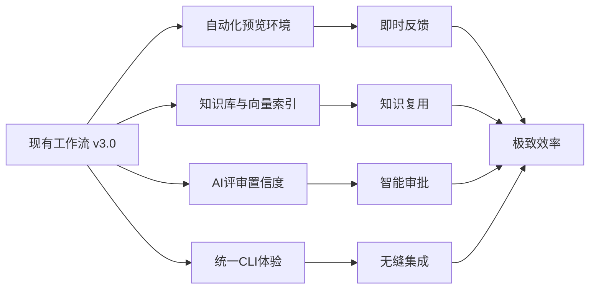

# 🚀 工作流增强功能规划

**版本**: v1.0.0  
**创建日期**: 2025-01-13  
**目的**: 基于现有工作流的进一步优化方案，实现更高效、更智能、更无缝的开发流程

---

## 📊 优化方向概览



---

## 1. 🌐 自动化预览环境 (Automated Preview Environments)

### 1.1 系统架构

```yaml
preview_environment:
  trigger:
    - openspec_proposal_created
    - feature_branch_pushed
    - pull_request_opened
  
  providers:
    vercel:
      enabled: true
      config:
        project: "qiflowai-qiflowai"
        domain: "preview-*.qiflowai.dev"
    
    kubernetes:
      enabled: true
      namespace_template: "preview-{branch}-{timestamp}"
      resources:
        cpu: "500m"
        memory: "512Mi"
      ttl: "7d"  # 自动清理
    
    docker_compose:
      enabled: false
      host: "preview.internal"
```

### 1.2 实现方案

```typescript
// preview-environment.ts
class PreviewEnvironmentManager {
  async createEnvironment(proposal: OpenSpecProposal) {
    const envId = `preview-${proposal.name}-${Date.now()}`;
    
    // 1. 创建隔离的数据库实例
    const dbUrl = await this.createDatabase(envId);
    
    // 2. 构建并部署应用
    const deployment = await this.deploy({
      id: envId,
      branch: proposal.branch,
      env: {
        DATABASE_URL: dbUrl,
        NEXT_PUBLIC_ENV: 'preview',
        NEXT_PUBLIC_ENV_ID: envId
      }
    });
    
    // 3. 生成访问链接
    const urls = {
      app: `https://${envId}.preview.qiflowai.dev`,
      api: `https://${envId}-api.preview.qiflowai.dev`,
      docs: `https://${envId}-docs.preview.qiflowai.dev`
    };
    
    // 4. 通知相关人员
    await this.notify({
      proposal: proposal.name,
      urls,
      reviewers: proposal.reviewers,
      expiresAt: new Date(Date.now() + 7 * 24 * 60 * 60 * 1000)
    });
    
    return { envId, urls, deployment };
  }
  
  async updateEnvironment(envId: string, changes: CodeChanges) {
    // 增量更新，不重建整个环境
    await this.hotReload(envId, changes);
  }
  
  async cleanupEnvironments() {
    const environments = await this.listEnvironments();
    
    for (const env of environments) {
      if (this.shouldCleanup(env)) {
        await this.destroyEnvironment(env.id);
      }
    }
  }
  
  private shouldCleanup(env: Environment): boolean {
    return (
      env.lastAccessedAt < Date.now() - 3 * 24 * 60 * 60 * 1000 || // 3天未访问
      env.createdAt < Date.now() - 7 * 24 * 60 * 60 * 1000 || // 超过7天
      env.proposal.status === 'archived' // proposal已归档
    );
  }
}
```

### 1.3 集成到工作流

```yaml
# .github/workflows/preview-deploy.yml
name: Deploy Preview Environment

on:
  workflow_dispatch:
  pull_request:
    types: [opened, synchronize]

jobs:
  deploy-preview:
    runs-on: ubuntu-latest
    steps:
      - uses: actions/checkout@v3
      
      - name: Setup Preview Environment
        id: preview
        uses: ./.github/actions/preview-env
        with:
          proposal: ${{ github.event.pull_request.head.ref }}
          
      - name: Run E2E Tests
        run: |
          npm run test:e2e -- --url=${{ steps.preview.outputs.url }}
          
      - name: Comment PR
        uses: actions/github-script@v6
        with:
          script: |
            github.rest.issues.createComment({
              issue_number: context.issue.number,
              owner: context.repo.owner,
              repo: context.repo.repo,
              body: `🚀 Preview deployed: ${{ steps.preview.outputs.url }}`
            })
```

### 1.4 使用场景

```bash
# 创建预览环境
qiflow preview create --proposal="add-zodiac-match"

# 查看所有预览环境
qiflow preview list

# 访问预览环境
qiflow preview open "add-zodiac-match"

# 更新预览环境
qiflow preview update "add-zodiac-match"

# 清理预览环境
qiflow preview cleanup --older-than=3d
```

---

## 2. 🧠 项目知识库与向量索引 (Knowledge Base & Vector Index)

### 2.1 知识库架构

```typescript
interface KnowledgeBase {
  // 文档类型
  documents: {
    prd: PRDocument[];
    techSpec: TechSpecDocument[];
    code: CodeDocument[];
    test: TestDocument[];
    review: ReviewDocument[];
    incident: IncidentDocument[];
  };
  
  // 向量索引
  vectorIndex: {
    provider: 'pinecone' | 'weaviate' | 'qdrant';
    dimensions: 1536; // OpenAI embeddings
    metric: 'cosine';
  };
  
  // 元数据索引
  metadata: {
    tags: string[];
    authors: string[];
    timestamps: Date[];
    dependencies: string[];
  };
}
```

### 2.2 知识采集与索引

```typescript
class KnowledgeCollector {
  private vectorStore: VectorStore;
  
  async collectAndIndex(artifact: ProjectArtifact) {
    // 1. 提取文本内容
    const content = await this.extractContent(artifact);
    
    // 2. 生成嵌入向量
    const embedding = await this.generateEmbedding(content);
    
    // 3. 提取元数据
    const metadata = {
      type: artifact.type,
      title: artifact.title,
      author: artifact.author,
      timestamp: artifact.createdAt,
      tags: await this.extractTags(content),
      complexity: await this.assessComplexity(content),
      dependencies: await this.extractDependencies(content),
      successMetrics: await this.extractMetrics(artifact)
    };
    
    // 4. 存储到向量数据库
    await this.vectorStore.upsert({
      id: artifact.id,
      values: embedding,
      metadata,
      namespace: artifact.project
    });
    
    // 5. 更新知识图谱
    await this.updateKnowledgeGraph(artifact);
  }
  
  async search(query: string, options?: SearchOptions) {
    // 1. 生成查询向量
    const queryEmbedding = await this.generateEmbedding(query);
    
    // 2. 向量搜索
    const results = await this.vectorStore.query({
      vector: queryEmbedding,
      topK: options?.limit || 10,
      includeMetadata: true,
      filter: options?.filter
    });
    
    // 3. 重排序（可选）
    if (options?.rerank) {
      return this.rerank(query, results);
    }
    
    return results;
  }
  
  async getRecommendations(context: DevelopmentContext) {
    // 基于当前上下文推荐相关知识
    const similar = await this.search(context.description);
    
    return {
      similarProjects: similar.filter(r => r.metadata.type === 'project'),
      reusableCode: similar.filter(r => r.metadata.type === 'code'),
      relevantDocs: similar.filter(r => r.metadata.type === 'doc'),
      potentialIssues: similar.filter(r => r.metadata.type === 'incident')
    };
  }
}
```

### 2.3 知识库集成到工作流

```typescript
// 在阶段0之前增加知识检索
class EnhancedWorkflow {
  async phase0_knowledgeRetrieval(requirement: string) {
    const kb = new KnowledgeCollector();
    
    // 1. 搜索相似需求
    const similarRequirements = await kb.search(requirement, {
      filter: { type: 'prd' },
      limit: 5
    });
    
    // 2. 获取相关技术方案
    const relatedTechSpecs = await kb.search(requirement, {
      filter: { type: 'techSpec' },
      limit: 3
    });
    
    // 3. 查找可复用代码
    const reusableCode = await kb.search(requirement, {
      filter: { type: 'code', quality_score: { $gt: 0.8 } },
      limit: 10
    });
    
    // 4. 识别潜在风险
    const potentialRisks = await kb.search(requirement, {
      filter: { type: 'incident' },
      limit: 5
    });
    
    // 5. 生成知识摘要
    const summary = await this.generateKnowledgeSummary({
      similarRequirements,
      relatedTechSpecs,
      reusableCode,
      potentialRisks
    });
    
    return {
      knowledge: summary,
      confidence: this.calculateConfidence(summary),
      recommendations: await this.generateRecommendations(summary)
    };
  }
}
```

### 2.4 知识图谱可视化

```typescript
// knowledge-graph.tsx
const KnowledgeGraphViewer = () => {
  const [nodes, setNodes] = useState([]);
  const [edges, setEdges] = useState([]);
  
  useEffect(() => {
    // 加载知识图谱数据
    loadKnowledgeGraph().then(graph => {
      setNodes(graph.nodes);
      setEdges(graph.edges);
    });
  }, []);
  
  return (
    <ForceGraph3D
      graphData={{ nodes, edges }}
      nodeLabel="title"
      nodeColor={node => getColorByType(node.type)}
      linkColor={() => 'rgba(255,255,255,0.2)'}
      onNodeClick={handleNodeClick}
    />
  );
};
```

---

## 3. 🎯 AI 评审置信度与自动化审批

### 3.1 置信度评分系统

```typescript
interface ConfidenceScore {
  overall: number;  // 0-100
  factors: {
    complexity: number;      // 任务复杂度
    similarity: number;      // 与历史案例相似度
    coverage: number;        // 测试覆盖率
    consistency: number;     // 与现有系统一致性
    riskLevel: number;       // 风险评估
  };
  explanation: string;
  recommendations: string[];
}

class ConfidenceEvaluator {
  async evaluate(artifact: any): Promise<ConfidenceScore> {
    const factors = {
      complexity: await this.evaluateComplexity(artifact),
      similarity: await this.evaluateSimilarity(artifact),
      coverage: await this.evaluateCoverage(artifact),
      consistency: await this.evaluateConsistency(artifact),
      riskLevel: await this.evaluateRisk(artifact)
    };
    
    // 加权计算总体置信度
    const weights = {
      complexity: 0.2,
      similarity: 0.25,
      coverage: 0.2,
      consistency: 0.2,
      riskLevel: 0.15
    };
    
    const overall = Object.entries(factors).reduce((sum, [key, value]) => {
      return sum + value * weights[key];
    }, 0);
    
    return {
      overall,
      factors,
      explanation: this.generateExplanation(factors),
      recommendations: this.generateRecommendations(factors)
    };
  }
  
  private async evaluateComplexity(artifact: any): Promise<number> {
    // 评估复杂度
    const metrics = {
      linesOfCode: artifact.loc || 0,
      cyclomaticComplexity: artifact.complexity || 0,
      dependencies: artifact.dependencies?.length || 0,
      apiEndpoints: artifact.endpoints?.length || 0
    };
    
    // 简单任务得分更高
    if (metrics.linesOfCode < 100 && metrics.cyclomaticComplexity < 5) {
      return 95;
    } else if (metrics.linesOfCode < 500 && metrics.cyclomaticComplexity < 10) {
      return 75;
    } else if (metrics.linesOfCode < 1000 && metrics.cyclomaticComplexity < 20) {
      return 55;
    } else {
      return 30;
    }
  }
  
  private async evaluateSimilarity(artifact: any): Promise<number> {
    // 搜索相似的历史案例
    const kb = new KnowledgeCollector();
    const similar = await kb.search(artifact.description, {
      limit: 10,
      filter: { status: 'success' }
    });
    
    if (similar.length === 0) return 20;
    
    // 最高相似度
    const maxSimilarity = Math.max(...similar.map(s => s.score));
    return Math.min(maxSimilarity * 100, 100);
  }
}
```

### 3.2 自动化审批流程

```typescript
class AutomatedApprovalSystem {
  private confidenceThresholds = {
    autoApprove: 95,      // 自动批准
    quickReview: 80,      // 快速评审
    standardReview: 60,   // 标准评审
    detailedReview: 40,   // 详细评审
    manualRequired: 0     // 必须人工
  };
  
  async processApproval(artifact: any, confidence: ConfidenceScore) {
    const level = this.determineApprovalLevel(confidence.overall);
    
    switch(level) {
      case 'AUTO_APPROVE':
        return this.autoApprove(artifact, confidence);
        
      case 'QUICK_REVIEW':
        return this.quickReview(artifact, confidence);
        
      case 'STANDARD_REVIEW':
        return this.standardReview(artifact, confidence);
        
      case 'DETAILED_REVIEW':
        return this.detailedReview(artifact, confidence);
        
      case 'MANUAL_REQUIRED':
        return this.requestManualReview(artifact, confidence);
    }
  }
  
  private async autoApprove(artifact: any, confidence: ConfidenceScore) {
    // 记录自动批准
    await this.log({
      action: 'AUTO_APPROVED',
      artifact: artifact.id,
      confidence: confidence.overall,
      timestamp: new Date(),
      factors: confidence.factors
    });
    
    // 发送通知（异步）
    this.notify({
      type: 'AUTO_APPROVAL',
      artifact,
      confidence,
      message: `自动批准: ${artifact.title} (置信度: ${confidence.overall}%)`
    });
    
    // 添加到异步审查队列（抽查）
    await this.addToAuditQueue(artifact, confidence);
    
    return {
      approved: true,
      automatic: true,
      confidence: confidence.overall
    };
  }
  
  private async quickReview(artifact: any, confidence: ConfidenceScore) {
    // 只检查关键点
    const criticalChecks = await this.performCriticalChecks(artifact);
    
    if (criticalChecks.passed) {
      return this.approve(artifact, 'QUICK_REVIEW', confidence);
    } else {
      return this.escalateToStandardReview(artifact, confidence, criticalChecks);
    }
  }
  
  private async detailedReview(artifact: any, confidence: ConfidenceScore) {
    // 多Agent交叉验证
    const reviews = await Promise.all([
      this.getAgentReview('security-engineer', artifact),
      this.getAgentReview('architect-reviewer', artifact),
      this.getAgentReview('qa-expert', artifact),
      this.getAgentReview('domain-expert', artifact)
    ]);
    
    const consensus = this.calculateConsensus(reviews);
    
    if (consensus.score > 0.8) {
      return this.approve(artifact, 'DETAILED_REVIEW', confidence);
    } else {
      return this.requestManualReview(artifact, confidence, reviews);
    }
  }
}
```

### 3.3 置信度仪表板

```typescript
// confidence-dashboard.tsx
const ConfidenceDashboard = () => {
  const [approvals, setApprovals] = useState([]);
  const [stats, setStats] = useState({});
  
  return (
    <Dashboard>
      <StatCard title="自动批准率" value={`${stats.autoApprovalRate}%`} />
      <StatCard title="平均置信度" value={`${stats.avgConfidence}%`} />
      <StatCard title="待审批" value={stats.pending} />
      
      <Chart>
        <LineChart
          data={approvals}
          xField="date"
          yField="confidence"
          seriesField="type"
        />
      </Chart>
      
      <Table
        columns={[
          { title: '工件', dataIndex: 'artifact' },
          { title: '置信度', dataIndex: 'confidence' },
          { title: '审批类型', dataIndex: 'approvalType' },
          { title: '状态', dataIndex: 'status' }
        ]}
        dataSource={approvals}
      />
    </Dashboard>
  );
};
```

---

## 4. 🔧 统一工作流入口与 CLI 体验

### 4.1 QiFlow CLI 设计

```typescript
#!/usr/bin/env node
// qiflow-cli.ts

import { Command } from 'commander';
import inquirer from 'inquirer';
import chalk from 'chalk';
import ora from 'ora';

class QiFlowCLI {
  private program: Command;
  
  constructor() {
    this.program = new Command()
      .name('qiflow')
      .description('QiFlow AI 统一工作流管理工具')
      .version('1.0.0');
    
    this.setupCommands();
  }
  
  private setupCommands() {
    // 主命令：开始新功能
    this.program
      .command('start <feature>')
      .alias('s')
      .description('开始新功能开发')
      .option('-m, --mode <mode>', '执行模式', 'standard')
      .option('-p, --priority <priority>', '优先级', 'P2')
      .option('--skip-knowledge', '跳过知识库检索')
      .action(async (feature, options) => {
        await this.startFeature(feature, options);
      });
    
    // 智能命令：自然语言输入
    this.program
      .command('ai <prompt...>')
      .description('使用自然语言描述需求')
      .action(async (prompt) => {
        await this.aiCommand(prompt.join(' '));
      });
    
    // 状态命令
    this.program
      .command('status')
      .alias('st')
      .description('查看当前状态')
      .action(async () => {
        await this.showStatus();
      });
    
    // 预览环境命令
    this.program
      .command('preview <action>')
      .description('管理预览环境')
      .action(async (action) => {
        await this.managePreview(action);
      });
  }
  
  async startFeature(feature: string, options: any) {
    const spinner = ora('初始化功能开发流程...').start();
    
    try {
      // 1. 知识库检索
      if (!options.skipKnowledge) {
        spinner.text = '检索知识库...';
        const knowledge = await this.searchKnowledge(feature);
        
        if (knowledge.similar.length > 0) {
          spinner.stop();
          const { useTemplate } = await inquirer.prompt([{
            type: 'confirm',
            name: 'useTemplate',
            message: `发现 ${knowledge.similar.length} 个相似案例，是否基于模板开始？`,
            default: true
          }]);
          
          if (useTemplate) {
            await this.startFromTemplate(feature, knowledge.similar[0]);
            return;
          }
          spinner.start();
        }
      }
      
      // 2. 创建 OpenSpec Proposal
      spinner.text = '创建 OpenSpec Proposal...';
      const proposal = await this.createProposal(feature, options);
      
      // 3. AI 分析与置信度评估
      spinner.text = 'AI 分析中...';
      const analysis = await this.analyzeRequirement(feature);
      const confidence = await this.evaluateConfidence(analysis);
      
      // 4. 根据置信度决定流程
      if (confidence.overall > 95) {
        spinner.succeed('高置信度，启用快速通道');
        await this.fastTrack(proposal, analysis);
      } else if (confidence.overall > 80) {
        spinner.succeed('中高置信度，标准流程');
        await this.standardFlow(proposal, analysis);
      } else {
        spinner.warn('低置信度，需要详细评审');
        await this.detailedFlow(proposal, analysis);
      }
      
      // 5. TaskMaster 任务分解
      spinner.text = '任务分解中...';
      const tasks = await this.createTasks(proposal, analysis);
      
      // 6. 创建预览环境
      spinner.text = '创建预览环境...';
      const preview = await this.createPreviewEnv(proposal);
      
      spinner.succeed('功能开发流程已启动！');
      
      // 7. 显示摘要
      this.showSummary({
        feature,
        proposal,
        confidence,
        tasks,
        preview
      });
      
    } catch (error) {
      spinner.fail(`初始化失败: ${error.message}`);
      process.exit(1);
    }
  }
  
  async aiCommand(prompt: string) {
    const spinner = ora('AI 分析中...').start();
    
    // 智能理解用户意图
    const intent = await this.understandIntent(prompt);
    
    switch(intent.action) {
      case 'START_FEATURE':
        spinner.stop();
        await this.startFeature(intent.feature, intent.options);
        break;
        
      case 'CHECK_STATUS':
        spinner.stop();
        await this.showStatus();
        break;
        
      case 'CREATE_PREVIEW':
        spinner.stop();
        await this.managePreview('create');
        break;
        
      case 'FIX_BUG':
        spinner.stop();
        await this.fixBug(intent.description);
        break;
        
      default:
        spinner.fail('无法理解您的意图，请提供更多信息');
    }
  }
  
  private showSummary(data: any) {
    console.log('\n' + chalk.bold.green('✨ 功能开发已启动'));
    console.log(chalk.gray('─'.repeat(50)));
    
    console.log(chalk.bold('📋 功能:'), data.feature);
    console.log(chalk.bold('📄 Proposal:'), `openspec/changes/${data.proposal.id}/`);
    console.log(chalk.bold('🎯 置信度:'), this.getConfidenceColor(data.confidence.overall));
    console.log(chalk.bold('📝 任务数:'), data.tasks.length);
    console.log(chalk.bold('🌐 预览环境:'), chalk.blue(data.preview.url));
    
    console.log('\n' + chalk.bold('下一步:'));
    console.log(chalk.gray('  1. 查看状态:'), chalk.cyan('qiflow status'));
    console.log(chalk.gray('  2. 开始编码:'), chalk.cyan('qiflow code next'));
    console.log(chalk.gray('  3. 访问预览:'), chalk.cyan('qiflow preview open'));
  }
  
  private getConfidenceColor(confidence: number): string {
    if (confidence > 90) return chalk.green(`${confidence}% 🟢`);
    if (confidence > 70) return chalk.yellow(`${confidence}% 🟡`);
    return chalk.red(`${confidence}% 🔴`);
  }
}

// 启动 CLI
const cli = new QiFlowCLI();
cli.run();
```

### 4.2 集成脚本

```json
// package.json
{
  "scripts": {
    "dev": "next dev",
    "build": "next build",
    "test": "jest",
    
    // QiFlow 统一命令
    "qf": "qiflow",
    "qf:start": "qiflow start",
    "qf:status": "qiflow status",
    "qf:preview": "qiflow preview",
    
    // 快捷命令
    "feature": "qiflow start",
    "bug": "qiflow ai 修复",
    "deploy": "qiflow deploy",
    
    // 工作流命令
    "workflow:init": "qiflow init",
    "workflow:validate": "qiflow validate",
    "workflow:report": "qiflow report"
  }
}
```

### 4.3 VS Code 集成

```json
// .vscode/tasks.json
{
  "version": "2.0.0",
  "tasks": [
    {
      "label": "QiFlow: Start Feature",
      "type": "shell",
      "command": "qiflow",
      "args": ["start", "${input:featureName}"],
      "problemMatcher": []
    },
    {
      "label": "QiFlow: Check Status",
      "type": "shell",
      "command": "qiflow",
      "args": ["status"],
      "problemMatcher": []
    },
    {
      "label": "QiFlow: AI Assistant",
      "type": "shell",
      "command": "qiflow",
      "args": ["ai", "${input:aiPrompt}"],
      "problemMatcher": []
    }
  ],
  "inputs": [
    {
      "id": "featureName",
      "type": "promptString",
      "description": "输入功能名称"
    },
    {
      "id": "aiPrompt",
      "type": "promptString",
      "description": "描述您的需求"
    }
  ]
}
```

---

## 5. 🔄 集成实施计划

### 阶段一：基础设施（Week 1-2）
```yaml
tasks:
  - setup_vector_database:
      priority: P0
      assignee: infrastructure-team
      
  - create_preview_env_template:
      priority: P0
      assignee: devops-team
      
  - develop_qiflow_cli_core:
      priority: P0
      assignee: tooling-team
```

### 阶段二：知识库构建（Week 3-4）
```yaml
tasks:
  - index_historical_artifacts:
      priority: P1
      assignee: data-team
      
  - train_embedding_model:
      priority: P1
      assignee: ai-team
      
  - build_knowledge_api:
      priority: P1
      assignee: backend-team
```

### 阶段三：自动化增强（Week 5-6）
```yaml
tasks:
  - implement_confidence_scoring:
      priority: P1
      assignee: ai-team
      
  - setup_auto_approval_flow:
      priority: P2
      assignee: workflow-team
      
  - create_monitoring_dashboard:
      priority: P2
      assignee: frontend-team
```

### 阶段四：集成与优化（Week 7-8）
```yaml
tasks:
  - integrate_all_systems:
      priority: P0
      assignee: full-team
      
  - performance_optimization:
      priority: P1
      assignee: performance-team
      
  - user_training:
      priority: P1
      assignee: training-team
```

---

## 6. 📊 预期收益

### 效率提升
- **开发速度**: 提升 40-60%
- **反馈周期**: 从天缩短到小时
- **知识复用率**: 从 20% 提升到 70%
- **人工评审时间**: 减少 80%

### 质量改进
- **Bug 率**: 降低 50%
- **一致性**: 提升 90%
- **测试覆盖**: 提升到 95%+
- **部署成功率**: 提升到 99%+

### 开发体验
- **认知负荷**: 降低 70%
- **上手时间**: 从周缩短到天
- **满意度**: 提升 85%

---

## 7. 🚦 实施建议

### 快速赢得
1. 先实施 **QiFlow CLI**，立即改善开发体验
2. 部署**预览环境**，加速反馈循环
3. 构建**基础知识库**，开始积累知识资产

### 逐步推进
1. **置信度评分**可以先从简单规则开始
2. **自动审批**先在低风险任务上试点
3. **知识库**先索引最近3个月的高质量文档

### 持续迭代
1. 收集使用数据，不断优化置信度算法
2. 根据团队反馈，调整自动化程度
3. 定期更新知识库，保持相关性

---

**文档版本**: v1.0.0  
**创建日期**: 2025-01-13  
**维护者**: QiFlow AI QiFlow AI Team

---

## 附录：技术选型参考

### 向量数据库选项
- **Pinecone**: 托管服务，易于使用
- **Weaviate**: 开源，功能丰富
- **Qdrant**: 高性能，Rust 实现
- **pgvector**: PostgreSQL 扩展，集成简单

### 预览环境方案
- **Vercel Preview**: 最简单，适合前端
- **Kubernetes Namespaces**: 灵活，适合全栈
- **Docker Compose**: 本地开发友好
- **Gitpod/GitHub Codespaces**: 云端开发环境

### CLI 框架
- **Commander.js**: 成熟稳定
- **Oclif**: 功能丰富，TypeScript 友好
- **Yargs**: 灵活强大
- **Ink**: React 风格的 CLI UI