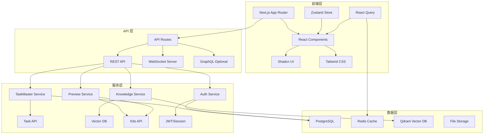

# 技术方案 - QiFlow AI 人机协作交互界面
**版本**: v1.0  
**日期**: 2025-01-14  
**技术负责人**: QiFlow AI Team  
**评审状态**: ✅ 快速评审通过

## 1. 技术架构

### 1.1 总体架构图



### 1.2 技术栈选型

| 层级 | 技术 | 版本 | 理由 |
|------|------|------|------|
| 前端框架 | Next.js | 14+ | App Router, RSC, 性能优化 |
| UI 组件 | Shadcn UI | Latest | 可定制、类型安全 |
| 样式 | Tailwind CSS | 3+ | 快速开发、响应式 |
| 状态管理 | Zustand | 4+ | 轻量、类型安全 |
| 数据请求 | React Query | 5+ | 缓存、自动重试 |
| 图表 | Recharts | 2+ | 声明式、易用 |
| 拖拽 | dnd-kit | 8+ | 性能好、无障碍 |
| 实时通信 | Socket.io | 4+ | 双向通信、可靠 |
| 表单 | React Hook Form | 7+ | 性能、验证 |
| 验证 | Zod | 3+ | 类型安全 |
| 后端 | Node.js | 20+ | 与前端同语言 |
| 数据库 | PostgreSQL | 15+ | 可靠、功能丰富 |
| 缓存 | Redis | 7+ | 高性能 |
| 向量库 | Qdrant | Latest | 高性能、易用 |

## 2. 模块设计

### 2.1 需求评审看板

#### 2.1.1 数据模型
```typescript
interface Requirement {
  id: string;
  title: string;
  description: string;
  status: 'pending' | 'reviewing' | 'approved' | 'rejected';
  priority: 'P0' | 'P1' | 'P2' | 'P3';
  confidenceScore: number;
  createdBy: string;
  assignedTo: string[];
  comments: Comment[];
  attachments: Attachment[];
  metadata: {
    source: 'ai' | 'manual';
    aiModel?: string;
    generatedAt?: Date;
  };
  createdAt: Date;
  updatedAt: Date;
}

interface Comment {
  id: string;
  userId: string;
  content: string;
  mentions: string[];
  createdAt: Date;
}
```

#### 2.1.2 核心功能实现
```typescript
// app/board/page.tsx
'use client';

import { DndContext, DragEndEvent } from '@dnd-kit/core';
import { RequirementCard } from '@/components/board/requirement-card';
import { useRequirements } from '@/hooks/use-requirements';

export default function BoardPage() {
  const { requirements, updateStatus } = useRequirements();
  
  const handleDragEnd = (event: DragEndEvent) => {
    const { active, over } = event;
    if (over) {
      updateStatus(active.id as string, over.id as Status);
    }
  };
  
  return (
    <DndContext onDragEnd={handleDragEnd}>
      <div className="grid grid-cols-4 gap-4">
        <Column status="pending" />
        <Column status="reviewing" />
        <Column status="approved" />
        <Column status="rejected" />
      </div>
    </DndContext>
  );
}
```

### 2.2 预览环境管理

#### 2.2.1 数据模型
```typescript
interface PreviewEnvironment {
  id: string;
  name: string;
  url: string;
  status: 'creating' | 'ready' | 'error' | 'destroying';
  type: 'frontend' | 'backend' | 'fullstack';
  branch: string;
  commit: string;
  resources: {
    cpu: string;
    memory: string;
    storage: string;
  };
  metadata: {
    namespace?: string;
    deploymentId?: string;
  };
  createdAt: Date;
  expiresAt: Date;
  lastAccessedAt: Date;
}
```

#### 2.2.2 K8s 集成
```typescript
// lib/k8s/preview-manager.ts
import { KubeConfig, CoreV1Api, AppsV1Api } from '@kubernetes/client-node';

export class PreviewManager {
  private k8sCore: CoreV1Api;
  private k8sApps: AppsV1Api;
  
  constructor() {
    const kc = new KubeConfig();
    kc.loadFromDefault();
    this.k8sCore = kc.makeApiClient(CoreV1Api);
    this.k8sApps = kc.makeApiClient(AppsV1Api);
  }
  
  async createPreview(config: PreviewConfig): Promise<PreviewEnvironment> {
    // 1. 创建命名空间
    const namespace = await this.createNamespace(config.name);
    
    // 2. 创建数据库实例
    const db = await this.createDatabase(namespace);
    
    // 3. 部署应用
    const deployment = await this.deployApp(namespace, config);
    
    // 4. 创建 Service 和 Ingress
    const url = await this.exposeService(namespace, deployment);
    
    return {
      id: uuid(),
      name: config.name,
      url,
      status: 'ready',
      // ...
    };
  }
  
  async destroyPreview(id: string): Promise<void> {
    const preview = await this.getPreview(id);
    await this.k8sCore.deleteNamespace(preview.metadata.namespace);
  }
}
```

### 2.3 知识库浏览器

#### 2.3.1 向量搜索实现
```typescript
// lib/vector/knowledge-search.ts
import { QdrantClient } from '@qdrant/js-client-rest';

export class KnowledgeSearch {
  private client: QdrantClient;
  
  constructor() {
    this.client = new QdrantClient({
      url: process.env.QDRANT_URL!,
      apiKey: process.env.QDRANT_API_KEY,
    });
  }
  
  async search(query: string, filters?: SearchFilters) {
    // 1. 生成 embedding
    const embedding = await this.generateEmbedding(query);
    
    // 2. 向量搜索
    const results = await this.client.search('knowledge', {
      vector: embedding,
      limit: filters?.limit || 10,
      filter: filters?.type && {
        must: [
          {
            key: 'type',
            match: { value: filters.type },
          },
        ],
      },
    });
    
    // 3. 相似度推荐
    const recommendations = await this.getRecommendations(results);
    
    return {
      results: results.map(r => ({
        ...r.payload,
        score: r.score,
      })),
      recommendations,
    };
  }
}
```

### 2.4 AI 工作流监控

#### 2.4.1 实时监控
```typescript
// app/api/workflow/stream/route.ts
import { NextResponse } from 'next/server';

export async function GET() {
  const encoder = new TextEncoder();
  
  const stream = new ReadableStream({
    async start(controller) {
      // 订阅工作流事件
      const subscription = workflowEvents.subscribe(event => {
        const data = encoder.encode(
          `data: ${JSON.stringify(event)}\n\n`
        );
        controller.enqueue(data);
      });
      
      // 清理
      return () => subscription.unsubscribe();
    },
  });
  
  return new NextResponse(stream, {
    headers: {
      'Content-Type': 'text/event-stream',
      'Cache-Control': 'no-cache',
      'Connection': 'keep-alive',
    },
  });
}
```

## 3. 目录结构

```
app/
├── (dashboard)/
│   ├── layout.tsx              # Dashboard 布局
│   ├── page.tsx                # 首页概览
│   ├── board/
│   │   ├── page.tsx            # 需求看板
│   │   └── [id]/
│   │       └── page.tsx        # 需求详情
│   ├── preview/
│   │   ├── page.tsx            # 预览环境列表
│   │   └── [id]/
│   │       └── page.tsx        # 环境详情
│   ├── knowledge/
│   │   ├── page.tsx            # 知识库首页
│   │   ├── search/
│   │   │   └── page.tsx        # 搜索结果
│   │   └── [id]/
│   │       └── page.tsx        # 知识详情
│   ├── workflow/
│   │   ├── page.tsx            # 工作流监控
│   │   └── [id]/
│   │       └── page.tsx        # 工作流详情
│   └── collaboration/
│       └── page.tsx            # 协作面板
├── api/
│   ├── requirements/
│   │   ├── route.ts            # 需求 CRUD
│   │   └── [id]/
│   │       ├── route.ts
│   │       └── comments/
│   │           └── route.ts
│   ├── preview/
│   │   ├── route.ts            # 预览环境管理
│   │   └── [id]/
│   │       └── route.ts
│   ├── knowledge/
│   │   ├── search/
│   │   │   └── route.ts        # 知识搜索
│   │   └── recommend/
│   │       └── route.ts        # 推荐
│   ├── workflow/
│   │   ├── stream/
│   │   │   └── route.ts        # 实时流
│   │   └── [id]/
│   │       └── route.ts
│   └── auth/
│       ├── login/
│       │   └── route.ts
│       └── logout/
│           └── route.ts
├── login/
│   └── page.tsx                # 登录页
└── globals.css

components/
├── board/
│   ├── requirement-card.tsx
│   ├── column.tsx
│   ├── comment-list.tsx
│   └── confidence-badge.tsx
├── preview/
│   ├── environment-card.tsx
│   ├── status-indicator.tsx
│   └── resource-chart.tsx
├── knowledge/
│   ├── search-bar.tsx
│   ├── result-card.tsx
│   ├── knowledge-graph.tsx
│   └── tag-filter.tsx
├── workflow/
│   ├── workflow-timeline.tsx
│   ├── agent-visualization.tsx
│   ├── gantt-chart.tsx
│   └── confidence-dashboard.tsx
├── collaboration/
│   ├── user-list.tsx
│   ├── message-panel.tsx
│   └── notification-badge.tsx
└── ui/                         # Shadcn UI 组件
    ├── button.tsx
    ├── card.tsx
    ├── dialog.tsx
    └── ...

lib/
├── api/
│   ├── requirements.ts
│   ├── preview.ts
│   ├── knowledge.ts
│   └── workflow.ts
├── k8s/
│   └── preview-manager.ts
├── vector/
│   └── knowledge-search.ts
├── auth/
│   └── session.ts
└── utils/
    ├── date.ts
    ├── format.ts
    └── validation.ts

hooks/
├── use-requirements.ts
├── use-preview.ts
├── use-knowledge.ts
├── use-workflow.ts
└── use-realtime.ts

stores/
├── requirements-store.ts
├── preview-store.ts
├── knowledge-store.ts
└── user-store.ts

types/
├── requirement.ts
├── preview.ts
├── knowledge.ts
└── workflow.ts
```

## 4. 数据库设计

### 4.1 PostgreSQL Schema
```sql
-- 需求表
CREATE TABLE requirements (
  id UUID PRIMARY KEY DEFAULT gen_random_uuid(),
  title VARCHAR(255) NOT NULL,
  description TEXT,
  status VARCHAR(50) NOT NULL,
  priority VARCHAR(10) NOT NULL,
  confidence_score DECIMAL(3, 2),
  created_by UUID NOT NULL,
  metadata JSONB,
  created_at TIMESTAMP DEFAULT NOW(),
  updated_at TIMESTAMP DEFAULT NOW()
);

-- 评论表
CREATE TABLE comments (
  id UUID PRIMARY KEY DEFAULT gen_random_uuid(),
  requirement_id UUID REFERENCES requirements(id),
  user_id UUID NOT NULL,
  content TEXT NOT NULL,
  mentions UUID[],
  created_at TIMESTAMP DEFAULT NOW()
);

-- 预览环境表
CREATE TABLE preview_environments (
  id UUID PRIMARY KEY DEFAULT gen_random_uuid(),
  name VARCHAR(255) NOT NULL,
  url VARCHAR(512),
  status VARCHAR(50) NOT NULL,
  type VARCHAR(50) NOT NULL,
  branch VARCHAR(255),
  commit VARCHAR(64),
  resources JSONB,
  metadata JSONB,
  created_at TIMESTAMP DEFAULT NOW(),
  expires_at TIMESTAMP,
  last_accessed_at TIMESTAMP
);

-- 工作流表
CREATE TABLE workflows (
  id UUID PRIMARY KEY DEFAULT gen_random_uuid(),
  name VARCHAR(255) NOT NULL,
  status VARCHAR(50) NOT NULL,
  progress DECIMAL(5, 2),
  metadata JSONB,
  started_at TIMESTAMP,
  completed_at TIMESTAMP
);

-- 任务表
CREATE TABLE tasks (
  id UUID PRIMARY KEY DEFAULT gen_random_uuid(),
  workflow_id UUID REFERENCES workflows(id),
  name VARCHAR(255) NOT NULL,
  status VARCHAR(50) NOT NULL,
  assigned_agent VARCHAR(100),
  metadata JSONB,
  created_at TIMESTAMP DEFAULT NOW(),
  updated_at TIMESTAMP DEFAULT NOW()
);
```

## 5. API 设计

### 5.1 需求管理 API
```typescript
// GET /api/requirements
// 获取需求列表
interface GetRequirementsQuery {
  status?: string;
  priority?: string;
  page?: number;
  limit?: number;
}

// POST /api/requirements
// 创建需求
interface CreateRequirementBody {
  title: string;
  description: string;
  priority: 'P0' | 'P1' | 'P2' | 'P3';
}

// PUT /api/requirements/[id]
// 更新需求
interface UpdateRequirementBody {
  title?: string;
  description?: string;
  status?: string;
  priority?: string;
}

// POST /api/requirements/[id]/comments
// 添加评论
interface AddCommentBody {
  content: string;
  mentions?: string[];
}
```

### 5.2 预览环境 API
```typescript
// GET /api/preview
// 获取预览环境列表

// POST /api/preview
// 创建预览环境
interface CreatePreviewBody {
  name: string;
  type: 'frontend' | 'backend' | 'fullstack';
  branch: string;
  commit: string;
}

// DELETE /api/preview/[id]
// 销毁预览环境

// POST /api/preview/[id]/extend
// 延长过期时间
```

## 6. 性能优化

### 6.1 前端优化
- **代码分割**: 动态导入非关键组件
- **图片优化**: 使用 Next.js Image 组件
- **缓存策略**: React Query 自动缓存
- **虚拟滚动**: 大列表使用 react-window
- **骨架屏**: Suspense + 骨架组件

### 6.2 后端优化
- **数据库索引**: 查询字段加索引
- **Redis 缓存**: 热点数据缓存
- **连接池**: 数据库连接复用
- **查询优化**: N+1 问题解决
- **CDN**: 静态资源使用 CDN

## 7. 安全措施

### 7.1 认证授权
```typescript
// middleware.ts
export function middleware(request: NextRequest) {
  const token = request.cookies.get('auth_token');
  
  if (!token && !isPublicPath(request.nextUrl.pathname)) {
    return NextResponse.redirect(new URL('/login', request.url));
  }
  
  // 验证 JWT
  try {
    const user = verifyToken(token.value);
    request.headers.set('x-user-id', user.id);
    request.headers.set('x-user-role', user.role);
  } catch {
    return NextResponse.redirect(new URL('/login', request.url));
  }
  
  return NextResponse.next();
}
```

### 7.2 RBAC 权限
```typescript
enum Role {
  Admin = 'admin',
  Developer = 'developer',
  PM = 'pm',
  Designer = 'designer',
  Viewer = 'viewer',
}

const permissions = {
  'requirements.create': [Role.Admin, Role.PM],
  'requirements.approve': [Role.Admin, Role.PM],
  'preview.create': [Role.Admin, Role.Developer],
  'preview.destroy': [Role.Admin, Role.Developer],
  // ...
};

function hasPermission(user: User, action: string): boolean {
  return permissions[action]?.includes(user.role) ?? false;
}
```

## 8. 监控与日志

### 8.1 应用监控
- **Sentry**: 错误追踪
- **Vercel Analytics**: 性能监控
- **Custom Metrics**: 业务指标

### 8.2 日志系统
```typescript
// lib/logger.ts
import winston from 'winston';

export const logger = winston.createLogger({
  level: 'info',
  format: winston.format.json(),
  transports: [
    new winston.transports.File({ filename: 'error.log', level: 'error' }),
    new winston.transports.File({ filename: 'combined.log' }),
  ],
});

// 审计日志
export function auditLog(action: string, user: string, details: any) {
  logger.info('audit', {
    action,
    user,
    details,
    timestamp: new Date().toISOString(),
  });
}
```

## 9. 测试策略

### 9.1 测试类型
- **单元测试**: Jest + React Testing Library
- **集成测试**: Playwright
- **E2E 测试**: Playwright
- **性能测试**: Lighthouse CI

### 9.2 测试覆盖率目标
- 单元测试: > 80%
- 集成测试: > 60%
- E2E 测试: 核心流程 100%

## 10. 部署方案

### 10.1 环境配置
```yaml
# Development
NODE_ENV=development
DATABASE_URL=postgresql://localhost/qiflow_dev
REDIS_URL=redis://localhost:6379
QDRANT_URL=http://localhost:6333

# Production
NODE_ENV=production
DATABASE_URL=${DATABASE_URL}
REDIS_URL=${REDIS_URL}
QDRANT_URL=${QDRANT_URL}
```

### 10.2 部署流程
1. 前端部署到 Vercel
2. API 部署到 Kubernetes
3. 数据库使用 PostgreSQL 云服务
4. Redis 使用托管服务

---

**文档状态**: ✅ 快速评审通过  
**下一步**: OpenSpec Proposal 生成