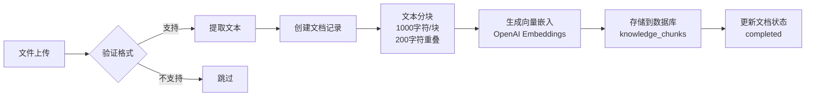

# 知识库文件格式支持

## 概述

QiFlow AI 知识库管理系统支持多种文件格式的文档上传和向量化处理。

## 支持的文件格式

### 文本格式
- **`.txt`** - 纯文本文件
  - 直接读取原始文本内容
  - 适合：FAQ、术语表、简单文档
  
- **`.md`** - Markdown 文件
  - 保留格式化标记
  - 适合：技术文档、教程、说明书

### 结构化数据
- **`.json`** - JSON 文件
  - 自动格式化（缩进2空格）
  - 解析失败时回退到原始文本
  - 适合：配置数据、结构化知识库

### 办公文档
- **`.pdf`** - PDF 文档
  - 使用 `pdf-parse` 库提取文本
  - 支持文本型PDF（扫描版需要OCR，暂不支持）
  - 适合：研究论文、正式报告、电子书
  
- **`.docx`** - Word 2007+ 文档
  - 使用 `mammoth` 库提取原始文本
  - 保留段落结构，去除格式
  - 适合：报告、文章、长文档
  
- **`.doc`** - Word 97-2003 文档
  - 同样使用 `mammoth` 处理
  - 兼容性较 `.docx` 略差
  - 建议转换为 `.docx` 后上传

## 技术实现

### 依赖库
```json
{
  "pdf-parse": "^1.1.1",
  "mammoth": "^1.6.0"
}
```

### 文本提取函数
`extractTextContent(file: File): Promise<string>`

根据文件扩展名自动选择合适的解析方法：
1. PDF → `pdfParse(buffer)`
2. DOCX/DOC → `mammoth.extractRawText({ buffer })`
3. JSON → `JSON.stringify(json, null, 2)`
4. 其他 → `file.text()`

### 文件大小限制
- 建议单文件 < 10MB
- 批量上传建议 < 50MB
- 超大文件可能导致处理超时

## 使用指南

### Web 界面上传
1. 访问 `/admin/knowledge` 管理页面
2. 选择一个或多个文件（支持批量）
3. 选择文档分类（或自定义）
4. 点击"开始上传"
5. 等待处理完成（状态显示："等待中" → "处理中" → "已完成"）

### CLI 脚本上传
```bash
# 上传单个文件
npx tsx scripts/ingest-knowledge-base.ts \
  --file docs/manual.pdf \
  --category fengshui

# 批量上传目录
npx tsx scripts/ingest-knowledge-base.ts \
  --dir docs/bazi/ \
  --category bazi

# 预估成本（不实际上传）
npx tsx scripts/ingest-knowledge-base.ts \
  --file large-book.pdf \
  --dry-run
```

## 成本估算

使用 OpenAI `text-embedding-3-small` 模型：
- 每 1M tokens ≈ $0.02
- 中文：1000字符 ≈ 2000 tokens
- 英文：1000单词 ≈ 750 tokens

示例：
- 10页PDF（约5000字符）≈ 10,000 tokens ≈ $0.0002
- 100页PDF（约50,000字符）≈ 100,000 tokens ≈ $0.002
- 500页书籍（约250,000字符）≈ 500,000 tokens ≈ $0.01

## 处理流程



## 注意事项

### PDF 文件
- ✅ 文本型PDF（可复制文字）
- ❌ 扫描版PDF（需要OCR）
- ✅ 表格内容会被线性化
- ⚠️ 复杂排版可能影响顺序

### Word 文档
- ✅ 文字、段落、列表
- ❌ 图片、图表说明
- ❌ 页眉、页脚、脚注
- ⚠️ 表格转为文本行

### JSON 文件
- 建议格式化良好
- 避免过深嵌套（影响可读性）
- 可用于结构化FAQ

## 错误处理

### 常见错误
| 错误信息 | 原因 | 解决方案 |
|---------|------|---------|
| `Skipping unsupported file` | 文件格式不支持 | 检查文件扩展名 |
| `Failed to parse PDF` | PDF损坏或加密 | 使用PDF编辑器修复 |
| `mammoth extraction failed` | Word文档损坏 | 重新保存为新文件 |
| `OPENAI_API_KEY not configured` | API密钥缺失 | 配置环境变量 |

### 日志查看
```bash
# 查看上传日志
tail -f logs/knowledge-upload.log

# 查看API错误
grep "Knowledge upload error" logs/app.log
```

## 最佳实践

1. **文件准备**
   - 清理多余格式
   - 删除图片（目前不处理）
   - 合并相关章节

2. **分类规划**
   - 使用预设分类（bazi、fengshui等）
   - 自定义分类用于特殊知识域
   - 避免过于细碎的分类

3. **批量上传**
   - 按主题分组上传
   - 单次不超过20个文件
   - 大文件单独上传

4. **质量检查**
   - 上传后检查chunk_count（块数量）
   - 测试向量检索效果
   - 必要时调整分块参数

## API 端点

### 上传
```typescript
POST /api/admin/knowledge/upload
Content-Type: multipart/form-data

FormData: {
  category: string,
  files: File[]
}
```

### 列表
```typescript
GET /api/admin/knowledge/list
Response: {
  success: boolean,
  documents: KnowledgeDocument[]
}
```

### 删除
```typescript
POST /api/admin/knowledge/delete
Content-Type: application/json

Body: {
  documentId: string
}
```

## 未来计划

- [ ] OCR支持（扫描版PDF）
- [ ] PPT/PPTX格式支持
- [ ] HTML网页导入
- [ ] RTF格式支持
- [ ] 图片描述生成（GPT-4 Vision）
- [ ] 自动摘要生成
- [ ] 重复内容检测

## 更新日志

### v5.1.1 (2024-01-13)
- ✨ 新增：PDF格式支持（pdf-parse）
- ✨ 新增：DOCX/DOC格式支持（mammoth）
- ✨ 新增：JSON格式美化处理
- 🔧 优化：文件格式验证逻辑
- 📝 文档：完善格式支持说明

### v5.1.0 (2024-01-10)
- 🎉 初始版本
- ✅ TXT、MD、JSON格式支持
- ✅ Web界面管理
- ✅ CLI脚本支持
