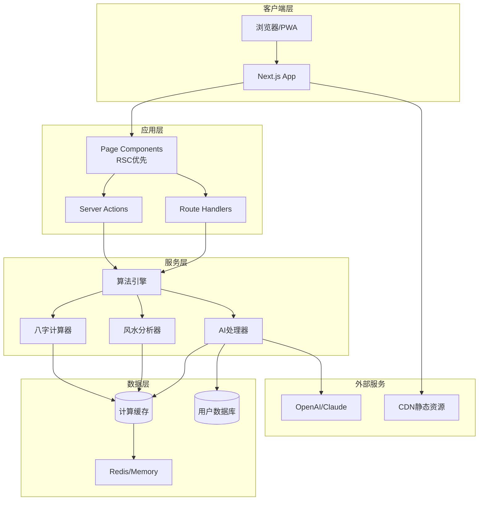

# AI八字风水网站技术架构方案

## 1. 系统架构概述

### 1.1 架构原则
- **算法优先**: 所有AI解释必须基于已计算的结构化数据
- **性能优先**: Server Components优先，最小化客户端JS
- **缓存优先**: 对确定性计算结果进行积极缓存
- **安全优先**: 敏感数据加密，API签名验证

### 1.2 技术栈
```yaml
Frontend:
  - Framework: Next.js 15.5.2 (App Router)
  - Language: TypeScript 5.8.3
  - UI: Radix UI + Shadcn + Tailwind CSS 4
  - State: Zustand + TanStack Query
  - Forms: React Hook Form + Zod

Backend:
  - Runtime: Node.js 22+
  - API: Next.js Route Handlers + Server Actions
  - Database: PostgreSQL + Drizzle ORM
  - Cache: Next.js Cache API + Redis (optional)

算法层:
  - 八字: @aharris02/bazi-calculator-by-alvamind
  - 风水: 自建玄空飞星算法
  - AI: Vercel AI SDK (多模型支持)

DevOps:
  - Deploy: Vercel/Cloudflare
  - CI/CD: GitHub Actions
  - Monitor: Vercel Analytics + Custom Metrics
```

## 2. 系统架构图



## 3. 核心模块设计

### 3.1 算法引擎模块

#### 目录结构
```
src/lib/qiflow/
├── bazi/               # 八字算法
│   ├── calculator.ts   # 核心计算
│   ├── schema.ts      # Zod数据验证
│   ├── cache.ts       # 缓存逻辑
│   └── types.ts       # TypeScript类型
├── xuankong/          # 玄空风水
│   ├── engine.ts      # 飞星计算
│   ├── schema.ts      # 数据验证
│   └── interpreter.ts # 结果解释
└── ai/                # AI集成
    ├── guardrails.ts  # 算法优先护栏
    ├── prompts/       # 系统提示词
    └── validator.ts   # 数据验证器
```

#### 算法优先护栏实现
```typescript
// src/lib/qiflow/ai/guardrails.ts
export class AlgorithmFirstGuard {
  async validateContext(sessionId: string): Promise<ValidationResult> {
    const baziData = await getBaziData(sessionId);
    const fengshuiData = await getFengshuiData(sessionId);
    
    if (!baziData && !fengshuiData) {
      return {
        hasData: false,
        suggestedAction: 'REDIRECT_TO_ANALYSIS',
        message: '请先完成八字或风水分析'
      };
    }
    
    return {
      hasData: true,
      availableData: { baziData, fengshuiData },
      allowedTopics: this.determineAllowedTopics(baziData, fengshuiData)
    };
  }
}
```

### 3.2 数据流设计

#### 八字分析数据流
```
用户输入 → 表单验证(Zod) → Server Action 
    → 缓存检查 → 计算引擎 → 结果缓存
    → 数据库持久化 → 返回客户端
```

#### AI问答数据流
```
用户提问 → 数据检测 → [无数据:引导] 
    → [有数据:构建上下文] → AI调用 
    → 响应验证 → 返回答案
```

### 3.3 缓存策略

#### 多级缓存架构
1. **浏览器缓存** (Service Worker)
   - 静态资源
   - 离线页面

2. **Next.js Cache** 
   ```typescript
   import { unstable_cache } from 'next/cache';
   
   export const cachedBaziCalculation = unstable_cache(
     async (input: BaziInput) => calculateBazi(input),
     ['bazi-calc'],
     {
       revalidate: false, // 永不过期(确定性计算)
       tags: [`bazi-${generateHash(input)}`]
     }
   );
   ```

3. **Redis缓存** (可选)
   - 会话数据
   - 热点数据

## 4. API设计

### 4.1 RESTful API设计

```typescript
// API路由结构
/api/
├── bazi/
│   ├── calculate     # POST 计算八字
│   ├── interpret     # POST AI解释(需已有数据)
│   └── export        # GET 导出PDF
├── fengshui/
│   ├── analyze       # POST 风水分析
│   ├── interpret     # POST AI解释
│   └── visualize     # GET 图表数据
└── chat/
    ├── session       # POST 创建会话
    ├── message       # POST 发送消息
    └── history       # GET 历史记录
```

### 4.2 Server Actions设计

```typescript
// src/actions/qiflow/calculate-bazi.ts
'use server';

export async function calculateBaziAction(
  input: BaziInput
): Promise<ActionResult<BaziOutput>> {
  // 1. 验证输入
  const validated = BaziInputSchema.safeParse(input);
  if (!validated.success) {
    return { error: validated.error };
  }
  
  // 2. 检查缓存
  const cacheKey = generateCacheKey(input);
  const cached = await getCache(cacheKey);
  if (cached) return { data: cached };
  
  // 3. 执行计算
  const result = await baziCalculator.calculate(input);
  
  // 4. 生成hash和版本
  result.version = ALGORITHM_VERSION;
  result.hash = generateHash(input);
  
  // 5. 缓存结果
  await setCache(cacheKey, result);
  
  // 6. 持久化(可选)
  if (userId) {
    await saveToDatabase(userId, result);
  }
  
  return { data: result };
}
```

## 5. 前端组件架构

### 5.1 组件层级
```
app/[locale]/
├── (marketing)/
│   └── page.tsx                 # 首页(RSC)
├── analysis/
│   ├── bazi/
│   │   ├── page.tsx             # 八字分析页(RSC)
│   │   ├── form.tsx             # 表单组件(Client)
│   │   └── result.tsx           # 结果展示(RSC+Client)
│   └── xuankong/
│       └── page.tsx             # 风水分析页
└── chat/
    └── page.tsx                 # AI问答页

components/qiflow/
├── forms/
│   ├── BaziStepper.tsx          # 步骤表单
│   └── FengshuiWizard.tsx       # 风水向导
├── charts/
│   ├── FiveElementsRadar.tsx    # 五行雷达图
│   └── FlyingStarGrid.tsx       # 飞星九宫格
└── ai/
    ├── ChatInterface.tsx         # 聊天界面
    └── DataGuard.tsx            # 数据检测守卫
```

### 5.2 状态管理

```typescript
// src/stores/analysis.store.ts
interface AnalysisStore {
  // 八字数据
  baziData: BaziOutput | null;
  setBaziData: (data: BaziOutput) => void;
  
  // 风水数据
  fengshuiData: FengshuiOutput | null;
  setFengshuiData: (data: FengshuiOutput) => void;
  
  // 计算状态
  isCalculating: boolean;
  error: Error | null;
  
  // 方法
  calculateBazi: (input: BaziInput) => Promise<void>;
  clearAll: () => void;
}
```

## 6. 性能优化策略

### 6.1 构建优化
- 代码分割: 按路由自动分割
- 树摇优化: 移除未使用代码
- 图片优化: next/image自动优化
- 字体优化: next/font本地托管

### 6.2 运行时优化
```typescript
// 动态导入重组件
const HeavyChart = dynamic(
  () => import('@/components/charts/ComplexVisualization'),
  { 
    ssr: false,
    loading: () => <ChartSkeleton />
  }
);

// Suspense包裹慢速组件
<Suspense fallback={<ResultSkeleton />}>
  <BaziAnalysisResult data={data} />
</Suspense>
```

### 6.3 数据获取优化
- Parallel fetching: 并行获取独立数据
- Prefetching: 预取可能需要的数据
- Stale-while-revalidate: 返回缓存同时更新

## 7. 安全设计

### 7.1 API安全
```typescript
// API签名验证
export async function verifyApiSignature(
  request: Request
): Promise<boolean> {
  const signature = request.headers.get('x-signature');
  const timestamp = request.headers.get('x-timestamp');
  const body = await request.text();
  
  const expectedSignature = createHmac('sha256', API_SECRET)
    .update(`${timestamp}.${body}`)
    .digest('hex');
    
  return signature === expectedSignature;
}
```

### 7.2 数据安全
- 敏感数据加密存储
- PII数据脱敏处理
- 会话数据定期清理

## 8. 监控与观测

### 8.1 性能监控
```typescript
// src/lib/monitoring/performance.ts
export function measurePerformance(name: string) {
  const start = performance.now();
  
  return {
    end: () => {
      const duration = performance.now() - start;
      // 上报指标
      trackMetric(name, duration);
    }
  };
}
```

### 8.2 错误监控
```typescript
// 全局错误边界
export function GlobalErrorBoundary({ children }) {
  return (
    <ErrorBoundary
      fallback={<ErrorFallback />}
      onError={(error, errorInfo) => {
        // 上报错误
        reportError(error, errorInfo);
      }}
    >
      {children}
    </ErrorBoundary>
  );
}
```

### 8.3 业务指标
```typescript
// 转化漏斗事件
export const trackEvents = {
  viewLanding: () => track('view_landing'),
  startAnalysis: (type: string) => track('start_analysis', { type }),
  completeAnalysis: (type: string) => track('complete_analysis', { type }),
  startChat: () => track('start_chat'),
  exportReport: (format: string) => track('export_report', { format })
};
```

## 9. 部署架构

### 9.1 环境配置
```yaml
Development:
  - URL: http://localhost:3000
  - Database: Local PostgreSQL
  - Cache: Memory

Staging:
  - URL: https://staging.qiflow.ai
  - Database: Supabase
  - Cache: Redis

Production:
  - URL: https://qiflow.ai
  - Database: Supabase (with read replicas)
  - Cache: Redis Cluster
  - CDN: Cloudflare
```

### 9.2 CI/CD流程
```yaml
name: Deploy Pipeline
on:
  push:
    branches: [main]

jobs:
  test:
    - lint
    - typecheck
    - unit tests
    - e2e tests
  
  build:
    - build application
    - optimize assets
    - generate sitemap
  
  deploy:
    - deploy to Vercel
    - run smoke tests
    - update monitoring
```

## 10. 扩展性设计

### 10.1 插件化算法
```typescript
interface AlgorithmPlugin {
  name: string;
  version: string;
  calculate: (input: any) => Promise<any>;
  validate: (input: any) => boolean;
}

class AlgorithmRegistry {
  register(plugin: AlgorithmPlugin) { }
  get(name: string): AlgorithmPlugin { }
}
```

### 10.2 多语言扩展
- 消息文件分离: messages/[locale].json
- 动态加载: 按需加载语言包
- 术语词典: 专业术语统一管理

### 10.3 API开放
- GraphQL网关(future)
- Webhook支持
- SDK开发

---
*文档版本: 1.0.0*
*更新日期: 2025-01-05*
*架构师: AI全栈交付代理*