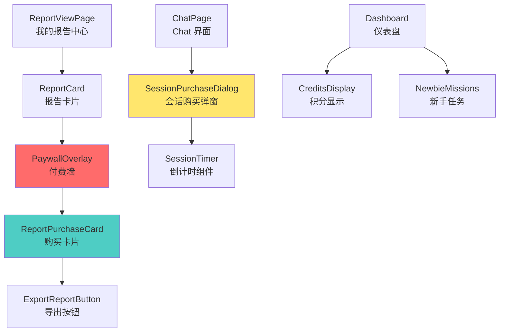

# Phase 0: 可复用组件清单 v1.0

## ✅ 可直接复用的前端组件

### 1. ExportReportButton 报告导出按钮
**文件位置**: `src/components/qiflow/ExportReportButton.tsx`

**当前功能**:
- 提交表单到 `exportQiflowPdfAction` 生成 PDF
- 支持 `type: 'bazi' | 'xuankong'`
- 传递 `input`, `result`, `interpretation` 数据
- 显示下载链接

**Phase 3 复用方案**:
```typescript
<ExportReportButton
  type="essential-report"  // 新增类型
  result={essentialReportData}
  input={userBirthInfo}
  language="zh"
/>
```

**Phase 4 改造点**:
- ✅ 添加 Paywall 判断:
  ```typescript
  if (!userHasPurchased) {
    return <PaywallOverlay reportType="essential" />;
  }
  ```

---

### 2. 积分余额显示
**推测位置**: 仪表盘 Header 或侧边栏

**Phase 4 复用**:
- 在报告购买页显示当前余额
- 实时扣费提示: "购买将消耗 120 积分"

---

### 3. 新手任务中心 UI
**推测位置**: Dashboard 侧边栏或独立页面

**现有能力**:
- 显示 5 个任务进度条
- 领取奖励按钮
- 完成百分比统计

**Phase 5 复用**:
- B 组用户自动显示第 6 个任务 "生成首份精华报告"
- 无需改动 UI 逻辑 (任务列表动态渲染)

---

## 🆕 需新建的组件 (Phase 3-4)

### 1. PaywallOverlay 付费墙组件
**位置**: `src/components/report/PaywallOverlay.tsx`

**功能**:
- 模糊背景 + 居中提示框
- 显示报告预览 (前 3 段)
- CTA 按钮: "解锁完整报告 (120 积分)"
- 价值主张列表:
  - ✅ 3 大主题深度解析
  - ✅ 个性化建议清单
  - ✅ 终身免费查看

**设计规范**:
```typescript
export function PaywallOverlay({
  reportType,
  preview,
  onUnlock,
}: {
  reportType: 'essential';
  preview: string;  // 前 500 字
  onUnlock: () => void;
}) {
  return (
    <div className="relative">
      <div className="blur-sm">{preview}</div>
      <div className="absolute inset-0 flex items-center justify-center bg-black/50">
        <Card>
          <CardTitle>解锁完整精华报告</CardTitle>
          <ul className="space-y-2">
            <li>✅ 3 大主题深度解析</li>
            {/* ... */}
          </ul>
          <Button onClick={onUnlock}>
            立即解锁 (120 积分)
          </Button>
        </Card>
      </div>
    </div>
  );
}
```

---

### 2. ReportPurchaseCard 购买卡片
**位置**: `src/components/report/ReportPurchaseCard.tsx`

**功能**:
- 显示报告类型、价格、包含内容
- 支付方式选择: 积分 or Stripe
- 余额不足提示 + 充值引导

**伪代码**:
```typescript
export function ReportPurchaseCard({
  reportType,
  price,
  userBalance,
}: {
  reportType: 'essential';
  price: number;
  userBalance: number;
}) {
  const canAfford = userBalance >= price;
  
  return (
    <Card>
      <Badge>精华报告</Badge>
      <div className="text-3xl font-bold">{price} 积分</div>
      <ul>
        <li>✅ 3 大主题</li>
        {/* ... */}
      </ul>
      {canAfford ? (
        <Button onClick={() => handlePurchase('credits')}>
          使用积分购买
        </Button>
      ) : (
        <>
          <Alert variant="warning">
            积分不足，还需 {price - userBalance} 积分
          </Alert>
          <Button variant="outline" onClick={() => router.push('/pricing')}>
            充值积分
          </Button>
        </>
      )}
      <Separator />
      <Button variant="secondary" onClick={() => handlePurchase('stripe')}>
        💳 Stripe 购买 ($4.99)
      </Button>
    </Card>
  );
}
```

---

### 3. SessionPurchaseDialog 会话购买弹窗
**位置**: `src/components/chat/SessionPurchaseDialog.tsx`

**功能** (Phase 6):
- 首次进入 Chat 时弹出
- 解释会话制: "15 分钟畅聊，消耗 40 积分"
- 倒计时显示剩余时间
- 续费选项: "+15 分钟 (40 积分)"

---

### 4. ReportViewPage 我的报告中心
**位置**: `src/app/(dashboard)/reports/page.tsx`

**功能** (Phase 4 + 优化建议):
- 列表展示用户所有已购报告
- 分类: 精华报告 | 基础报告
- 操作: 查看 | 导出 PDF | 分享
- 资产感强化: "您已拥有 3 份精华报告"

**设计要点**:
- 卡片式布局，显示生成日期、标题、封面图
- 快捷操作: 点击卡片直接查看，无需再次支付

---

## 🔥 UI 设计原则 (Phase 3-4)

### 1. Paywall 设计 (参考最佳实践)
- **预览诱饵**: 显示前 30% 内容 + 渐变蒙版
- **价值主张**: 3-5 个带 ✅ 的收益点
- **紧迫感**: "限时优惠价 120 积分 (原价 150)"
- **社会证明**: "已有 1,234 人解锁"

### 2. 积分支付 UX
- **双轨支付**: 优先展示积分支付，Stripe 作为备选
- **余额提示**: 实时显示当前余额和扣费后余额
- **降级引导**: 余额不足时推荐低价产品或充值

### 3. 购买确认流程
```
[报告预览] → [解锁按钮] → [支付确认] → [生成中 (20s)] → [查看报告]
     ↓
 (余额不足)
     ↓
[充值引导] → [Stripe Checkout] → [Webhook 到账] → [返回购买]
```

---

## 🎨 组件依赖关系图



---

## ➡️ Phase 0.3 Next Step
创建 **Schema 变更设计.md** (数据库表详细设计)
