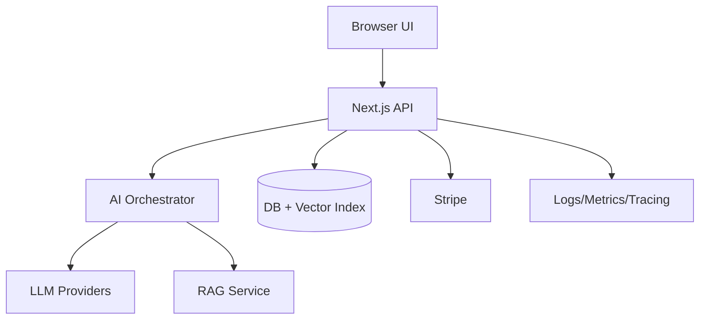

# 架构总览（C4 简化）（v5.1）

```mermaid
flowchart TB
  browser[Browser UI] --> api[Next.js API]
  api --> orchestrator[AI Orchestrator]
  orchestrator --> providers[LLM Providers]
  orchestrator --> rag[RAG Service]
  api --> db[(DB + Vector Index)]
  api --> stripe[Stripe]
  api --> observability[Logs/Metrics/Tracing]
```
