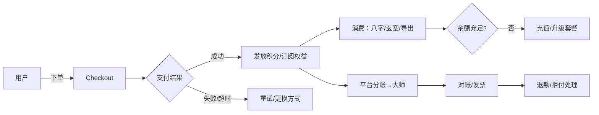

# 计费与分账流程（v5.1）
> 依据：@PRD_v5.0.md、@TECH_GUIDE_v5.0.md、@TASK_PLAN_v5.0.md、@REVIEW_FINAL_arbiter.json。

```mermaid
flowchart LR
  U[用户] -->|下单| C[Checkout]
  C --> P{支付结果}
  P -- 成功 --> COINS[发放积分/订阅权益]
  COINS --> USE[消费：八字/玄空/导出]
  USE --> BAL{余额充足?}
  BAL -- 否 --> TOPUP[充值/升级套餐]
  P -- 失败/超时 --> RETRY[重试/更换方式]
  COINS --> SPLIT[平台分账→大师]
  SPLIT --> RECON[对账/发票]
  RECON --> REFUND[退款/拒付处理]
```
- 异常：幂等、超时、重复扣款、拒付；审计日志与水印对齐。
- 可视化：余额/预计消耗/实时扣费提示（参见 @UI_DESIGN_v5.0.md）。
