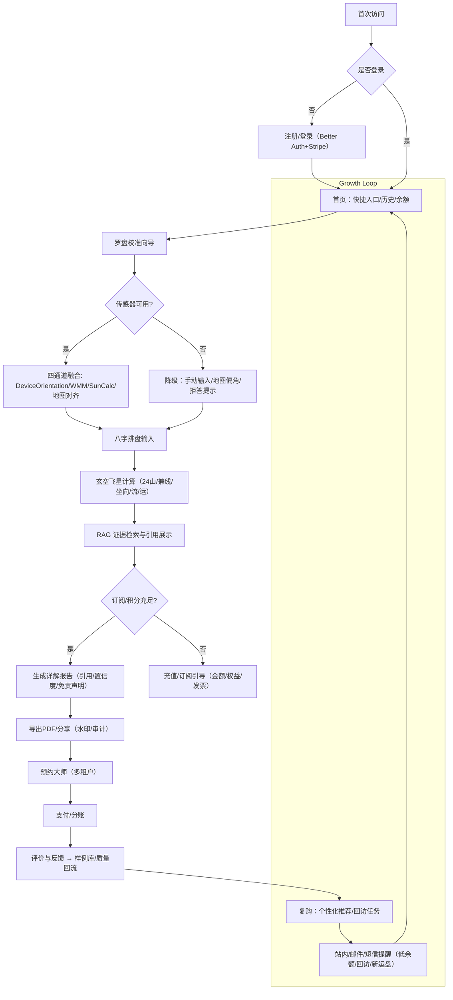

# 用户流程图（v5.1）— AI 八字玄空风水应用
> 依据：@PRD_v5.0.md、@TECH_GUIDE_v5.0.md、@TASK_PLAN_v5.0.md、@UI_DESIGN_v5.0.md、@REVIEW_FINAL_arbiter.json。
> 目标：覆盖 MVP 的关键闭环：注册→校准→分析→预约/支付→报告/导出→复购与留存。

## 状态与约束
- 状态：空/错误/限流/超时 统一组件（参见 @UI_DESIGN_v5.0.md）。
- 计费：入口强校验（参见 @PRD_v5.0.md & @REVIEW_FINAL_arbiter.json prd_patch）。
- 合规：显著免责声明、18+ 提示、隐私与撤回（参见 @COMPLIANCE_KIT_v5.1.md）。
