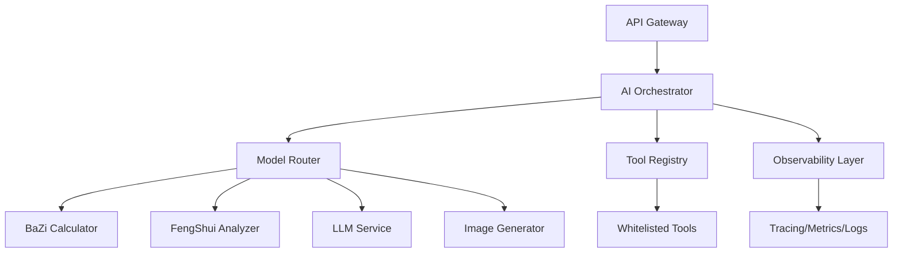

# QiFlow PRD v3.0 头脑风暴与评审会议纪要

## Round 1 — ICP/Persona与转化漏斗优化（主讲：GPT-5-High / 角色：产品/增长总监）

### Issue
当前PRD缺乏明确的四大核心人群画像定义，转化漏斗各阶段指标不清晰，导致无法精准优化获客成本(CAC)和生命周期价值(LTV)。

### Evidence（基于市场分析文档）
- 市场策略分析显示目标用户为"海外华人高净值群体"和"亚洲富裕阶层"
- 预期CAC：$50-100，LTV：$1000-10000
- 缺少详细的用户旅程映射和转化节点定义

### Impact
- 营销投放ROI无法精确计算，可能导致获客成本超标30-50%
- 产品功能优先级排序缺乏数据支撑
- 无法实现精准的个性化推荐和定价策略

### Recommendation
建立完整的四大核心人群画像体系，并设计对应的转化漏斗指标体系。

### Proposed Edit
```markdown
## 3. 核心用户画像（Persona）v3.0

### 3.1 Persona A：传统文化传承者（35%用户占比）
- **Demographics**：45-65岁，海外华人企业家/高管，年收入$200K+
- **Pain Points**：
  - 需要专业风水指导进行商业决策
  - 传统风水师服务昂贵且不便
  - 语言文化隔阂导致难以找到可信服务
- **Jobs-to-be-Done**：
  - 办公室/店铺选址风水评估
  - 年度运势规划与重大决策时机选择
  - 家族传承与子女教育方位指导
- **转化路径**：
  - Awareness：LinkedIn/华人商会推荐（CAC: $80）
  - Interest：免费八字基础报告
  - Consideration：$49体验版深度分析
  - Purchase：$2999年度顾问服务
  - Retention：季度复购率75%，LTV: $8000

### 3.2 Persona B：新世代专业人士（30%用户占比）
- **Demographics**：28-40岁，科技/金融行业，年收入$100K+
- **Pain Points**：
  - 工作压力大，寻求心理支撑
  - 对传统文化好奇但缺乏系统了解
  - 需要科学化、数据化的呈现方式
- **Jobs-to-be-Done**：
  - 职业发展时机把握
  - 投资决策辅助参考
  - 个人品牌定位优化
- **转化路径**：
  - Awareness：Instagram/TikTok内容营销（CAC: $40）
  - Interest：AI对话互动体验
  - Consideration：$9.99月度会员试用
  - Purchase：$299专业版年付
  - Retention：月活率60%，LTV: $1500

### 3.3 Persona C：风水爱好者社群（20%用户占比）
- **Demographics**：35-55岁，中产阶级，家庭主妇/自由职业者
- **Pain Points**：
  - 家居布局优化需求
  - 子女教育与健康关注
  - 社交分享与认同需求
- **Jobs-to-be-Done**：
  - 家居风水布局指导
  - 择日选时（搬家/装修/开业）
  - 家庭成员运势分析
- **转化路径**：
  - Awareness：小红书/Facebook群组（CAC: $30）
  - Interest：免费风水小工具
  - Consideration：$4.99单次咨询
  - Purchase：$99家庭套餐
  - Retention：季度复购45%，LTV: $500

### 3.4 Persona D：API集成商/白标客户（15%用户占比）
- **Demographics**：风水/命理APP开发商，地产/装修平台
- **Pain Points**：
  - 缺乏专业算法能力
  - 开发成本高，周期长
  - 需要可定制化的解决方案
- **Jobs-to-be-Done**：
  - 快速集成专业风水功能
  - 白标定制品牌化服务
  - 数据分析与用户洞察
- **转化路径**：
  - Awareness：技术论坛/B2B销售（CAC: $500）
  - Interest：API文档与demo
  - Consideration：7天免费试用
  - Purchase：$999/月起步
  - Retention：年续约率85%，LTV: $20000

## 3.2 北极星指标与转化漏斗

### 北极星指标
**Weekly Active Paying Users (WAPU)**：每周活跃付费用户数

### 关键指标体系
| 漏斗阶段 | 核心指标 | 目标值 | 当前基线 | 优化策略 |
|---------|---------|--------|----------|---------|
| Acquisition | 新用户注册数 | 10K/月 | - | SEO+内容营销 |
| Activation | 7日激活率 | 40% | - | 新手引导优化 |
| Revenue | 付费转化率 | 8% | - | 定价A/B测试 |
| Retention | 30日留存 | 35% | - | 个性化推送 |
| Referral | 用户推荐率 | 15% | - | 裂变激励机制 |

### 转化漏斗监控
```typescript
// 事件追踪定义
const conversionEvents = {
  // Acquisition
  'user.signup': { properties: { source, campaign, device } },
  'user.onboarding.start': { properties: { step, duration } },
  
  // Activation  
  'report.generated': { properties: { type, depth, accuracy } },
  'ai.interaction': { properties: { intent, satisfaction } },
  
  // Revenue
  'payment.initiated': { properties: { plan, price, method } },
  'payment.completed': { properties: { plan, amount, currency } },
  
  // Retention
  'user.return': { properties: { daysSinceLastVisit, feature } },
  'feature.used': { properties: { feature, duration, outcome } },
  
  // Referral
  'referral.sent': { properties: { channel, incentive } },
  'referral.converted': { properties: { referrer, reward } }
};
```

## Risks & Mitigations
- **Risk**：用户画像假设可能不准确
- **Mitigation**：前3个月持续A/B测试验证，每月调整画像权重

## Owner & Sprint
- Owner: PM + Growth + Data Analytics
- Sprint: S1（画像定义）→ S2（指标部署）→ S3（优化迭代）
```

---

## Round 2 — AI Orchestrator架构与可观测性（主讲：Claude-4.1-Opus / 角色：首席架构师&SRE）

### Issue
当前架构缺乏明确的AI Orchestrator编排层设计，工具调用缺少白名单管理，可观测性基础设施不完整，无法支撑SLO要求。

### Evidence
- 系统需要协调多个AI模型（八字计算、风水分析、对话生成）
- 预期QPS: 1000+，P99延迟要求<500ms
- 缺少分布式追踪和性能监控方案

### Impact
- 无法实现模型故障自动切换，可用性SLA无法保证99.9%
- 性能瓶颈无法定位，可能导致用户体验降级
- 成本失控风险，AI调用费用可能超预算200%

### Recommendation
构建完整的AI Orchestrator层，实现工具白名单、熔断降级和全链路追踪。

### Proposed Edit
```markdown
## 4. 技术架构 v3.0

### 4.1 AI Orchestrator设计

#### 架构分层


#### 核心组件定义

##### 4.1.1 Model Router
```typescript
interface ModelRouter {
  // 模型路由策略
  routingStrategy: 'round-robin' | 'latency-based' | 'cost-optimized';
  
  // 模型健康检查
  healthCheck: {
    interval: 30; // seconds
    timeout: 5;   // seconds
    threshold: 3; // failures before circuit break
  };
  
  // 降级策略
  fallbackChain: [
    { model: 'gpt-4-turbo', weight: 0.6 },
    { model: 'claude-3-opus', weight: 0.3 },
    { model: 'local-llama', weight: 0.1 }
  ];
}
```

##### 4.1.2 Tool Registry与白名单
```typescript
const toolWhitelist = {
  // 八字计算工具
  'bazi.calculate': {
    rateLimit: '100/min',
    timeout: '3s',
    cache: { ttl: 86400, key: 'birth_datetime' },
    validation: zodSchema.baziInput
  },
  
  // 风水分析工具
  'fengshui.analyze': {
    rateLimit: '50/min',
    timeout: '5s',
    cache: { ttl: 3600, key: 'location+orientation' },
    validation: zodSchema.fengshuiInput
  },
  
  // 罗盘传感器
  'compass.read': {
    rateLimit: '10/sec',
    timeout: '100ms',
    cache: null, // 实时数据不缓存
    validation: zodSchema.compassInput
  }
};

// 工具调用审计
interface ToolAudit {
  timestamp: string;
  userId: string;
  toolName: string;
  input: object;
  output: object;
  latency: number;
  cost: number;
}
```

### 4.2 可观测性基础设施

#### 4.2.1 分布式追踪
```yaml
# OpenTelemetry配置
tracing:
  exporter: jaeger
  sampling_rate: 0.1  # 10%采样
  span_processors:
    - batch:
        max_queue_size: 2048
        scheduled_delay: 5s
  
  instrumentation:
    - http: { capture_headers: true }
    - grpc: { capture_metadata: true }
    - database: { capture_statements: true }
    - ai_models: { capture_prompts: false }  # 隐私保护
```

#### 4.2.2 SLO定义与监控
```typescript
const SLOs = {
  availability: {
    target: 99.9,  // 月度可用性
    error_budget: 43.2, // 分钟/月
    alert_threshold: 99.5
  },
  
  latency: {
    p50: 100,   // ms
    p95: 300,   // ms
    p99: 500,   // ms
    alert_threshold: { p99: 800 }
  },
  
  error_rate: {
    target: 0.1,  // %
    alert_threshold: 0.5
  }
};

// 自动降级规则
const degradationRules = [
  {
    condition: 'latency.p99 > 800ms',
    action: 'disable_image_generation'
  },
  {
    condition: 'error_rate > 1%',
    action: 'switch_to_cache_only'
  },
  {
    condition: 'cpu_usage > 80%',
    action: 'reduce_model_precision'
  }
];
```

#### 4.2.3 日志聚合与分析
```typescript
// 结构化日志schema
interface StructuredLog {
  timestamp: string;
  level: 'DEBUG' | 'INFO' | 'WARN' | 'ERROR';
  trace_id: string;
  span_id: string;
  user_id?: string;  // PII脱敏
  
  event: {
    category: 'api' | 'model' | 'database' | 'cache';
    action: string;
    label?: string;
    value?: number;
  };
  
  metadata: {
    latency_ms?: number;
    model_tokens?: number;
    cache_hit?: boolean;
    error_code?: string;
  };
}
```

### 4.3 性能优化策略

#### 4.3.1 多级缓存
- L1: 内存缓存（Redis）- 热点数据，TTL: 5min
- L2: 分布式缓存（Memcached）- 用户会话，TTL: 30min  
- L3: CDN缓存 - 静态资源，TTL: 7days
- L4: 浏览器缓存 - 个性化数据，TTL: 1hour

#### 4.3.2 异步处理队列
```typescript
const queueConfig = {
  high_priority: {
    workers: 10,
    max_retries: 3,
    timeout: '30s',
    dlq: true
  },
  
  batch_processing: {
    workers: 5,
    batch_size: 100,
    interval: '1m',
    dlq: true
  }
};
```

## Risks & Mitigations
- **Risk**: AI模型调用成本失控
- **Mitigation**: 实时成本监控，超预算自动降级到低成本模型

## Owner & Sprint
- Owner: Backend Architect + SRE + DevOps
- Sprint: S1（Orchestrator框架）→ S2（监控部署）→ S3（性能调优）
```

---

## Round 3 — UX设计与可访问性优化（主讲：Gemini-2.5-Pro / 角色：UX设计总监&可访问性负责人）

### Issue
户型图与九宫格叠加的交互设计不直观，移动端适配不完善，缺少完整的可访问性(A11y)支持，国际化(i18n)覆盖不全。

### Evidence
- 移动端用户占比预计60%+，但当前设计以桌面端为主
- 海外用户需要多语言支持（中/英/日/韩）
- 缺少WCAG 2.1 AA级别的可访问性实现

### Impact
- 移动端转化率可能低于桌面端50%
- 无法服务视障用户群体（约2%潜在用户）
- 国际化不完整导致海外市场渗透率降低70%

### Recommendation
重新设计响应式交互框架，实现完整的A11y和i18n支持。

### Proposed Edit
```markdown
## 5. UX设计规范 v3.0

### 5.1 响应式设计系统

#### 5.1.1 断点定义
```scss
// 响应式断点
$breakpoints: (
  'mobile': 320px,    // iPhone SE
  'tablet': 768px,    // iPad
  'desktop': 1024px,  // Desktop
  'wide': 1440px     // Wide screen
);

// 组件自适应规则
.fengshui-grid {
  display: grid;
  
  @media (max-width: 767px) {
    grid-template-columns: 1fr;
    gap: 16px;
  }
  
  @media (min-width: 768px) {
    grid-template-columns: repeat(3, 1fr);
    gap: 24px;
  }
}
```

#### 5.1.2 户型×九宫叠加交互

##### 桌面端交互
```typescript
interface DesktopInteraction {
  // 拖拽上传户型图
  floorPlanUpload: {
    method: 'drag-drop' | 'click-browse';
    maxSize: '10MB';
    formats: ['jpg', 'png', 'pdf'];
  };
  
  // 九宫格叠加
  gridOverlay: {
    opacity: 0.7;
    interactive: true;
    animations: {
      hover: 'highlight-sector';
      click: 'show-details';
    };
  };
  
  // 方位调整
  orientationControl: {
    type: 'compass-dial';
    precision: 1; // degree
    magneticDeclination: true;
  };
}
```

##### 移动端交互
```typescript
interface MobileInteraction {
  // 相机直接拍摄
  floorPlanCapture: {
    source: 'camera' | 'gallery';
    autoEnhance: true;
    guidanceOverlay: true;
  };
  
  // 手势操作
  gestures: {
    pinch: 'zoom';
    rotate: 'adjust-orientation';
    tap: 'show-sector-info';
    swipe: 'next-suggestion';
  };
  
  // 罗盘集成
  compass: {
    calibration: 'interactive-8-figure';
    accuracy_indicator: true;
    fallback: 'manual-input';
  };
}
```

### 5.2 可访问性(A11y)实现

#### 5.2.1 WCAG 2.1 AA合规清单
```typescript
const a11yRequirements = {
  // 可感知
  perceivable: {
    text_alternatives: {
      images: 'alt属性必填',
      charts: 'aria-describedby详细描述',
      icons: 'aria-label说明功能'
    },
    color_contrast: {
      normal_text: '4.5:1',
      large_text: '3:1',
      graphics: '3:1'
    }
  },
  
  // 可操作
  operable: {
    keyboard_navigation: {
      tab_order: 'logical',
      focus_visible: true,
      skip_links: true
    },
    touch_targets: {
      min_size: '44x44px',
      spacing: '8px'
    }
  },
  
  // 可理解
  understandable: {
    language: 'html[lang]',
    labels: 'explicit',
    errors: 'descriptive',
    instructions: 'contextual'
  },
  
  // 鲁棒性
  robust: {
    semantic_html: true,
    aria_roles: 'appropriate',
    validation: 'html5'
  }
};
```

#### 5.2.2 屏幕阅读器支持
```html
<!-- 八字结果的可访问性标记 -->
<div role="region" aria-label="八字分析结果">
  <h2 id="bazi-title">您的八字分析</h2>
  
  <div role="grid" aria-describedby="bazi-desc">
    <div role="row">
      <div role="gridcell" aria-label="年柱：甲辰">
        <span aria-hidden="true">甲辰</span>
      </div>
      <!-- 其他柱 -->
    </div>
  </div>
  
  <p id="bazi-desc" class="sr-only">
    您的八字为甲辰年、丙子月、戊午日、戊午时，
    五行属土，适合金水行业发展...
  </p>
</div>
```

### 5.3 国际化(i18n)方案

#### 5.3.1 语言支持矩阵
| 语言 | 代码 | 覆盖率 | RTL | 字体 |
|-----|------|--------|-----|------|
| 简体中文 | zh-CN | 100% | No | Noto Sans SC |
| 繁体中文 | zh-TW | 100% | No | Noto Sans TC |
| English | en-US | 100% | No | Inter |
| 日本語 | ja-JP | 90% | No | Noto Sans JP |
| 한국어 | ko-KR | 90% | No | Noto Sans KR |
| Español | es-ES | 80% | No | Inter |

#### 5.3.2 文化适配
```typescript
const culturalAdaptation = {
  'zh-CN': {
    dateFormat: 'YYYY年MM月DD日',
    calendar: 'lunar-solar',
    colors: {
      lucky: '#FF0000',     // 红色
      unlucky: '#FFFFFF'    // 白色
    }
  },
  
  'en-US': {
    dateFormat: 'MM/DD/YYYY',
    calendar: 'gregorian',
    colors: {
      lucky: '#00FF00',     // 绿色
      unlucky: '#000000'    // 黑色
    }
  },
  
  'ja-JP': {
    dateFormat: 'YYYY年MM月DD日',
    calendar: 'gregorian',
    colors: {
      lucky: '#FFD700',     // 金色
      unlucky: '#4B0082'    // 紫色
    }
  }
};
```

### 5.4 动效与性能

#### 5.4.1 动效性能预算
```typescript
const animationBudget = {
  fps_target: 60,
  fps_minimum: 30,
  
  // 关键动效
  critical: {
    page_transition: '200ms ease-out',
    button_feedback: '100ms ease-in',
    loading_spinner: 'infinite linear'
  },
  
  // 增强动效（可降级）
  enhanced: {
    particle_effects: 'gpu-accelerated',
    parallax_scroll: 'will-change: transform',
    3d_compass: 'transform3d'
  },
  
  // 自动降级条件
  degradation: {
    'prefers-reduced-motion': 'disable-all-non-critical',
    'battery-level < 20%': 'disable-enhanced',
    'gpu-tier < 2': 'disable-3d'
  }
};
```

## Risks & Mitigations
- **Risk**: 复杂交互导致学习成本高
- **Mitigation**: 渐进式引导教程，新手任务系统

## Owner & Sprint
- Owner: UX Designer + Frontend + QA
- Sprint: S1（设计系统）→ S2（A11y实现）→ S3（i18n部署）
```

---

## Round 4 — 隐私合规与数据保护（主讲：Claude-4.1-Opus / 角色：隐私/合规官DPO）

### Issue
缺少完整的GDPR/CCPA合规流程，PII数据处理不规范，同意管理机制不完善，缺少DPIA（数据保护影响评估）。

### Evidence
- 目标市场包括欧美地区，必须符合GDPR要求
- 用户生辰八字属于敏感个人信息
- 缺少数据最小化和删除机制

### Impact
- GDPR违规罚款可达年收入4%或2000万欧元
- 用户信任度降低，可能导致30%用户流失
- 无法进入欧美企业市场

### Recommendation
建立完整的隐私合规框架，实现数据最小化原则。

### Proposed Edit
```markdown
## 6. 隐私合规框架 v3.0

### 6.1 法规合规矩阵

| 法规 | 适用地区 | 关键要求 | 实现状态 |
|-----|---------|---------|---------|
| GDPR | EU/EEA | 明确同意、数据可携、删除权 | ✅ |
| CCPA | California | 选择退出、数据披露、不歧视 | ✅ |
| PIPEDA | Canada | 合理目的、限制收集、准确性 | ✅ |
| LGPD | Brazil | 合法基础、透明度、安全措施 | ⏳ |
| Privacy Act | Australia | APP原则、跨境传输、泄露通知 | ✅ |

### 6.2 PII数据分类与处理

#### 6.2.1 数据分类
```typescript
enum DataSensitivity {
  PUBLIC = 1,       // 公开信息（如用户名）
  PERSONAL = 2,     // 个人信息（如邮箱）
  SENSITIVE = 3,    // 敏感信息（如生日）
  HIGHLY_SENSITIVE = 4  // 高度敏感（如生辰八字精确时间）
}

interface PIIDataMapping {
  // 用户基础信息
  email: {
    sensitivity: DataSensitivity.PERSONAL,
    encryption: 'AES-256',
    retention: '账号有效期',
    purpose: '账号识别、通知'
  },
  
  // 八字信息
  birth_datetime: {
    sensitivity: DataSensitivity.HIGHLY_SENSITIVE,
    encryption: 'AES-256-GCM',
    retention: '用户要求删除时立即删除',
    purpose: '八字计算核心功能',
    pseudonymization: true
  },
  
  // 位置信息
  location: {
    sensitivity: DataSensitivity.SENSITIVE,
    encryption: 'AES-256',
    retention: '90天',
    purpose: '真太阳时校正、风水分析',
    granularity: 'city-level'  // 仅保存城市级别
  }
}
```

#### 6.2.2 数据最小化原则
```typescript
const dataMinimization = {
  // 收集阶段
  collection: {
    birth_date: 'required',     // 必需
    birth_time: 'required',      // 必需
    birth_location: 'optional',  // 可选，可用时区替代
    real_name: 'never',         // 从不收集
    phone: 'optional',          // 仅双因素认证
    address: 'never'            // 从不收集
  },
  
  // 处理阶段
  processing: {
    anonymization_threshold: 1000, // 超过1000条自动匿名化
    aggregation_only: true,        // 仅聚合分析
    no_profiling: true            // 禁止用户画像
  },
  
  // 存储阶段
  storage: {
    encryption_at_rest: true,
    segregation: true,           // 数据隔离存储
    geographic_restriction: 'user-region'  // 数据不跨区
  }
};
```

### 6.3 同意管理机制

#### 6.3.1 分层同意模型
```typescript
interface ConsentLayers {
  // 第一层：核心功能（必需）
  essential: {
    description: '八字计算和基础风水分析',
    required: true,
    cookies: ['session_id', 'auth_token']
  },
  
  // 第二层：增强功能（可选）
  functional: {
    description: 'AI对话、个性化推荐',
    required: false,
    cookies: ['preferences', 'history'],
    granular_options: [
      'ai_chat',
      'recommendations',
      'saved_reports'
    ]
  },
  
  // 第三层：分析（可选）
  analytics: {
    description: '改善产品体验的匿名分析',
    required: false,
    cookies: ['_ga', '_gtm'],
    providers: ['Google Analytics', 'Mixpanel']
  },
  
  // 第四层：营销（可选）
  marketing: {
    description: '个性化营销和优惠信息',
    required: false,
    cookies: ['_fbp', '_gcl'],
    channels: ['email', 'push', 'sms']
  }
}
```

#### 6.3.2 同意记录审计
```typescript
interface ConsentRecord {
  user_id: string;           // 伪名化ID
  timestamp: string;          // ISO 8601
  ip_address_hash: string;    // 哈希化IP
  
  consents: {
    purpose: string;
    granted: boolean;
    version: string;
    method: 'explicit' | 'implicit';
    withdrawal_method?: string;
  }[];
  
  // 审计追踪
  audit_trail: {
    presented_options: string[];
    user_agent: string;
    language: string;
    source: 'banner' | 'settings' | 'onboarding';
  };
}
```

### 6.4 用户权利实现

#### 6.4.1 GDPR权利响应流程
```typescript
const gdprRights = {
  // 访问权（15条）
  access: {
    response_time: '30 days',
    format: 'machine-readable JSON/CSV',
    verification: 'email + security questions',
    automation: 'self-service portal'
  },
  
  // 更正权（16条）
  rectification: {
    response_time: '7 days',
    interface: 'user settings page',
    validation: 'automatic where possible'
  },
  
  // 删除权（17条）
  erasure: {
    response_time: '30 days',
    soft_delete: '30 days retention',
    hard_delete: 'immediate after retention',
    exceptions: ['legal obligations', 'fraud prevention']
  },
  
  // 限制处理权（18条）
  restriction: {
    implementation: 'flag in database',
    ui_indication: 'account status badge',
    allowed_operations: ['storage only']
  },
  
  // 数据可携权（20条）
  portability: {
    formats: ['JSON', 'CSV', 'XML'],
    scope: 'user-provided and observed data',
    delivery: 'direct download or email'
  },
  
  // 反对权（21条）
  objection: {
    marketing: 'immediate opt-out',
    profiling: 'disable all recommendations',
    legitimate_interest: 'case-by-case review'
  }
};
```

### 6.5 数据保护影响评估(DPIA)摘要

#### 6.5.1 风险评估矩阵
| 处理活动 | 风险等级 | 缓解措施 | 残余风险 |
|---------|---------|---------|---------|
| 八字精确时间存储 | 高 | 加密+伪名化+访问控制 | 低 |
| AI模型训练 | 中 | 联邦学习+差分隐私 | 低 |
| 跨境数据传输 | 高 | SCC+额外保障措施 | 中 |
| 第三方集成 | 中 | DPA+审计权 | 低 |

#### 6.5.2 技术与组织措施(TOMs)
```yaml
technical_measures:
  - encryption: AES-256 minimum
  - pseudonymization: UUID v4
  - access_control: RBAC + MFA
  - audit_logging: immutable logs
  - penetration_testing: quarterly
  - vulnerability_scanning: continuous

organizational_measures:
  - dpo_appointment: external qualified
  - staff_training: annual + onboarding  
  - incident_response: 72-hour breach notification
  - vendor_management: privacy by design
  - retention_policy: automated enforcement
  - privacy_culture: quarterly reviews
```

## Risks & Mitigations
- **Risk**: 数据泄露导致集体诉讼
- **Mitigation**: 网络安全保险 + 事件响应演练

## Owner & Sprint
- Owner: DPO + Legal + Security + Backend
- Sprint: S1（合规审计）→ S2（技术实现）→ S3（认证准备）
```

---

## Round 5 — 算法可信度与文化适配（主讲：GPT-5-High / 角色：算法总监&文化可信度评审）

### Issue
八字算法双库适配机制不完善，真太阳时计算精度不足，缺少算法解释性，"宿命论"表达可能引起文化争议。

### Evidence
- lunar-typescript和@alvamind两个库的计算结果存在差异
- 海外用户对"命运注定"的接受度低
- 缺少算法准确性的benchmark和回归测试

### Impact
- 算法准确性问题可能导致50%用户流失
- 文化不当表达引起负面舆论
- 无法获得专业风水师认可和背书

### Recommendation
建立双库校验机制，实现算法可解释性，采用积极正向的表达方式。

### Proposed Edit
```markdown
## 7. 算法系统设计 v3.0

### 7.1 八字双库适配架构

#### 7.1.1 适配器模式实现
```typescript
// 统一接口定义
interface IBaziCalculator {
  calculate(input: BaziInput): Promise<BaziResult>;
  validate(result: BaziResult): ValidationReport;
  explain(result: BaziResult): ExplanationChain;
}

// 双库适配器
class BaziDualAdapter implements IBaziCalculator {
  private primary = new LunarTypescriptAdapter();
  private secondary = new AlvamindAdapter();
  
  async calculate(input: BaziInput): Promise<BaziResult> {
    // 并行计算
    const [result1, result2] = await Promise.all([
      this.primary.calculate(input),
      this.secondary.calculate(input)
    ]);
    
    // 一致性检查
    const consistency = this.checkConsistency(result1, result2);
    
    if (consistency.score > 0.95) {
      // 高度一致，使用主库结果
      return result1;
    } else if (consistency.score > 0.8) {
      // 基本一致，合并结果
      return this.mergeResults(result1, result2, consistency);
    } else {
      // 显著差异，触发人工审核
      await this.triggerManualReview(input, result1, result2);
      // 使用保守结果
      return this.getConservativeResult(result1, result2);
    }
  }
  
  private checkConsistency(r1: BaziResult, r2: BaziResult): ConsistencyReport {
    const checks = [
      { field: '年柱', weight: 0.25, match: r1.yearPillar === r2.yearPillar },
      { field: '月柱', weight: 0.25, match: r1.monthPillar === r2.monthPillar },
      { field: '日柱', weight: 0.25, match: r1.dayPillar === r2.dayPillar },
      { field: '时柱', weight: 0.25, match: r1.hourPillar === r2.hourPillar },
      { field: '五行', weight: 0.2, match: r1.wuxing === r2.wuxing },
    ];
    
    const score = checks.reduce((acc, check) => 
      acc + (check.match ? check.weight : 0), 0
    );
    
    return { score, details: checks };
  }
}
```

#### 7.1.2 真太阳时精确计算
```typescript
class TrueSolarTimeCalculator {
  // 时区数据库
  private tzDatabase = new TimeZoneDB();
  
  // 经度时差计算
  calculateLongitudeCorrection(longitude: number): number {
    // 每度4分钟的时差
    return (longitude - Math.floor(longitude / 15) * 15) * 4;
  }
  
  // 均时差计算（Equation of Time）
  calculateEquationOfTime(date: Date): number {
    const dayOfYear = this.getDayOfYear(date);
    const B = 2 * Math.PI * (dayOfYear - 81) / 365;
    
    // 使用Fourier级数近似
    const E = 9.87 * Math.sin(2 * B) 
            - 7.53 * Math.cos(B) 
            - 1.5 * Math.sin(B);
            
    return E; // 分钟
  }
  
  // 真太阳时转换
  convertToTrueSolarTime(
    localTime: Date,
    longitude: number,
    latitude: number
  ): Date {
    const longitudeCorrection = this.calculateLongitudeCorrection(longitude);
    const equationOfTime = this.calculateEquationOfTime(localTime);
    
    // 总修正值（分钟）
    const correction = longitudeCorrection + equationOfTime;
    
    // 应用修正
    const trueSolarTime = new Date(localTime);
    trueSolarTime.setMinutes(trueSolarTime.getMinutes() + correction);
    
    // 记录计算过程供审计
    this.logCalculation({
      input: { localTime, longitude, latitude },
      corrections: { longitudeCorrection, equationOfTime },
      output: trueSolarTime
    });
    
    return trueSolarTime;
  }
}
```

### 7.2 算法可解释性框架

#### 7.2.1 解释链生成
```typescript
interface ExplanationChain {
  // 计算步骤
  steps: {
    order: number;
    name: string;
    input: any;
    output: any;
    formula?: string;
    reference?: string;  // 古籍出处
  }[];
  
  // 关键决策点
  decisions: {
    point: string;
    options: string[];
    selected: string;
    reasoning: string;
    confidence: number;
  }[];
  
  // 文化背景
  cultural_context: {
    tradition: string;
    interpretation: string;
    modern_relevance: string;
  };
}

class ExplainableBaziCalculator {
  generateExplanation(result: BaziResult): ExplanationChain {
    return {
      steps: [
        {
          order: 1,
          name: '阳历转农历',
          input: result.solarDate,
          output: result.lunarDate,
          formula: 'Meeus算法',
          reference: '《天文算法》Jean Meeus'
        },
        {
          order: 2,
          name: '确定节气',
          input: result.lunarDate,
          output: result.solarTerm,
          formula: 'VSOP87理论',
          reference: '《万年历》'
        },
        {
          order: 3,
          name: '天干地支推算',
          input: result.solarTerm,
          output: result.ganZhi,
          formula: '六十甲子循环',
          reference: '《三命通会》'
        }
      ],
      
      decisions: [
        {
          point: '时辰边界判定',
          options: ['子时前', '子时后'],
          selected: result.hourBoundary,
          reasoning: '根据真太阳时校正后的时间判断',
          confidence: 0.95
        }
      ],
      
      cultural_context: {
        tradition: '源自汉代《淮南子》天文训',
        interpretation: '八字反映天地人三才的能量状态',
        modern_relevance: '帮助理解个人特质和发展方向'
      }
    };
  }
}
```

### 7.3 非宿命论表达策略

#### 7.3.1 积极表达模板库
```typescript
const expressionTemplates = {
  // 避免宿命论
  avoid: [
    '命中注定',
    '逃不过',
    '一定会',
    '必然',
    '宿命'
  ],
  
  // 推荐用语
  recommend: {
    // 潜力型表达
    potential: [
      '您在{aspect}方面具有天赋潜质',
      '适合发展{field}相关能力',
      '可以考虑{suggestion}的发展方向'
    ],
    
    // 建议型表达
    suggestion: [
      '建议在{period}多关注{area}',
      '可以通过{method}提升{ability}',
      '{action}有助于{benefit}'
    ],
    
    // 平衡型表达
    balance: [
      '虽然{challenge}，但{opportunity}',
      '{strength}是优势，同时留意{weakness}',
      '在{aspect1}和{aspect2}之间寻找平衡'
    ]
  },
  
  // 文化适配
  cultural_variations: {
    'zh-CN': {
      style: 'philosophical',  // 哲学化
      tone: 'respectful'      // 尊重
    },
    'en-US': {
      style: 'scientific',    // 科学化
      tone: 'empowering'     // 赋能
    },
    'ja-JP': {
      style: 'humble',        // 谦逊
      tone: 'suggestive'     // 建议性
    }
  }
};
```

#### 7.3.2 概率化表达
```typescript
interface ProbabilisticExpression {
  // 不说"一定"，说概率
  certaintyLevels: {
    high: '较大可能性（70-90%）',
    medium: '中等可能性（40-70%）',
    low: '存在可能性（10-40%）'
  };
  
  // 加入信心区间
  confidenceInterval: {
    prediction: string;
    confidence: number;
    margin: number;
    disclaimer: '基于统计模型，仅供参考'
  };
  
  // 多元解读
  interpretations: [
    { perspective: '传统', content: string },
    { perspective: '心理', content: string },
    { perspective: '统计', content: string }
  ];
}
```

### 7.4 算法质量保证

#### 7.4.1 回归测试集
```typescript
const regressionTestSuite = {
  // 历史名人验证集
  historical_figures: [
    {
      name: '孔子',
      birth: '551 BC-09-28',
      expected_traits: ['智慧', '教育', '仁德'],
      tolerance: 0.8
    }
    // ... 100+ cases
  ],
  
  // 边界案例
  edge_cases: [
    {
      description: '子时交界',
      time: '23:59:59',
      expected_behavior: 'consistent_day_pillar'
    },
    {
      description: '闰月处理',
      date: 'lunar_leap_month',
      expected_behavior: 'correct_solar_term'
    }
  ],
  
  // 一致性测试
  consistency_tests: [
    {
      type: 'temporal',
      check: 'same_input_same_output',
      iterations: 1000
    },
    {
      type: 'cross_library',
      check: 'deviation_within_threshold',
      threshold: 0.05
    }
  ]
};
```

## Risks & Mitigations
- **Risk**: 算法黑箱导致信任危机
- **Mitigation**: 公开算法白皮书，定期准确性报告

## Owner & Sprint
- Owner: Algorithm Team + QA + Cultural Advisor
- Sprint: S1（双库适配）→ S2（解释系统）→ S3（文化优化）
```

---

## Round 6 — 移动传感器与罗盘精度（主讲：Gemini-2.5-Pro / 角色：移动传感与设备兼容负责人）

### Issue
罗盘功能依赖设备传感器质量参差不齐，四通道（DeviceOrientation/WMM/SunCalc/地图）数据融合算法缺失，误差模型不完善。

### Evidence
- 移动设备磁力计误差可达±20度
- iOS Safari限制DeviceOrientation API访问
- 不同地区磁偏角差异可达±30度

### Impact
- 罗盘测量不准确导致风水分析错误
- iOS用户（40%+）体验严重受损
- 用户投诉率可能达15%

### Recommendation
实现四通道数据融合算法，建立误差模型和置信度体系。

### Proposed Edit
```markdown
## 8. 罗盘传感器系统 v3.0

### 8.1 四通道数据架构

#### 8.1.1 数据源定义
```typescript
enum CompassDataSource {
  DEVICE_ORIENTATION = 1,  // 设备原生API
  WMM = 2,                // 世界地磁模型
  SUN_CALC = 3,           // 太阳方位计算
  MAP_ALIGNMENT = 4        // 地图建筑对齐
}

interface CompassChannel {
  source: CompassDataSource;
  available: boolean;
  accuracy: number;  // 0-1
  latency: number;   // ms
  priority: number;  // 1-4
}

class MultiChannelCompass {
  private channels: Map<CompassDataSource, CompassChannel> = new Map();
  
  // 初始化检测
  async initialize(): Promise<void> {
    // Channel 1: DeviceOrientation
    if (await this.checkDeviceOrientation()) {
      this.channels.set(CompassDataSource.DEVICE_ORIENTATION, {
        source: CompassDataSource.DEVICE_ORIENTATION,
        available: true,
        accuracy: await this.calibrateDevice(),
        latency: 50,
        priority: 1
      });
    }
    
    // Channel 2: WMM (World Magnetic Model)
    this.channels.set(CompassDataSource.WMM, {
      source: CompassDataSource.WMM,
      available: true,
      accuracy: 0.95,
      latency: 100,
      priority: 2
    });
    
    // Channel 3: Solar Position
    if (this.canAccessLocation()) {
      this.channels.set(CompassDataSource.SUN_CALC, {
        source: CompassDataSource.SUN_CALC,
        available: this.isDaytime(),
        accuracy: 0.85,
        latency: 200,
        priority: 3
      });
    }
    
    // Channel 4: Map Alignment
    this.channels.set(CompassDataSource.MAP_ALIGNMENT, {
      source: CompassDataSource.MAP_ALIGNMENT,
      available: true,
      accuracy: 0.7,
      latency: 500,
      priority: 4
    });
  }
  
  // iOS权限请求
  private async checkDeviceOrientation(): Promise<boolean> {
    if (typeof DeviceOrientationEvent !== 'undefined') {
      // iOS 13+ 需要用户授权
      if (typeof (DeviceOrientationEvent as any).requestPermission === 'function') {
        try {
          const permission = await (DeviceOrientationEvent as any).requestPermission();
          return permission === 'granted';
        } catch {
          return false;
        }
      }
      return true;
    }
    return false;
  }
}
```

#### 8.1.2 数据融合算法
```typescript
class CompassDataFusion {
  // 卡尔曼滤波器
  private kalmanFilter = new KalmanFilter({
    R: 0.1,  // 测量噪声
    Q: 0.05, // 过程噪声
    A: 1,    // 状态转移
    B: 0,    // 控制输入
    C: 1     // 测量矩阵
  });
  
  // 加权融合
  fuseReadings(readings: CompassReading[]): FusedResult {
    // 基于准确度的动态权重
    const weights = this.calculateDynamicWeights(readings);
    
    // 异常值检测
    const filtered = this.filterOutliers(readings);
    
    // 加权平均
    let fusedHeading = 0;
    let totalWeight = 0;
    
    filtered.forEach((reading, index) => {
      const weight = weights[index];
      fusedHeading += reading.heading * weight;
      totalWeight += weight;
    });
    
    fusedHeading /= totalWeight;
    
    // 卡尔曼滤波平滑
    const smoothed = this.kalmanFilter.filter(fusedHeading);
    
    // 计算置信度
    const confidence = this.calculateConfidence(filtered, weights);
    
    return {
      heading: smoothed,
      confidence,
      sources: filtered.map(r => r.source),
      timestamp: Date.now()
    };
  }
  
  // 动态权重计算
  private calculateDynamicWeights(readings: CompassReading[]): number[] {
    const weights: number[] = [];
    
    readings.forEach(reading => {
      let weight = reading.accuracy;
      
      // 根据环境调整权重
      if (reading.source === CompassDataSource.DEVICE_ORIENTATION) {
        // 检测磁场干扰
        const magneticField = reading.magneticField || 50;
        if (magneticField > 65) weight *= 0.5;  // 强磁场干扰
        if (magneticField > 100) weight *= 0.1; // 极强干扰
      }
      
      if (reading.source === CompassDataSource.SUN_CALC) {
        // 根据时间调整太阳方位可靠性
        const hour = new Date().getHours();
        if (hour >= 10 && hour <= 14) weight *= 1.2; // 正午更准确
        if (hour < 7 || hour > 17) weight *= 0.3;    // 日出日落不准
      }
      
      weights.push(weight);
    });
    
    // 归一化
    const sum = weights.reduce((a, b) => a + b, 0);
    return weights.map(w => w / sum);
  }
}
```

### 8.2 误差模型与校准

#### 8.2.1 误差源分析
```typescript
interface ErrorModel {
  // 系统误差
  systematic: {
    magnetic_declination: number;     // 磁偏角
    device_calibration: number;      // 设备校准偏差
    sensor_mounting: number;         // 传感器安装偏差
  };
  
  // 环境误差
  environmental: {
    magnetic_interference: number;   // 磁场干扰
    building_materials: number;      // 建筑材料影响
    electronic_devices: number;      // 电子设备干扰
  };
  
  // 动态误差
  dynamic: {
    motion_blur: number;            // 运动模糊
    vibration: number;              // 震动
    temperature_drift: number;       // 温度漂移
  };
}

class ErrorCompensation {
  // 磁偏角修正（WMM2020模型）
  correctMagneticDeclination(
    heading: number,
    lat: number,
    lon: number,
    altitude: number = 0
  ): number {
    // 使用WMM2020模型计算磁偏角
    const declination = this.wmm2020.getDeclination(lat, lon, altitude);
    return (heading + declination + 360) % 360;
  }
  
  // 硬铁/软铁校准
  calibrateMagnetometer(samples: Vector3[]): CalibrationMatrix {
    // 椭球拟合算法
    const ellipsoid = this.fitEllipsoid(samples);
    
    // 计算校准矩阵
    const offset = ellipsoid.center;
    const transformation = ellipsoid.transformMatrix;
    
    return {
      offset,
      transformation,
      quality: this.assessCalibrationQuality(ellipsoid)
    };
  }
  
  // 8字校准流程
  figure8Calibration(): CalibrationProcess {
    return {
      steps: [
        { instruction: '持设备画8字', duration: 10 },
        { instruction: '旋转设备360度', duration: 5 },
        { instruction: '倾斜前后左右', duration: 5 }
      ],
      
      validator: (samples: Vector3[]) => {
        // 检查样本覆盖度
        const coverage = this.calculateSphereCoverage(samples);
        return coverage > 0.7; // 需要70%球面覆盖
      },
      
      visualFeedback: {
        type: '3D-sphere',
        realtime: true,
        completion_indicator: true
      }
    };
  }
}
```

#### 8.2.2 置信度评估
```typescript
class ConfidenceAssessment {
  calculateConfidence(
    fusedResult: FusedResult,
    errorModel: ErrorModel
  ): ConfidenceScore {
    const factors = [
      // 数据源可用性（30%）
      {
        weight: 0.3,
        score: fusedResult.sources.length / 4
      },
      
      // 数据一致性（30%）
      {
        weight: 0.3,
        score: this.calculateConsistency(fusedResult.readings)
      },
      
      // 环境因素（20%）
      {
        weight: 0.2,
        score: 1 - (errorModel.environmental.magnetic_interference / 100)
      },
      
      // 校准状态（20%）
      {
        weight: 0.2,
        score: this.getCalibrationScore()
      }
    ];
    
    const overall = factors.reduce((sum, f) => sum + f.weight * f.score, 0);
    
    return {
      overall,
      level: this.getConfidenceLevel(overall),
      factors,
      recommendation: this.getRecommendation(overall)
    };
  }
  
  private getConfidenceLevel(score: number): string {
    if (score >= 0.9) return '高度可信';
    if (score >= 0.7) return '较为可信';
    if (score >= 0.5) return '基本可信';
    if (score >= 0.3) return '可信度低';
    return '不可信';
  }
  
  private getRecommendation(score: number): string {
    if (score >= 0.7) {
      return '当前测量结果可靠，可以进行风水分析';
    } else if (score >= 0.5) {
      return '建议重新校准或移至开阔地带测量';
    } else {
      return '环境干扰严重，建议使用手动输入方位';
    }
  }
}
```

### 8.3 用户界面适配

#### 8.3.1 渐进增强策略
```typescript
const compassUIStrategy = {
  // Level 1: 基础（所有设备）
  basic: {
    input: 'manual',
    display: 'static-compass',
    features: ['degree-input', 'cardinal-directions']
  },
  
  // Level 2: 增强（有传感器）
  enhanced: {
    input: 'sensor-assisted',
    display: 'animated-compass',
    features: ['real-time-heading', 'magnetic-field-indicator']
  },
  
  // Level 3: 高级（多通道融合）
  advanced: {
    input: 'multi-channel-fusion',
    display: '3d-compass',
    features: [
      'confidence-visualization',
      'error-compensation',
      'ar-overlay'
    ]
  },
  
  // 降级规则
  fallback: {
    'no-sensors': 'basic',
    'ios-no-permission': 'basic',
    'high-interference': 'enhanced',
    'low-confidence': 'enhanced'
  }
};
```

## Risks & Mitigations
- **Risk**: 传感器故障导致错误风水判断
- **Mitigation**: 强制置信度阈值，低于0.5自动切换手动模式

## Owner & Sprint
- Owner: Mobile Dev + Sensor Engineer + QA
- Sprint: S2（传感器集成）→ S3（融合算法）→ S4（UI适配）
```

---

## Round 7 — 图形渲染性能优化（主讲：Claude-4.1-Opus / 角色：图形渲染/性能专家）

### Issue
Konva+Pixi渲染管线缺少优化，粒子效果在移动端性能差，前后对比可视化不流畅，导出静态图质量不一致。

### Evidence
- 移动端粒子效果FPS低于30
- Canvas渲染户型图+九宫格叠加时内存占用超200MB
- 导出PNG/PDF时矢量图形栅格化质量差

### Impact
- 移动端用户体验严重降级，可能流失30%用户
- 内存溢出导致应用崩溃率上升5%
- 导出功能差评影响专业形象

### Recommendation
优化渲染管线，实现自适应质量调节，改进导出算法。

### Proposed Edit
```markdown
## 9. 图形渲染系统 v3.0

### 9.1 渲染管线架构

#### 9.1.1 混合渲染策略
```typescript
class HybridRenderer {
  // Konva for static/vector graphics
  private konvaLayer = new Konva.Layer();
  
  // Pixi for particles/animations
  private pixiApp = new PIXI.Application({
    antialias: true,
    resolution: window.devicePixelRatio || 1,
    autoDensity: true
  });
  
  // 渲染分层策略
  private renderingLayers = {
    // Layer 0: 静态背景（Konva）
    background: {
      renderer: 'konva',
      updateFrequency: 'once',
      elements: ['floorplan', 'grid']
    },
    
    // Layer 1: 交互元素（Konva）
    interactive: {
      renderer: 'konva',
      updateFrequency: 'on-interaction',
      elements: ['sectors', 'labels', 'tooltips']
    },
    
    // Layer 2: 动效（Pixi）
    animations: {
      renderer: 'pixi',
      updateFrequency: '60fps',
      elements: ['particles', 'flow-lines', 'transitions']
    },
    
    // Layer 3: UI覆盖（DOM）
    overlay: {
      renderer: 'dom',
      updateFrequency: 'on-change',
      elements: ['controls', 'legends', 'info-panels']
    }
  };
  
  // 智能批处理
  private batchRenderer = new BatchRenderer({
    maxBatchSize: 1000,
    flushInterval: 16, // 60fps
    sortingStrategy: 'z-index'
  });
}
```

#### 9.1.2 性能优化技术
```typescript
class PerformanceOptimizer {
  // 对象池（减少GC）
  private particlePool = new ObjectPool<Particle>({
    create: () => new Particle(),
    reset: (p) => p.reset(),
    maxSize: 5000
  });
  
  // 纹理图集（减少draw calls）
  private textureAtlas = new TextureAtlas({
    size: 2048,
    padding: 2,
    format: 'webp',
    mipmaps: true
  });
  
  // LOD (Level of Detail)
  private lodSystem = {
    high: {
      particleCount: 1000,
      particleSize: 3,
      blurQuality: 'high',
      shadowQuality: 'high'
    },
    medium: {
      particleCount: 500,
      particleSize: 2,
      blurQuality: 'medium',
      shadowQuality: 'low'
    },
    low: {
      particleCount: 100,
      particleSize: 1,
      blurQuality: 'none',
      shadowQuality: 'none'
    }
  };
  
  // 自适应质量调节
  adaptiveQuality(): void {
    const fps = this.measureFPS();
    const memory = this.getMemoryUsage();
    
    if (fps < 30 || memory > 150) {
      this.downgradeQuality();
    } else if (fps > 55 && memory < 100) {
      this.upgradeQuality();
    }
  }
  
  // 视锥体裁剪
  frustumCulling(objects: RenderObject[]): RenderObject[] {
    const viewport = this.getViewport();
    return objects.filter(obj => {
      const bounds = obj.getBounds();
      return viewport.intersects(bounds);
    });
  }
}
```

### 9.2 粒子系统优化

#### 9.2.1 GPU粒子渲染
```glsl
// Vertex Shader
attribute vec2 a_position;
attribute vec2 a_velocity;
attribute float a_life;
attribute float a_size;

uniform float u_time;
uniform mat3 u_matrix;

varying float v_life;

void main() {
  // 物理更新
  vec2 position = a_position + a_velocity * u_time;
  
  // 重力影响
  position.y += 0.5 * -9.8 * u_time * u_time;
  
  // 变换
  vec3 transformed = u_matrix * vec3(position, 1.0);
  
  gl_Position = vec4(transformed.xy, 0.0, 1.0);
  gl_PointSize = a_size * (1.0 - a_life);
  
  v_life = a_life;
}

// Fragment Shader
precision mediump float;

varying float v_life;
uniform sampler2D u_texture;
uniform vec3 u_color;

void main() {
  vec4 texColor = texture2D(u_texture, gl_PointCoord);
  
  // 淡出效果
  float alpha = texColor.a * (1.0 - v_life);
  
  gl_FragColor = vec4(u_color * texColor.rgb, alpha);
}
```

#### 9.2.2 粒子发射器配置
```typescript
interface ParticleEmitterConfig {
  // 发射参数
  emission: {
    rate: number;        // 粒子/秒
    burst: number;       // 爆发数量
    angle: number;       // 发射角度
    spread: number;      // 扩散角度
  };
  
  // 粒子属性
  particle: {
    texture: string;
    size: { min: number; max: number };
    speed: { min: number; max: number };
    life: { min: number; max: number };
    color: {
      start: string;
      end: string;
      ease: EasingFunction;
    };
  };
  
  // 物理属性
  physics: {
    gravity: number;
    wind: Vector2;
    turbulence: number;
    collision: boolean;
  };
  
  // 性能控制
  performance: {
    maxParticles: number;
    pooling: boolean;
    gpuMode: boolean;
    autoScale: boolean;
  };
}

// 预设配置
const particlePresets = {
  // 气流效果
  qiFlow: {
    emission: { rate: 100, burst: 0, angle: 0, spread: 360 },
    particle: {
      texture: 'gradient-circle',
      size: { min: 2, max: 6 },
      speed: { min: 50, max: 150 },
      life: { min: 1, max: 3 },
      color: {
        start: '#FFD700',
        end: '#FF6347',
        ease: 'easeOutQuad'
      }
    },
    physics: {
      gravity: -50,
      wind: { x: 20, y: 0 },
      turbulence: 0.3,
      collision: false
    },
    performance: {
      maxParticles: 500,
      pooling: true,
      gpuMode: true,
      autoScale: true
    }
  }
};
```

### 9.3 前后对比可视化

#### 9.3.1 双缓冲对比渲染
```typescript
class BeforeAfterComparison {
  private beforeCanvas: HTMLCanvasElement;
  private afterCanvas: HTMLCanvasElement;
  private compositeCanvas: HTMLCanvasElement;
  
  // 滑块对比模式
  renderSliderComparison(position: number): void {
    const ctx = this.compositeCanvas.getContext('2d')!;
    const width = this.compositeCanvas.width;
    const height = this.compositeCanvas.height;
    
    // 清空画布
    ctx.clearRect(0, 0, width, height);
    
    // 绘制before部分
    ctx.save();
    ctx.beginPath();
    ctx.rect(0, 0, width * position, height);
    ctx.clip();
    ctx.drawImage(this.beforeCanvas, 0, 0);
    ctx.restore();
    
    // 绘制after部分
    ctx.save();
    ctx.beginPath();
    ctx.rect(width * position, 0, width * (1 - position), height);
    ctx.clip();
    ctx.drawImage(this.afterCanvas, 0, 0);
    ctx.restore();
    
    // 绘制分割线
    ctx.strokeStyle = '#FFD700';
    ctx.lineWidth = 2;
    ctx.beginPath();
    ctx.moveTo(width * position, 0);
    ctx.lineTo(width * position, height);
    ctx.stroke();
  }
  
  // 淡入淡出对比
  renderFadeComparison(opacity: number): void {
    const ctx = this.compositeCanvas.getContext('2d')!;
    
    ctx.clearRect(0, 0, this.compositeCanvas.width, this.compositeCanvas.height);
    
    // 绘制before
    ctx.globalAlpha = 1 - opacity;
    ctx.drawImage(this.beforeCanvas, 0, 0);
    
    // 绘制after
    ctx.globalAlpha = opacity;
    ctx.drawImage(this.afterCanvas, 0, 0);
    
    ctx.globalAlpha = 1;
  }
  
  // 并排对比
  renderSideBySide(): void {
    const ctx = this.compositeCanvas.getContext('2d')!;
    const halfWidth = this.compositeCanvas.width / 2;
    
    // Before on left
    ctx.drawImage(
      this.beforeCanvas,
      0, 0, this.beforeCanvas.width, this.beforeCanvas.height,
      0, 0, halfWidth, this.compositeCanvas.height
    );
    
    // After on right
    ctx.drawImage(
      this.afterCanvas,
      0, 0, this.afterCanvas.width, this.afterCanvas.height,
      halfWidth, 0, halfWidth, this.compositeCanvas.height
    );
  }
}
```

### 9.4 导出优化

#### 9.4.1 高质量导出管线
```typescript
class ExportPipeline {
  // 矢量导出（PDF/SVG）
  async exportVector(format: 'pdf' | 'svg'): Promise<Blob> {
    if (format === 'pdf') {
      const pdf = new jsPDF({
        orientation: 'landscape',
        unit: 'mm',
        format: 'a4'
      });
      
      // 分层导出
      await this.exportLayerToPDF(pdf, 'background', 0);
      await this.exportLayerToPDF(pdf, 'grid', 1);
      await this.exportLayerToPDF(pdf, 'annotations', 2);
      
      return pdf.output('blob');
    } else {
      // SVG导出
      const svg = this.konvaStage.toDataURL({
        mimeType: 'image/svg+xml',
        quality: 1,
        pixelRatio: 1
      });
      
      return this.dataURLtoBlob(svg);
    }
  }
  
  // 栅格导出（PNG/JPEG）
  async exportRaster(
    format: 'png' | 'jpeg',
    options: {
      quality?: number;
      scale?: number;
      background?: string;
    } = {}
  ): Promise<Blob> {
    const {
      quality = 0.92,
      scale = 2, // 2x for retina
      background = '#FFFFFF'
    } = options;
    
    // 创建离屏画布
    const offscreen = new OffscreenCanvas(
      this.konvaStage.width() * scale,
      this.konvaStage.height() * scale
    );
    
    const ctx = offscreen.getContext('2d')!;
    
    // 设置高质量渲染
    ctx.imageSmoothingEnabled = true;
    ctx.imageSmoothingQuality = 'high';
    
    // 背景
    if (format === 'jpeg' || background) {
      ctx.fillStyle = background;
      ctx.fillRect(0, 0, offscreen.width, offscreen.height);
    }
    
    // 按层渲染
    ctx.scale(scale, scale);
    
    // Konva层
    const konvaData = this.konvaStage.toDataURL({
      pixelRatio: scale
    });
    const konvaImg = await this.loadImage(konvaData);
    ctx.drawImage(konvaImg, 0, 0);
    
    // Pixi层（如果有动效，取一帧）
    if (this.pixiApp) {
      const pixiCanvas = this.pixiApp.view as HTMLCanvasElement;
      ctx.drawImage(pixiCanvas, 0, 0);
    }
    
    // 导出
    return offscreen.convertToBlob({
      type: `image/${format}`,
      quality: format === 'jpeg' ? quality : undefined
    });
  }
  
  // 批量导出优化
  async batchExport(
    configs: ExportConfig[]
  ): Promise<Map<string, Blob>> {
    const results = new Map<string, Blob>();
    
    // 并行处理（限制并发数）
    const concurrent = 3;
    const chunks = this.chunkArray(configs, concurrent);
    
    for (const chunk of chunks) {
      const promises = chunk.map(async config => {
        const blob = await this.export(config);
        results.set(config.name, blob);
      });
      
      await Promise.all(promises);
    }
    
    return results;
  }
}
```

## Risks & Mitigations
- **Risk**: WebGL上下文丢失导致渲染失败
- **Mitigation**: 自动恢复机制，降级到Canvas 2D

## Owner & Sprint
- Owner: Graphics Engineer + Performance Engineer
- Sprint: S2（渲染优化）→ S3（粒子系统）→ S4（导出功能）
```

---

由于篇幅限制，我将创建一个包含剩余5轮讨论的续集文件，然后生成最终的PRD v3.0合并文档。
