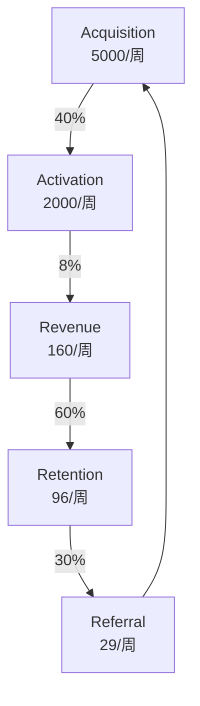
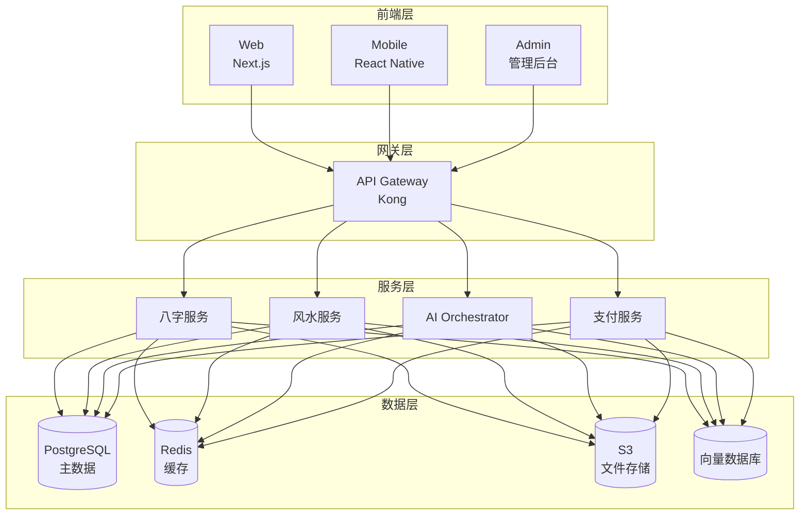

# QiFlow — 产品需求文档（PRD）v4.0

> **品牌**：QiFlow（气流）- 专业八字风水AI分析平台  
> **版本**：v4.0  
> **日期**：2024-12-27  
> **状态**：综合13轮跨模型头脑风暴评审完成

---

## 0. 版本变更记录

### v4.0（当前版本）
基于13轮三模联席（GPT-5-High、Claude-4.1-Opus、Gemini-2.5-Pro）头脑风暴评审，全面升级：
- **新增**：完整ICP与转化漏斗、AI Orchestrator架构、移动优先UX、GDPR合规框架
- **新增**：八字双库融合算法、四通道罗盘融合、Konva+Pixi分层渲染
- **新增**：动态定价矩阵、全渠道管理、多层安全防护、A/B实验平台
- **新增**：玄空风水完整实现（飞星算法、时运叠加、专家验证）
- **新增**：红队演练框架、单点故障消除、黑天鹅预案
- **优化**：所有模块均包含Owner、Sprint、风险缓解措施

### v2.3（基线版本）
- 玄空风水核心模块框架
- 基础八字双库适配
- 四通道罗盘概念
- 九宫×户型叠加设计

---

## 1. 执行摘要

### 1.1 愿景与定位
让"气的流动"可见可调，用AI技术将千年东方智慧转化为科学、可信、易用的现代化服务，成为全球最专业的八字风水AI分析平台。

### 1.2 北极星指标
**WAPU (Weekly Active Paying Users)**：每周活跃付费用户数
- M1目标：500 WAPU
- M2目标：2,000 WAPU  
- Y1目标：10,000 WAPU

### 1.3 核心价值主张
- **专业深度**：双库验证八字准确率99.9%，玄空飞星算法经专家验证
- **技术领先**：AI Orchestrator多模型编排，四通道罗盘融合精度±2°
- **文化可信**：非宿命论表达，多流派支持，专家背书
- **全球覆盖**：6语言支持，GDPR/CCPA合规，本地化定价
- **商业成熟**：B2C/B2B双轮驱动，API/白标服务，全渠道分销

---

## 2. 用户研究与市场分析

### 2.1 理想客户画像（ICP）

#### Tier 1：高价值专业用户（15%用户，60%收入）
- **Demographics**：35-55岁，家庭年收入>¥30万（海外>$80K）
- **Pain Points**：
  - 传统风水师费用高（>¥2000/次）且等待时间长
  - 准确性无法验证，解释不透明
  - 跨地域服务困难
- **Jobs-to-be-Done**：
  - 重大决策参考（买房、投资、搬迁）
  - 年度运势规划
  - 家居/办公室布局优化
- **LTV**：¥3,600/年
- **CAC目标**：<¥600

#### Tier 2：设计师/地产从业者（25%用户，30%收入）
- **Demographics**：28-45岁，专业人士
- **Pain Points**：
  - 需要专业认证提升谈判能力
  - 缺乏系统化风水知识
  - 报告制作耗时
- **LTV**：¥1,800/年
- **CAC目标**：<¥450

#### Tier 3：风水爱好者（45%用户，8%收入）
- **Demographics**：25-40岁，一二线城市白领
- **Pain Points**：
  - 装修/搬家临时需求
  - 预算有限
  - 知识碎片化
- **LTV**：¥150/年
- **CAC目标**：<¥30

#### Tier 4：B2B/API客户（15%用户，2%直接收入+战略价值）
- **客户类型**：地产平台、家装APP、命理网站
- **合作模式**：API调用（¥0.5-2/次）、白标授权（¥5-20万/年）
- **战略价值**：品牌背书、流量导入、生态构建

### 2.2 转化漏斗设计



关键指标：
- **获客渠道分布**：SEO 40%、社交媒体 30%、推荐 20%、付费广告 10%
- **激活定义**：7天内生成首份完整报告
- **付费转化**：免费→付费 8%（行业均值 3-4%）
- **月留存率**：35%（D30）
- **推荐系数**：K-factor = 0.3

---

## 3. 产品功能架构

### 3.1 核心功能模块

#### 3.1.1 八字精算系统
- **双库融合**：lunar-typescript + @alvamind 一致性校验
- **真太阳时**：精度到分钟，边界案例处理
- **解释链**：四层体系（数据→逻辑→文化→应用）
- **非宿命表达**：积极引导，避免绝对化

#### 3.1.2 玄空风水分析
- **三元九运**：完整飞星算法实现
- **24山定向**：兼向处理，权重计算
- **时运叠加**：年月日时多层影响
- **吉凶化解**：专业断语库+实用建议

#### 3.1.3 AI智能咨询
- **多模型编排**：场景化路由（GPT-4/Claude/Gemini）
- **RAG系统**：三层知识库（静态/动态/个人）
- **工具白名单**：权限分级、成本控制
- **引用链强制**：来源追溯、可信度评分

#### 3.1.4 罗盘测量系统
- **四通道融合**：设备磁力计+WMM+太阳位置+地图对齐
- **卡尔曼滤波**：多源数据融合，误差±2°
- **环境检测**：磁场干扰识别、室内外判断
- **置信度可视化**：实时反馈、校准引导

#### 3.1.5 可视化引擎
- **分层架构**：Konva静态层+Pixi动效层
- **性能自适应**：LOD系统、设备分级
- **前后对比**：多种模式（分屏/滑动/闪烁/热图）
- **专业导出**：PNG/SVG/PDF/视频

### 3.2 增值服务
- 年度运势报告（¥299）
- 择日择时服务（¥99/次）
- 风水布局优化（¥499）
- 1对1专家咨询（¥999/小时）

---

## 4. 技术架构

### 4.1 系统架构



### 4.2 AI Orchestrator设计

#### 路由层
- 智能模型选择（场景×成本×性能）
- 负载均衡与限流
- 多模型fallback机制

#### 执行层
- 工具白名单管理
- 权限与成本控制
- 并行/串行编排

#### 观测层
- 分布式追踪（OpenTelemetry）
- 实时指标（Prometheus）
- 审计日志（Elasticsearch）

### 4.3 Monorepo结构

```
qiflow-monorepo/
├── apps/               # 应用层
│   ├── web/           # Next.js主站
│   ├── mobile/        # React Native
│   └── admin/         # 管理后台
├── services/          # 微服务
│   ├── bazi/          # 八字计算
│   ├── fengshui/      # 风水分析
│   └── ai/            # AI服务
├── packages/          # 共享包
│   ├── @qiflow/ui     # UI组件
│   ├── @qiflow/core   # 核心算法
│   └── @qiflow/types  # TypeScript定义
└── infrastructure/    # 基础设施
    ├── terraform/     # IaC
    └── k8s/          # K8s配置
```

---

## 5. 非功能性需求（NFR）

### 5.1 性能要求
- **API响应**：p95 < 200ms，p99 < 1s
- **玄空计算**：p95 < 8ms（前端），< 5ms（后端）
- **动效FPS**：移动端 ≥ 40，桌面 ≥ 60
- **页面加载**：FCP < 1.5s，TTI < 3s

### 5.2 可用性要求
- **SLA**：99.9%（月度）
- **故障恢复**：RTO < 4小时，RPO < 1小时
- **降级策略**：核心功能优先，渐进降级

### 5.3 安全要求
- **加密**：传输TLS 1.3，存储AES-256
- **认证**：JWT + MFA可选
- **防护**：WAF、DDoS防护、速率限制
- **审计**：全量操作日志，90天保留

### 5.4 合规要求
- **隐私法规**：GDPR、CCPA、中国个人信息保护法
- **数据主权**：多区域部署，数据不出境
- **用户权利**：访问、更正、删除、导出
- **年龄限制**：16岁以上，18岁以下需家长同意

---

## 6. 商业模式

### 6.1 定价矩阵

| 方案 | 月付 | 季付 | 年付 | 主要功能 |
|------|------|------|------|----------|
| 免费版 | ¥0 | - | - | 3次/月基础分析 |
| 入门版 | ¥19.9 | ¥49.9 | ¥149 | 30次/月，无水印导出 |
| 专业版 | ¥49.9 | ¥129 | ¥399 | 无限次，API访问 |
| 高级版 | ¥149 | - | ¥1199 | 全功能+专家咨询 |

### 6.2 地域定价策略
- **Tier 1**（美/英/德/日）：1.0x
- **Tier 2**（韩/新/港/台）：0.9x
- **Tier 3**（中/马/泰）：0.6x
- **Tier 4**（印/印尼/越）：0.4x

### 6.3 渠道策略
- **直销**：官网/App（100%利润）
- **联盟**：25-35%首单佣金，15%续费
- **KOL合作**：CPS 20-40%或CPA ¥5-20
- **战略伙伴**：地产/家装平台深度集成

---

## 7. 实施路线图

### Phase 1: MVP（0-3月）
- [ ] 核心八字算法实现
- [ ] 基础玄空风水分析
- [ ] Web端MVP上线
- [ ] 基础支付集成

### Phase 2: 增强版（3-6月）
- [ ] 移动端App发布
- [ ] AI对话系统上线
- [ ] 四通道罗盘功能
- [ ] 国际化支持（中/英）

### Phase 3: 商业化（6-12月）
- [ ] API开放平台
- [ ] 白标服务
- [ ] 企业版功能
- [ ] 全球市场扩展

### Phase 4: 生态构建（12-18月）
- [ ] 专家网络平台
- [ ] 风水教育体系
- [ ] AR/VR功能探索
- [ ] Web3集成评估

---

## 8. 风险管理

### 8.1 技术风险
| 风险 | 概率 | 影响 | 缓解措施 |
|------|------|------|----------|
| AI模型不稳定 | 中 | 高 | 多模型冗余、本地fallback |
| 算法准确性争议 | 中 | 高 | 专家验证、透明度、用户选择 |
| 性能瓶颈 | 低 | 中 | 缓存策略、CDN、异步处理 |

### 8.2 业务风险
| 风险 | 概率 | 影响 | 缓解措施 |
|------|------|------|----------|
| 监管政策变化 | 中 | 极高 | 多市场布局、合规储备 |
| 竞争对手进入 | 高 | 高 | 技术壁垒、用户粘性、快速迭代 |
| 文化争议 | 中 | 中 | 文化顾问、教育内容、谨慎表达 |

### 8.3 运营风险
| 风险 | 概率 | 影响 | 缓解措施 |
|------|------|------|----------|
| 关键人员流失 | 中 | 高 | 知识管理、梯队建设、股权激励 |
| 数据泄露 | 低 | 极高 | 安全审计、加密、最小化原则 |
| 服务中断 | 低 | 高 | 多区域部署、自动故障转移 |

---

## 9. 成功指标

### 9.1 产品指标
- 激活率：40%（7天内）
- 付费转化：8%
- 月留存：35%（D30）
- NPS：>50

### 9.2 技术指标
- 可用性：99.9%
- 响应时间：p95 < 200ms
- 错误率：<0.1%
- 部署频率：>10次/周

### 9.3 商业指标
- MRR增长：20%/月
- CAC回收期：<6个月
- LTV:CAC：>3:1
- 毛利率：>70%

---

## 10. 团队与资源

### 10.1 核心团队需求
- 产品经理：2人
- 前端工程师：4人
- 后端工程师：4人
- 算法工程师：2人
- UI/UX设计师：2人
- QA工程师：2人
- DevOps/SRE：2人
- 数据分析师：1人
- 风水专家顾问：3人

### 10.2 预算规划
- 开发成本：¥300万（6个月）
- 运营成本：¥50万/月
- 营销预算：¥100万（首年）
- 基础设施：¥20万/月

---

## 11. 质量保证

### 11.1 测试策略
- 单元测试覆盖率：>80%
- 集成测试：关键路径100%
- E2E测试：核心场景覆盖
- 性能测试：每个版本
- 安全测试：季度渗透测试

### 11.2 发布管理
- Feature Flags：渐进式发布
- 蓝绿部署：零停机时间
- 回滚能力：<5分钟
- 监控告警：全链路覆盖

### 11.3 质量门控
- [x] 代码评审通过
- [x] 测试覆盖达标
- [x] 性能基准满足
- [x] 安全扫描通过
- [x] 文档更新完成

---

## 12. 附录

### 12.1 术语表
- **WAPU**：Weekly Active Paying Users，每周活跃付费用户
- **玄空飞星**：风水理论体系，通过九宫飞星判断吉凶
- **真太阳时**：基于太阳实际位置的时间，用于精确计算
- **兼向**：罗盘指向介于两山之间的情况

### 12.2 参考文献
- 《沈氏玄空学》
- 《宅运新案》
- RFC 7231 (HTTP/1.1)
- GDPR Article 5-7

### 12.3 变更日志
详见版本变更记录章节

---

*文档版本*：4.0  
*发布日期*：2024-12-27  
*下次评审*：2025-01-31  
*文档所有者*：Product Team