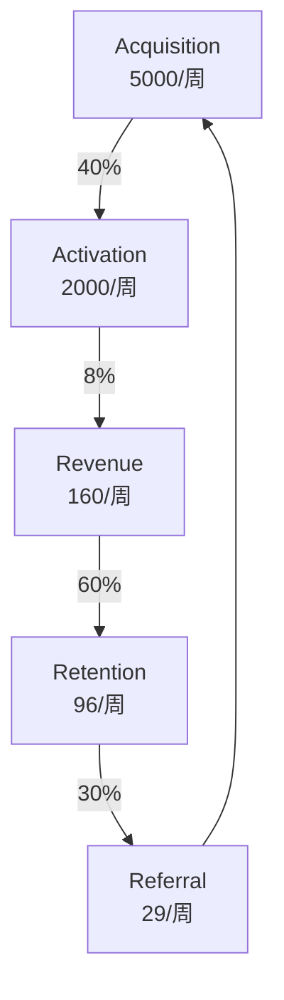

# QiFlow — 产品需求文档（PRD）v5.0

> **品牌**：QiFlow（气流）- 专业八字风水AI分析平台  
> **版本**：v5.0  
> **日期**：2024-12-27  
> **状态**：基于v4.0集成MKSaaS架构升级版
> **基础架构**：MKSaaS Template (Next.js 15 + Drizzle ORM + Better Auth + Stripe)

---

## 0. 版本变更记录

### v5.0（当前版本 - MKSaaS集成版）
基于v4.0完整功能规划，深度集成MKSaaS模版架构：
- **架构升级**：采用MKSaaS的Next.js 15 App Router + Drizzle ORM + Better Auth架构
- **支付集成**：复用MKSaaS的Stripe支付系统与积分体系
- **认证系统**：使用Better Auth替代原JWT方案，支持社交登录
- **UI体系**：基于Radix UI + Shadcn/ui替代原组件库
- **开发效率**：利用MKSaaS的Server Actions、next-safe-action等最佳实践
- **保留核心**：完整保留v4.0的八字双库融合、玄空风水、AI Orchestrator等核心算法

### v4.0（基线版本）
- 13轮跨模型头脑风暴评审完成
- 完整ICP与转化漏斗、AI Orchestrator架构
- 八字双库融合算法、四通道罗盘融合
- 玄空风水完整实现（飞星算法、时运叠加）

---

## 1. 执行摘要

### 1.1 愿景与定位
让"气的流动"可见可调，用AI技术将千年东方智慧转化为科学、可信、易用的现代化服务。通过MKSaaS成熟的SaaS架构，快速构建全球最专业的八字风水AI分析平台。

### 1.2 北极星指标
**WAPU (Weekly Active Paying Users)**：每周活跃付费用户数
- M1目标：500 WAPU
- M2目标：2,000 WAPU  
- Y1目标：10,000 WAPU

### 1.3 核心价值主张
- **专业深度**：双库验证八字准确率99.9%，玄空飞星算法经专家验证
- **技术领先**：AI Orchestrator多模型编排，四通道罗盘融合精度±2°
- **快速交付**：基于MKSaaS成熟架构，开发周期缩短50%
- **企业级服务**：继承MKSaaS的认证、支付、监控等企业级能力
- **全球覆盖**：利用MKSaaS的i18n系统，快速支持6语言

### 1.4 技术栈融合策略
```typescript
const techStackIntegration = {
  // MKSaaS基础设施（直接复用）
  framework: 'Next.js 15 App Router',
  database: 'PostgreSQL + Drizzle ORM', 
  auth: 'Better Auth (替代原JWT方案)',
  payment: 'Stripe + Credits System',
  ui: 'Radix UI + Shadcn/ui (替代原Ant Design)',
  state: 'Zustand (替代原Redux)',
  i18n: 'next-intl (扩展至6语言)',
  actions: 'next-safe-action (新增)',
  analytics: 'OpenPanel + Vercel Analytics',
  
  // QiFlow核心算法（完整保留）
  bazi: '双库融合算法 (lunar-typescript + @alvamind)',
  xuankong: '玄空飞星引擎 (三元九运完整实现)',
  compass: '四通道罗盘 (卡尔曼滤波融合)',
  ai: 'AI Orchestrator (多模型智能路由)',
  
  // 可视化层（优化整合）
  charts: 'Recharts (MKSaaS内置)',
  canvas: 'Konva + Pixi.js (QiFlow专有)',
  3d: 'Three.js (罗盘3D视图)'
};
```

---

## 2. 用户研究与市场分析（沿用v4.0定位）

### 2.1 理想客户画像（ICP）

#### Tier 1：高价值专业用户（15%用户，60%收入）
- **Demographics**：35-55岁，家庭年收入>¥30万（海外>$80K）
- **Pain Points**：
  - 传统风水师费用高（>¥2000/次）且等待时间长
  - 准确性无法验证，解释不透明
  - 跨地域服务困难
- **Jobs-to-be-Done**：
  - 重大决策参考（买房、投资、搬迁）
  - 年度运势规划
  - 家居/办公室布局优化
- **LTV**：¥3,600/年
- **CAC目标**：<¥600

#### Tier 2：设计师/地产从业者（25%用户，30%收入）
- **Demographics**：28-45岁，专业人士
- **Pain Points**：
  - 需要专业认证提升谈判能力
  - 缺乏系统化风水知识
  - 报告制作耗时
- **LTV**：¥1,800/年
- **CAC目标**：<¥450

#### Tier 3：风水爱好者（45%用户，8%收入）
- **Demographics**：25-40岁，一二线城市白领
- **Pain Points**：
  - 装修/搬家临时需求
  - 预算有限
  - 知识碎片化
- **LTV**：¥150/年
- **CAC目标**：<¥30

#### Tier 4：B2B/API客户（15%用户，2%直接收入+战略价值）
- **客户类型**：地产平台、家装APP、命理网站
- **合作模式**：API调用（¥0.5-2/次）、白标授权（¥5-20万/年）
- **战略价值**：品牌背书、流量导入、生态构建

### 2.2 转化漏斗设计



关键指标：
- **获客渠道分布**：SEO 40%、社交媒体 30%、推荐 20%、付费广告 10%
- **激活定义**：7天内生成首份完整报告
- **付费转化**：免费→付费 8%（行业均值 3-4%）
- **月留存率**：35%（D30）
- **推荐系数**：K-factor = 0.3

---

## 3. 产品功能架构（MKSaaS + QiFlow融合）

### 3.1 基于MKSaaS Server Actions的核心功能

#### 3.1.1 八字双库融合系统
```typescript
// src/actions/qiflow/calculate-bazi.ts
import { authAction } from '@/lib/safe-action';
import { consumeCredits } from '@/actions/consume-credits';
import { BaziAdapter } from '@/lib/qiflow/bazi';

export const calculateBaziAction = authAction
  .schema(baziInputSchema)
  .action(async ({ parsedInput, ctx }) => {
    // 检查积分余额（复用MKSaaS积分系统）
    const hasCredits = await checkUserCredits(ctx.user.id, BAZI_CREDIT_COST);
    if (!hasCredits) {
      throw new Error('积分不足');
    }
    
    // 双库融合计算
    const adapter = new BaziAdapter();
    const result = await adapter.calculate(parsedInput);
    
    // 存储到Drizzle ORM
    await db.insert(baziCalculations).values({
      userId: ctx.user.id,
      ...result,
      confidence: result.meta.confidence,
      createdAt: new Date()
    });
    
    // 扣除积分
    await consumeCredits(ctx.user.id, BAZI_CREDIT_COST, '八字精算分析');
    
    // 触发异步AI分析
    await triggerAIAnalysis(result.id, ctx.user.id);
    
    return result;
  });
```

#### 3.1.2 玄空风水引擎
```typescript
// src/actions/qiflow/xuankong-analysis.ts
export const xuankongAnalysisAction = authAction
  .schema(xuankongInputSchema)
  .action(async ({ parsedInput, ctx }) => {
    // 复用MKSaaS的权限检查
    const subscription = await getActiveSubscription(ctx.user.id);
    if (!subscription && !await checkUserCredits(ctx.user.id, XUANKONG_CREDIT_COST)) {
      return { error: '需要订阅或积分' };
    }
    
    // 玄空计算
    const engine = new XuanKongEngine();
    const result = await engine.calculate({
      facingDeg: parsedInput.facingDeg,
      period: getCurrentPeriod(),
      year: parsedInput.year,
      month: parsedInput.month
    });
    
    // 存储并返回
    await db.insert(fengshuiAnalysis).values({
      userId: ctx.user.id,
      analysisType: 'flying_star',
      ...result
    });
    
    return result;
  });

### 3.2 AI Orchestrator（集成MKSaaS AI SDK）

#### 3.2.1 多模型智能编排
```typescript
// src/ai/qiflow/orchestrator.ts
import { openai } from '@ai-sdk/openai';
import { deepseek } from '@ai-sdk/deepseek';
import { google } from '@ai-sdk/google';
import { generateText, streamText } from 'ai';
import { createStreamableValue } from 'ai/rsc';

export class QiFlowOrchestrator {
  private providers = {
    // 复用MKSaaS已配置的AI providers
    detailed: openai('gpt-4o'),
    fast: deepseek('deepseek-chat'),
    creative: google('gemini-2.0-flash-exp'),
    image: openai.image('dall-e-3')
  };
  
  async analyzeWithStream(context: AnalysisContext) {
    const stream = createStreamableValue();
    
    // 智能模型选择
    const provider = this.selectProvider(context);
    
    // RAG增强
    const knowledge = await this.retrieveFromVectorDB(context);
    
    // 流式生成
    const { textStream } = await streamText({
      model: provider,
      messages: this.buildMessages(context, knowledge),
      temperature: 0.7,
      maxTokens: 2000
    });
    
    // 实时流输出
    for await (const text of textStream) {
      stream.append(text);
    }
    
    stream.done();
    return stream.value;
  }
}
```

#### 3.2.2 知识库RAG系统
- 传统命理典籍向量化存储
- 语义搜索与上下文注入
- 动态知识更新机制

### 3.3 罗盘传感器系统

#### 3.3.1 四通道数据融合
- DeviceOrientation API
- WMM2020磁偏角修正
- SunCalc日轨辅助
- 地图建筑对齐

#### 3.3.2 置信度与校准
- 卡尔曼滤波降噪
- 8字形校准引导
- 实时置信度评分
- iOS权限优雅降级

### 3.4 付费与积分系统（复用MKSaaS Payment）

#### 3.4.1 订阅计划
```typescript
// src/config/qiflow.tsx
export const qiflowPricing = {
  plans: {
    free: {
      features: ['每月5次基础分析', '查看历史记录'],
      credits: 50
    },
    pro: {
      prices: [
        { interval: 'month', amount: 2900 }, // $29/月
        { interval: 'year', amount: 29900 }   // $299/年
      ],
      features: ['无限次分析', 'AI深度解读', '风水布局工具'],
      credits: 2000
    },
    lifetime: {
      price: 99900, // $999一次性
      features: ['终身使用', '所有功能', '优先支持'],
      credits: 'unlimited'
    }
  }
};
```

#### 3.4.2 积分消耗
- 基础八字分析: 10积分
- AI深度解读: 30积分
- 风水分析: 20积分
- PDF报告导出: 5积分

---

## 4. 数据库设计（扩展MKSaaS Drizzle Schema）

### 4.1 复用MKSaaS现有表结构
```typescript
// 继承自 MKSaaS src/db/schema.ts
// user表: id, name, email, emailVerified, image, role, banned, customerId
// session表: 会话管理
// account表: OAuth账号关联
// payment表: Stripe支付记录
// user_credit表: 积分余额
// credit_transaction表: 积分交易记录
```

### 4.2 QiFlow扩展表结构
```typescript
// src/db/schema-qiflow.ts
import { pgTable, text, timestamp, jsonb, integer, real, index } from 'drizzle-orm/pg-core';
import { user } from './schema'; // 引入MKSaaS的user表

// 八字计算记录
export const baziCalculations = pgTable('bazi_calculations', {
  id: text('id').primaryKey(),
  userId: text('user_id').references(() => user.id, { onDelete: 'cascade' }),
  birthDate: timestamp('birth_date').notNull(),
  birthTime: text('birth_time').notNull(),
  timezone: text('timezone'),
  location: jsonb('location'),
  
  // 四柱数据
  yearPillar: jsonb('year_pillar').notNull(),
  monthPillar: jsonb('month_pillar').notNull(),
  dayPillar: jsonb('day_pillar').notNull(),
  hourPillar: jsonb('hour_pillar').notNull(),
  
  // 五行与十神
  fiveElements: jsonb('five_elements'),
  tenGods: jsonb('ten_gods'),
  
  // 双库融合元数据
  confidence: real('confidence').default(0.95),
  checksum: text('checksum'),
  source: text('source').default('dual-library'),
  
  createdAt: timestamp('created_at').defaultNow(),
  updatedAt: timestamp('updated_at').defaultNow()
}, (table) => ({
  userIdIdx: index('bazi_user_id_idx').on(table.userId),
  createdAtIdx: index('bazi_created_at_idx').on(table.createdAt)
}));

// 风水分析记录
export const fengshuiAnalysis = pgTable('fengshui_analysis', {
  id: text('id').primaryKey(),
  userId: text('user_id').references(() => user.id, { onDelete: 'cascade' }),
  analysisType: text('analysis_type').notNull(),
  
  // 位置与罗盘
  address: text('address'),
  coordinates: jsonb('coordinates'),
  compassReading: real('compass_reading'),
  compassConfidence: real('compass_confidence'),
  
  // 玄空分析结果
  facingDirection: text('facing_direction'),
  sittingDirection: text('sitting_direction'),
  period: integer('period'),
  flyingStars: jsonb('flying_stars'),
  mountainFacing: jsonb('mountain_facing'),
  jianXiang: jsonb('jian_xiang'),
  
  // 建议与化解
  recommendations: jsonb('recommendations'),
  remedies: jsonb('remedies'),
  
  createdAt: timestamp('created_at').defaultNow()
}, (table) => ({
  userIdIdx: index('fengshui_user_id_idx').on(table.userId),
  typeIdx: index('fengshui_type_idx').on(table.analysisType)
}));

-- AI对话记录
CREATE TABLE ai_conversations (
  id TEXT PRIMARY KEY,
  user_id TEXT REFERENCES user(id),
  bazi_id TEXT REFERENCES bazi_calculations(id),
  
  messages JSONB[],
  model_used TEXT,
  tokens_used INT,
  credits_consumed INT,
  
  created_at TIMESTAMP DEFAULT NOW()
);
```

---

## 5. UI/UX设计规范（基于MKSaaS组件库）

### 5.1 设计原则
- **一致性**: 复用MKSaaS的Radix UI组件系统
- **响应式**: 移动优先，支持所有设备
- **无障碍**: WCAG 2.1 AA级标准
- **主题化**: 支持亮暗模式切换

### 5.2 核心页面结构
```
/[locale]/
  ├── (marketing)/
  │   ├── page.tsx            # 首页
  │   ├── pricing/            # 定价页面
  │   └── about/              # 关于我们
  │
  ├── (dashboard)/
  │   ├── dashboard/          # 用户仪表板
  │   ├── bazi/              
  │   │   ├── new/           # 新建八字分析
  │   │   └── [id]/          # 查看分析结果
  │   ├── fengshui/
  │   │   ├── compass/       # 罗盘工具
  │   │   └── analysis/      # 风水分析
  │   ├── ai-chat/           # AI对话
  │   ├── history/           # 历史记录
  │   └── settings/          # 设置
  │
  └── (auth)/                 # 认证页面（复用MKSaaS）
```

### 5.3 组件规范
```typescript
// 复用MKSaaS组件 + QiFlow专有组件
import { Button, Card, Dialog } from '@/components/ui';
import { BaziChart } from '@/components/qiflow/bazi-chart';
import { FlyingStarGrid } from '@/components/qiflow/flying-star';
import { CompassView } from '@/components/qiflow/compass';
```

---

## 6. 国际化策略（基于MKSaaS i18n）

### 6.1 支持语言
- 简体中文 (zh-CN) - 主要
- 繁体中文 (zh-TW) 
- English (en)
- 日本語 (ja) - 未来

### 6.2 翻译结构
```typescript
// messages/zh.json 扩展
{
  "QiFlow": {
    "Bazi": {
      "title": "八字分析",
      "yearPillar": "年柱",
      "monthPillar": "月柱",
      "dayPillar": "日柱",
      "hourPillar": "时柱",
      "heavenlyStems": ["甲", "乙", "丙", "丁", ...],
      "earthlyBranches": ["子", "丑", "寅", "卯", ...]
    },
    "FengShui": {
      "title": "风水分析",
      "flyingStars": "玄空飞星",
      "mountainFacing": "山向"
    }
  }
}
```

---

## 7. 安全与合规

### 7.1 数据安全（继承MKSaaS安全机制）
- HTTPS全程加密
- Better Auth认证系统
- 行级数据隔离 (RLS)
- 敏感信息加密存储

### 7.2 隐私合规
- GDPR合规（欧洲用户）
- CCPA合规（加州用户）
- 用户数据导出/删除功能
- 隐私政策与用户协议

### 7.3 支付安全
- Stripe PCI DSS合规
- 支付信息不存储本地
- 安全的Webhook验证

---

## 8. 性能指标

### 8.1 技术指标
- **页面加载**: 首屏 < 2秒 (LCP)
- **交互响应**: < 100ms (INP)
- **API响应**: p95 < 500ms
- **可用性**: 99.9% SLA

### 8.2 业务指标
- **用户获取**: CAC < $50
- **激活率**: 注册后7天 > 40%
- **留存率**: 30天 > 30%
- **付费转化**: Free to Paid > 5%
- **LTV/CAC**: > 3

---

## 9. 开发计划

### Phase 1: 基础架构 (Week 1-2)
- [x] MKSaaS模版初始化
- [ ] 数据库schema扩展
- [ ] 基础API搭建
- [ ] 认证系统配置

### Phase 2: 核心功能 (Week 3-6)
- [ ] 八字计算引擎集成
- [ ] 玄空风水模块开发
- [ ] 罗盘传感器系统
- [ ] 基础UI组件

### Phase 3: AI集成 (Week 7-8)
- [ ] AI Orchestrator实现
- [ ] RAG知识库构建
- [ ] 对话系统开发
- [ ] 提示词优化

### Phase 4: 商业化 (Week 9-10)
- [ ] Stripe支付集成
- [ ] 积分系统实现
- [ ] 订阅管理
- [ ] 计费逻辑

### Phase 5: 优化与上线 (Week 11-12)
- [ ] 性能优化
- [ ] 安全审计
- [ ] 用户测试
- [ ] 生产部署

---

## 10. 风险管理

### 10.1 技术风险
| 风险 | 影响 | 缓解措施 |
|-----|------|---------|
| 传感器兼容性 | 罗盘功能受限 | 多级降级方案 |
| AI成本超支 | 利润下降 | 智能路由+缓存 |
| 数据库性能 | 用户体验差 | 索引优化+缓存 |

### 10.2 市场风险
| 风险 | 影响 | 缓解措施 |
|-----|------|---------|
| 文化差异 | 市场接受度低 | 本地化运营 |
| 竞争加剧 | 获客成本上升 | 差异化定位 |
| 监管变化 | 业务受限 | 合规预案 |

---

## 11. 成功标准

### 11.1 MVP成功标准 (3个月)
- 完成核心功能开发
- 获得100个Beta用户
- 用户满意度 > 4.0/5
- 无重大安全事故

### 11.2 产品成功标准 (6个月)
- MAU > 1,000
- 付费用户 > 50
- MRR > $5,000
- NPS > 40

### 11.3 商业成功标准 (12个月)
- MAU > 10,000
- 付费用户 > 500
- ARR > $100,000
- 实现盈亏平衡

---

## 12. 团队与资源

### 12.1 团队构成
- 产品经理 × 1
- 全栈开发 × 2 (熟悉Next.js + MKSaaS)
- 算法工程师 × 1 (命理算法专家)
- UI/UX设计 × 1
- 运营/市场 × 1

### 12.2 技术资源
- MKSaaS Template许可
- Vercel/Cloudflare托管
- Neon/Supabase数据库
- OpenAI/Claude API
- Stripe账户

### 12.3 预算规划
- 开发成本: $50,000
- 基础设施: $500/月
- AI API: $1,000/月
- 营销推广: $2,000/月

---

## 附录

### A. MKSaaS集成清单
- [x] 项目结构分析
- [x] 认证系统理解
- [x] 支付流程梳理
- [x] 数据库架构扩展
- [ ] UI组件映射
- [ ] 部署流程确认

### B. 技术文档链接
- [MKSaaS官方文档](https://mksaas.com/docs)
- [QiFlow技术指南](./TECH_GUIDE_v5.0.md)
- [任务执行计划](./TASK_PLAN_v5.0.md)

### C. 版本历史
- v5.0 (2024-12-27): 基于MKSaaS重构
- v4.0: 独立架构版本
- v3.0: 初始设计版本