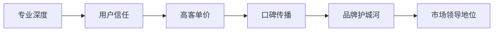
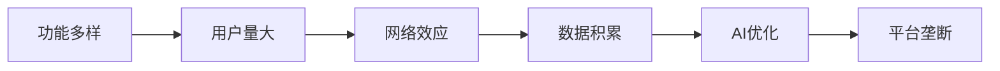

# QiFlowAI 市场策略分析报告

## 执行摘要

经过深度分析，**建议采用"垂直深耕+渐进扩展"策略**：先专注于"个人八字+玄空风水"垂直领域，建立品牌和技术壁垒，然后逐步扩展到更广泛的玄学领域。

---

## 一、两种定位方案对比

### 方案A：垂直领域 - 八字玄空风水专家系统

**核心定位**：全球最专业的个人八字与玄空风水AI分析平台

**产品特色**：
- 🎯 极度专注：只做八字+玄空风水
- 🔬 专业深度：算法精确，分析详尽
- 🏆 权威性强：易建立专家形象
- 💎 高客单价：专业服务定价更高

### 方案B：广泛领域 - 综合玄学AI平台

**核心定位**：一站式AI玄学服务平台

**产品特色**：
- 🌍 覆盖面广：八字、风水、占卜、星座等
- 👥 用户基数大：满足不同需求
- 🔄 流量导向：易获取大量用户
- 💰 多元变现：广告、会员、付费咨询

---

## 二、市场机会分析

### 海外市场数据（2024年）

```
目标市场规模：
┌─────────────────────────────────────────────┐
│ 垂直市场（八字风水）                        │
│ • 全球华人：6000万+                        │
│ • 高净值群体：300万+                       │
│ • 年均消费：$500-5000                      │
│ • 市场规模：$15-150亿                      │
├─────────────────────────────────────────────┤
│ 广泛市场（综合玄学）                        │
│ • 目标用户：3亿+                           │
│ • 活跃用户：5000万+                        │
│ • 年均消费：$50-500                        │
│ • 市场规模：$250亿+                        │
└─────────────────────────────────────────────┘
```

### 竞争格局

**垂直领域竞争者**：
- 传统风水师线上化（技术弱）
- 小型专业APP（营销弱）
- **机会：技术+营销双重优势**

**广泛领域竞争者**：
- Co-Star（估值$15M）
- The Pattern（用户500万+）
- Sanctuary（月活100万+）
- **挑战：红海市场，获客成本高**

---

## 三、成功路径分析

### 🏆 垂直领域成功要素



**关键指标**：
- 获客成本：$50-100
- 客单价：$200-2000
- LTV：$1000-10000
- 毛利率：80-90%

### 🌟 广泛领域成功要素



**关键指标**：
- 获客成本：$5-20
- 客单价：$10-100
- LTV：$50-500
- 毛利率：60-70%

---

## 四、出海赚美金策略

### 💎 垂直策略：高端路线

**目标客群**：
1. **海外华人高净值群体**（优先级：⭐⭐⭐⭐⭐）
   - 美国：160万华人家庭，平均年收入$10万+
   - 加拿大：50万华人家庭
   - 澳洲：30万华人家庭
   - 欧洲：20万华人家庭

2. **亚洲富裕阶层**（优先级：⭐⭐⭐⭐）
   - 新加坡：购买力极强
   - 马来西亚：华人富商多
   - 香港：风水文化浓厚

**变现模式**：
```
收费层级：
┌────────────────────────────────────┐
│ 1. 基础报告：$49/份               │
│ 2. 深度分析：$299/份              │
│ 3. 年度顾问：$2999/年             │
│ 4. 企业风水：$9999+/项目          │
│ 5. API授权：$999/月                │
└────────────────────────────────────┘
```

**预期收益**（第一年）：
- 付费用户：5000人
- 平均客单价：$500
- 年收入：$250万
- 净利润：$150万（60%利润率）

### 🚀 广泛策略：流量变现

**目标客群**：
1. **西方玄学爱好者**（优先级：⭐⭐⭐）
   - 美国：3000万+用户
   - 欧洲：2000万+用户
   - 需求：占星、塔罗、水晶

2. **年轻群体**（优先级：⭐⭐⭐⭐）
   - Z世代：精神需求强
   - 千禧一代：压力大，寻求指引

**变现模式**：
```
多元化收入：
┌────────────────────────────────────┐
│ 1. 免费版：广告收入               │
│ 2. 会员版：$9.99/月               │
│ 3. 单次咨询：$4.99/次             │
│ 4. 虚拟物品：$0.99-9.99           │
│ 5. 联盟营销：15-30%佣金           │
└────────────────────────────────────┘
```

**预期收益**（第一年）：
- 注册用户：100万
- 付费转化：5%
- 平均月ARPU：$5
- 年收入：$300万
- 净利润：$90万（30%利润率）

---

## 五、技术实现难度

### 垂直领域技术要求

```typescript
// 核心技术栈
const verticalTechStack = {
  算法深度: "极高",
  数据准确性: "99.9%",
  专业知识: "大师级",
  开发周期: "3-6个月",
  维护成本: "中等",
  
  技术壁垒: {
    八字算法: "核心竞争力",
    风水模型: "独家秘方",
    AI预测: "深度学习"
  }
};
```

### 广泛领域技术要求

```typescript
// 技术挑战
const broadTechStack = {
  功能广度: "极高",
  系统复杂度: "高",
  数据整合: "困难",
  开发周期: "12-18个月",
  维护成本: "高",
  
  技术挑战: {
    多系统整合: "复杂",
    数据一致性: "困难",
    个性化推荐: "需要大数据"
  }
};
```

---

## 六、风险评估

### ⚠️ 垂直领域风险

| 风险类型 | 风险等级 | 缓解策略 |
|---------|---------|---------|
| 市场规模受限 | 中 | 逐步扩展相关领域 |
| 文化接受度 | 低 | 本地化运营 |
| 专业门槛高 | 中 | 聘请专家顾问 |
| 获客成本高 | 中 | KOL营销+口碑 |

### ⚠️ 广泛领域风险

| 风险类型 | 风险等级 | 缓解策略 |
|---------|---------|---------|
| 竞争激烈 | 高 | 差异化定位 |
| 烧钱获客 | 高 | 精准营销 |
| 品牌定位模糊 | 高 | 清晰价值主张 |
| 技术债务 | 中 | 模块化开发 |

---

## 七、推荐策略：阶段性发展路径

### 🎯 Phase 1：垂直突破（0-12个月）

**核心任务**：
1. 完善八字+玄空风水核心功能
2. 建立专业品牌形象
3. 获取种子用户和案例
4. 实现正向现金流

**里程碑**：
- 月度：1000付费用户
- 月收入：$50,000
- 用户满意度：90%+

### 🚀 Phase 2：横向扩展（12-24个月）

**扩展方向**：
```
八字风水 --> 八字风水+择日
         --> 八字风水+起名
         --> 八字风水+合婚
         --> 八字风水+事业指导
```

**目标**：
- 月度：10,000付费用户
- 月收入：$300,000
- 市场份额：垂直领域Top 3

### 🌍 Phase 3：生态构建（24-36个月）

**平台化转型**：
1. 开放API和SDK
2. 引入风水师入驻
3. 建立内容社区
4. AI+人工服务结合

**愿景**：
- 年收入：$1000万+
- 估值：$5000万+
- 全球用户：100万+

---

## 八、竞争优势构建

### 独特价值主张（UVP）

```
QiFlowAI = AI技术 + 千年智慧 + 现代体验

核心优势：
1. 技术领先：最准确的八字算法
2. 用户体验：最简洁的交互设计  
3. 专业深度：最详尽的分析报告
4. 全球视野：多语言本地化
5. 数据安全：隐私保护最严格
```

### 护城河建设

**短期护城河**（6个月）：
- 算法准确性
- 用户体验
- 响应速度

**中期护城河**（12个月）：
- 用户数据
- 品牌认知
- 专家网络

**长期护城河**（24个月）：
- 网络效应
- 生态系统
- AI模型优势

---

## 九、营销获客策略

### 🎯 垂直领域获客

**内容营销**：
1. SEO优化：
   - 关键词："八字算命"、"风水大师"、"BaZi Calculator"
   - 长尾词：针对具体问题的解决方案

2. 社交媒体：
   - YouTube：风水案例分析视频
   - Instagram：每日运势卡片
   - TikTok：30秒风水小技巧
   - 小红书：家居风水改造

**KOL合作**：
- 华人社区意见领袖
- 风水大师背书
- 成功企业家案例

**付费推广**：
- Google Ads：$5000/月
- Facebook Ads：$3000/月
- 预期CAC：$50-80
- 预期ROI：300%+

### 🚀 广泛领域获客

**病毒式增长**：
1. 免费功能吸引
2. 社交分享机制
3. 邀请奖励系统
4. 内容UGC

**Partnership**：
- 约会APP合作
- 心理健康平台
- 生活方式媒体
- 企业HR服务

---

## 十、财务预测模型

### 垂直模式财务预测（3年）

```
Year 1:
- 用户数：5,000
- 收入：$250万
- 成本：$100万
- 利润：$150万

Year 2:
- 用户数：20,000
- 收入：$800万
- 成本：$300万
- 利润：$500万

Year 3:
- 用户数：50,000
- 收入：$2000万
- 成本：$600万
- 利润：$1400万

3年总计：利润$2050万
估值：$5000万-1亿
```

### 广泛模式财务预测（3年）

```
Year 1:
- 用户数：1,000,000
- 付费率：5%
- 收入：$300万
- 成本：$210万
- 利润：$90万

Year 2:
- 用户数：5,000,000
- 付费率：8%
- 收入：$2000万
- 成本：$1400万
- 利润：$600万

Year 3:
- 用户数：15,000,000
- 付费率：10%
- 收入：$7500万
- 成本：$5250万
- 利润：$2250万

3年总计：利润$2940万
估值：$1-3亿（需要持续融资）
```

---

## 十一、最终建议

### 🏆 推荐方案：垂直起步，渐进扩展

**理由**：

1. **更快盈利**：3-6个月即可正现金流
2. **资金效率高**：不需要烧钱获客
3. **技术可控**：专注核心算法，避免技术债
4. **品牌清晰**：容易建立专业形象
5. **风险可控**：不依赖融资，自主发展
6. **扩展性强**：成功后可自然延伸

### 📋 执行计划（Next 90 Days）

**Week 1-2：产品定位**
- 确定核心USP
- 设计价格体系
- 制定GTM策略

**Week 3-4：MVP优化**
- 完善八字算法
- 优化风水分析
- 提升用户体验

**Week 5-8：内容准备**
- 制作营销材料
- 准备案例研究
- 建立内容日历

**Week 9-12：市场测试**
- 小规模推广
- 收集用户反馈
- 迭代优化产品
- 实现首批付费用户

### 🎯 成功指标（KPI）

**30天目标**：
- 完成产品定位
- 获得100个测试用户
- NPS分数>50

**60天目标**：
- 获得首批10个付费用户
- 月收入$1000+
- 用户留存率>60%

**90天目标**：
- 付费用户100+
- 月收入$5000+
- 实现单位经济正向

---

## 结论

基于深度分析，**强烈建议QiFlowAI采用"垂直深耕"策略**，先在"个人八字+玄空风水"领域建立绝对优势，再逐步扩展。这种策略能够：

1. ✅ 更快实现盈利（3-6个月 vs 12-18个月）
2. ✅ 更高利润率（60% vs 30%）
3. ✅ 更低风险（不依赖融资）
4. ✅ 更强护城河（专业壁垒）
5. ✅ 更好的退出选择（被收购或独立IPO）

**一句话总结**：宁做垂直领域的领导者，不做广泛市场的追随者。

---

*报告编制：QiFlowAI Strategy Team*
*日期：2024年12月*