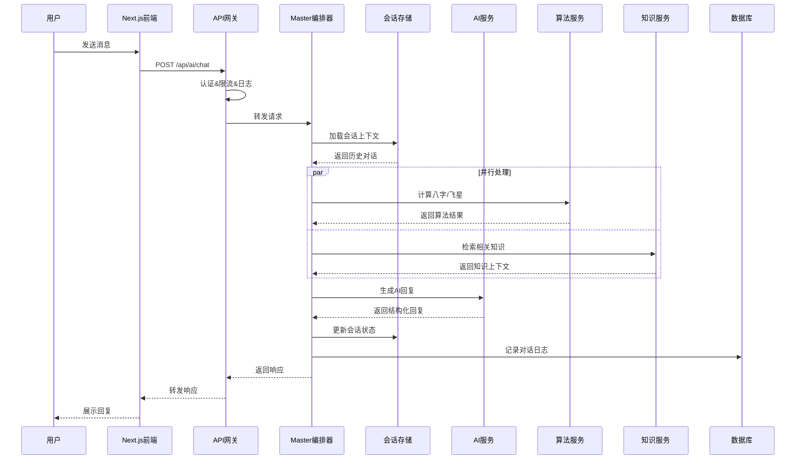

# QiFlow AI - AI八字风水对话大师技术架构设计文档

**文档版本**: v1.2
**撰写日期**: 2025-01-20
**最后更新**: 2025-01-20
**文档状态**: 架构优化版
**负责人**: 技术架构负责人

---

## 0. 文档信息

### 0.1 更新记录

| 版本 | 日期       | 修订人     | 修订内容                                                                           | 评审状态 |
| ---- | ---------- | ---------- | ---------------------------------------------------------------------------------- | -------- |
| v1.2 | 2025-01-20 | 跨团队评审 | 基于专家建议优化：Master Orchestrator架构、Redis集成、性能指标、安全策略、监控体系 | 评审中   |
| v1.1 | 2025-01-20 | Codex 协作 | 对齐新版 PRD，明确服务边界、数据流与非功能要求                                     | 已完成   |
| v1.0 | 2025-01-19 | 技术团队   | 初版架构草案                                                                       | 已完成   |

### 0.2 审核清单

```
[架构评审意见汇总]
- 前端负责人: [✓] 组件架构合理，需细化响应式设计实现
- 后端负责人: [✓] 服务分层清晰，需补充Redis集群配置
- AI 平台负责人: [✓] AI架构可行，需成本控制和质量保证
- DevOps 负责人: [✓] 部署方案完善，需监控告警优化
- 安全负责人: [✓] 安全策略全面，需数据加密细化
- 算法负责人: [✓] 传统算法集成方案可行
```

---

## 1. 架构概览

### 1.1 系统分层架构（详细版）

| 层级           | 组件                         | 关键职责                                   | 技术栈                                       | 性能要求                        | 扩展性                 |
| -------------- | ---------------------------- | ------------------------------------------ | -------------------------------------------- | ------------------------------- | ---------------------- |
| **客户端层**   | Next.js 15 App Router        | 对话UI、罗盘可视化、会员中心、移动端适配   | React 18 + TypeScript + Tailwind + shadcn/ui | 首屏加载≤2.5s，交互响应≤200ms   | 支持PWA，静态资源CDN   |
| **API网关层**  | Next.js API Routes           | 请求路由、认证鉴权、限流熔断、日志记录     | Edge Runtime + 中间件                        | 路由延迟≤50ms，限流10000req/min | 水平扩展，负载均衡     |
| **会话编排层** | Master Orchestrator          | 对话状态机、上下文管理、AI路由、故障恢复   | TypeScript + Redis + Circuit Breaker         | 编排延迟≤100ms，状态切换≤50ms   | 无状态设计，分布式部署 |
| **AI服务层**   | Model Router + Prompt Engine | 模型选择、提示生成、置信度评估、成本控制   | Multi-provider SDK + Template Engine         | AI调用≤2s，路由决策≤50ms        | 动态扩容，模型热切换   |
| **算法服务层** | BaZi + FengShui Services     | 传统算法计算、结果缓存、数据转换、错误处理 | 现有算法库 + 缓存层                          | 计算延迟≤500ms，缓存命中≥80%    | 算法版本管理，并行计算 |
| **知识服务层** | Knowledge Graph + RAG        | 知识检索、文化校验、术语管理、内容审核     | Vector DB + Graph DB + NLP                   | 检索延迟≤200ms，准确率≥95%      | 知识库分片，增量更新   |
| **业务服务层** | User/Subscription/Expert     | 用户管理、权限控制、订阅计费、专家预约     | Supabase + Stripe + CRM                      | 查询延迟≤100ms，事务一致性      | 微服务架构，数据分片   |
| **数据存储层** | Multi-storage Architecture   | 关系数据、向量存储、会话缓存、文件存储     | PostgreSQL + ChromaDB + Redis + S3           | 读延迟≤10ms，写延迟≤50ms        | 读写分离，分库分表     |
| **基础设施层** | Monitoring + Security        | 监控告警、日志分析、安全防护、合规审计     | OpenTelemetry + ELK + WAF                    | 监控采集≤1s，告警响应≤30s       | 多区域部署，灾备切换   |

### 1.2 完整交互流程（详细版）

#### 对话请求处理流程



#### 关键时序要求

1. **认证鉴权**: ≤50ms（JWT验证 + 权限检查）
2. **上下文加载**: ≤100ms（Redis热数据 + 必要时DB查询）
3. **算法计算**: ≤500ms（八字/飞星并行计算 + 缓存策略）
4. **知识检索**: ≤200ms（向量相似度搜索 + 结果排序）
5. **AI生成**: ≤2000ms（模型调用 + 后处理）
6. **状态更新**: ≤100ms（内存更新 + 异步持久化）
7. **总响应时间**: ≤3000ms（P95指标）

---

## 2. 前端架构

- **框架**：Next.js 15（App Router），React 18，TypeScript 5.x。
- **状态管理**：React Query + Zustand（对话本地状态），Supabase client 处理会话。
- **UI 体系**：Tailwind CSS v4 + shadcn/ui + 自定义设计 Token（见 UI 文档）。
- **关键模块**：
  - `src/components/analysis/enhanced-guest-analysis-page.tsx`：嘉宾体验入口。
  - `src/components/compass`：罗盘与飞星可视化组件。
  - `src/components/ai/master-chat-panel.tsx`：AI 对话面板。
- **渲染策略**：
  - 对话区使用 Client Component；静态资产与 SEO 页面使用 SSG/ISR。
  - 引导、定价页 SSR，确保搜索友好。
- **性能优化**：Lazy Loading + Suspense，Konva 场景分拆；使用 `performance-monitor.ts` 采集指标。

---

## 3. 服务与模块设计

### 3.1 会话编排（AI 平台）

| 模块                  | 说明                     | 实现要点                                     |
| --------------------- | ------------------------ | -------------------------------------------- |
| `master-orchestrator` | 对话入口，聚合算法与模型 | - 接收前端 payload（问题、上下文、用户等级） |

- 读取 `conversation-memory`（Supabase KV）和 `session-context`（Redis）
- 调用 `analysis-service` 获取结构化建议
- 根据策略选择模型，封装 Prompt（引用模板、术语解释）
- 记录响应 ID、模型、耗时到日志表 |
  | `conversation-memory` | 上下文存储层 | - 最近 50 条话术存入 KV，敏感信息脱敏
- 提供 TTL 与手动清除接口 |
  | `model-router` | 模型路由与降级 | - 按用户等级、成本、稳定性排序
- Primary: DeepSeek/Claude；Secondary: Gemini
- Failure 时读取缓存模板，通知 Sentry |

### 3.2 算法与业务服务

- **`bazi-service`**：封装 `src/lib/bazi`，提供命盘生成、十神分析、流年运势。输出 JSON Schema `BaziAnalysis`。
- **`fengshui-service`**：封装 `src/lib/fengshui` + `compass` 数据，提供 24 山定位、飞星盘、布局建议。
- **`analysis-service`**：组合算法结果 + 用户画像（Supabase），生成行动清单、风险提示、引用链路。所有输出经 `safe-data-utils.ts` 校验。
- **`subscription-service`**：基于 Supabase RLS，管理会员等级、额度、提醒策略。
- **`expert-service`**：对接运营 CRM 或外部预约系统，生成工单与 SLA。

---

## 4. 数据设计

### 4.1 数据存储

| 存储                | 用途                             | 关键结构                                                                               |
| ------------------- | -------------------------------- | -------------------------------------------------------------------------------------- |
| Supabase Postgres   | 用户、命盘、对话、会员、专家预约 | 表：`users`、`conversation_logs`、`analysis_snapshot`、`subscriptions`、`expert_cases` |
| Supabase KV（Edge） | 会话记忆、上下文缓存             | Key 为 `session_id`，Value 为压缩 JSON                                                 |
| Redis               | 模型路由缓存、配额、热点数据     | TTL 控制，存储用户级调用计数                                                           |
| Supabase Storage    | 报告、上传平面图、导出文件       | 使用预签名 URL                                                                         |
| S3（可选）          | 大型附件备份                     | Beta 后评估                                                                            |

### 4.2 数据流程

1. 用户请求进入 `api/ai/master`（Edge Function）。
2. 读取用户画像（`users` + `subscriptions`），检查调用额度。
3. 调用 `analysis-service`，写入 `analysis_snapshot`（含引用、版本号）。
4. 结果返回前端，并写入 `conversation_logs`（字段：`conversation_id`、`role`、`content`、`source_refs`）。
5. 若触发专家推荐，向 `expert_cases` 写入待处理工单并通知运营。

### 4.3 数据安全

- 采用 Supabase RLS 控制访客/会员/管理员访问范围。
- 敏感字段（出生信息、地址）使用 Supabase 内置加密或 KMS。
- 启用审计日志，记录数据访问与导出行为。

---

## 5. 接口设计（摘要）

| 名称         | 路径                          | 方法 | 描述                     | 认证                      |
| ------------ | ----------------------------- | ---- | ------------------------ | ------------------------- |
| AI 对话入口  | `POST /api/ai/master`         | POST | 发起对话，返回富文本结构 | Supabase Auth、游客 Token |
| 行动清单导出 | `POST /api/analysis/export`   | POST | 导出 PDF/Markdown        | 会员                      |
| 会员额度查询 | `GET /api/subscription/quota` | GET  | 查询剩余额度             | 登录用户                  |
| 专家预约     | `POST /api/expert/request`    | POST | 创建预约请求             | 会员/至尊                 |
| 运营事件上报 | `POST /api/ops/events`        | POST | 上报预警/模型异常        | 内部                      |

所有接口返回统一 Envelope：`{ status, data, error?, traceId }`，并在 header 提供 `X-Response-Source`（模型+算法版本）。

---

## 6. 非功能性设计

### 6.1 性能

- P95 响应 ≤ 3s，P99 ≤ 6s；对话并发初始支持 200 RPS。
- 使用 Redis + 本地缓存加速常用术语解释、算法结果。
- 对话请求使用 Streaming（Server-Sent Events）提升感知速度。

### 6.2 可靠性

- 所有核心服务部署于 Kubernetes（多副本，水平自动扩缩）。
- 使用 Circuit Breaker 保护外部大模型调用；失败自动降级模板回复。
- 关键数据定时备份到冷存储；启用 PITR（Point-in-time Recovery）。

### 6.3 安全与合规

- WAF + Bot 防护；对外接口限速与 IP 黑名单。
- 模型提示词与输出经安全过滤器，敏感内容上报运营。
- 合规：遵循《网络安全法》《个人信息保护法》以及目标市场法律；提供数据删除接口。

### 6.4 可观测性

- OpenTelemetry 采集 trace，统一写入 Grafana Tempo。
- Prometheus 指标：AI 响应时长、模型成本、错误率、会员转化。
- Sentry 收集前后端错误，P1/P0 自动通知 PagerDuty。
- 日志结构化（JSON），通过 Loki 或 ELK 管理。

---

## 7. 部署与发布

- **环境划分**：Dev（共享）、Staging（Beta 前）、Production（正式）。
- **CI/CD**：使用 GitHub Actions → Supabase + Vercel/Kubernetes。
  - 每次合并运行：Lint、Type Check、Unit Test、Playwright Smoke。
  - Staging/Prod 发布采用 blue-green 或 canary。
- **配置管理**：使用环境变量 + Supabase Config；敏感信息托管于 Vault。
- **回滚策略**：保持最近 3 个版本镜像；数据库迁移使用可回滚脚本。

---

## 8. 测试与质量保障

- 单元测试：算法≥90% 覆盖；对话编排≥80%。
- 集成测试：模拟主要旅程（游客、会员、高端用户），验证数据一致性。
- 端到端测试：Playwright 覆盖对话、导出、会员升级流程。
- 性能测试：K6/Locust，验证 200 RPS 与 3 倍突发；监控资源曲线。
- 安全测试：渗透扫描、依赖漏洞检查（Dependabot/Trivy）。

---

## 9. 风险与缓解

| 风险             | 等级 | 影响               | 应对策略                                |
| ---------------- | ---- | ------------------ | --------------------------------------- |
| 模型不可用或限流 | 高   | 对话服务中断       | 建立多模型池、缓存策略、人工 fallback   |
| 算法结果不一致   | 中   | 建议可信度下降     | 每次发布进行回归，版本号随响应返回      |
| 数据增长迅速     | 中   | 存储成本与性能压力 | 建立冷热分层、定期归档、启用压缩        |
| 国际化复杂度     | 中   | 文案与排版错位     | 使用 i18n key、设计留白、自动化截图比对 |
| 合规政策变化     | 高   | 功能下线风险       | 建立合规评审，小版本可配置化开关        |

---

## 10. 待办与后续工作

- [ ] 完成详细接口文档（OpenAPI）。
- [ ] 输出数据库 ER 图及迁移脚本清单。
- [ ] 建立模型评估流水线（离线评测 + 线上 A/B）。
- [ ] 与运营共建专家服务 CRM 对接方案。
- [ ] 制定成本监控与模型配额策略。

---

**文档结束**
